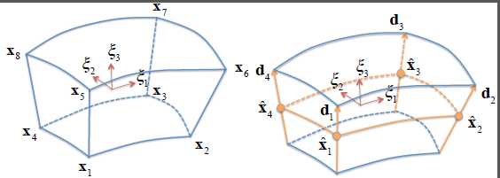
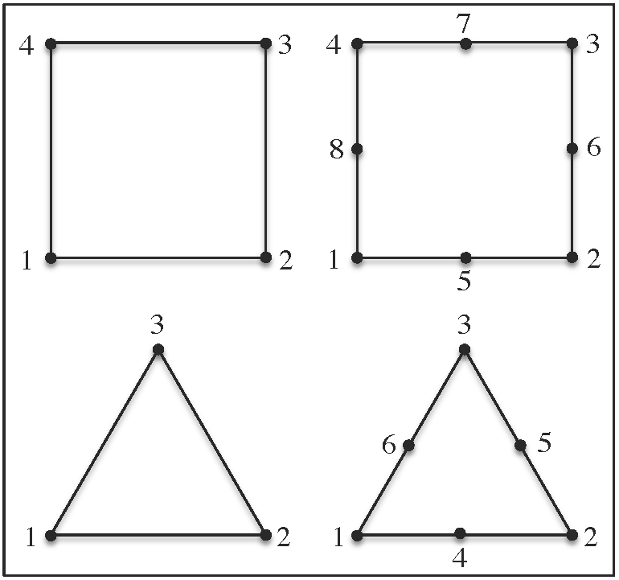
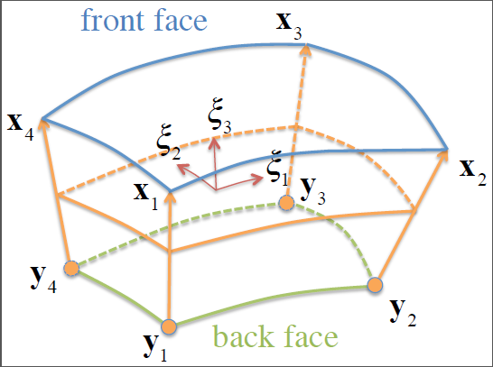

# 4.2 Shell Elements {: #sec:Shell-Elements }

Historically, shells have been formulated using two different approaches [^4.2-1]. The difference between these approaches lies in the way the rotational degrees of freedom are defined. In the first approach, the rotational degrees of freedom are defined as angles. In addition, the plane stress condition needs to be enforced to take thickness variations into account. This approach is very useful for infinitesimal strains, but becomes very difficult to pursue in finite deformation due to the fact that finite rotations do not commute. Another disadvantage of this approach is that it requires a modification to the material formulation to enforce the plane stress condition. For complex materials this modification is very difficult or even impossible to obtain.

The alternative approach is to use an _extensible director_ to describe the rotational degrees of freedom. With this approach it is not necessary to enforce the plane-stress condition and the full 3D constitutive relations can be employed. This approach is adapted in FEBio as described here.

The shell formulation implemented in FEBio is still a work in progress. The goal is to implement an extensible director formulation with strain enhancements to deal with the well-known locking effect in incompressible and bending problems [^4.2-2]. With the current state of the implementation, it is advised to use quadratic elements in such problems.

Starting with FEBio 2.6, two shell formulations have become available: The original formulation, where nodes are located at the mid-surface through the thickness of the shell, and a new formulation where nodes are located on the top face of the shell. The original formulation uses nodal displacements and directors as degrees of freedom; the new formulation uses top and bottom face nodal displacements. The new formulation is designed to properly accommodate shells attached to the surface of a solid element, or shells sandwiched between two solid elements, with minimal alterations to the rest of the code. The original formulation does not strictly enforce continuity of all the relevant degrees of freedom in those situations. However, this original formulation is maintained in the code for backward compatibility.

Most of the shell elements available in FEBio use a _compatible strain_ formulation, where the calculation of strain components is based only on nodal displacements, similar to hexahedral or pentrahedral elements. Users should be aware that this compatible strain formulation is very susceptible to element locking when the shell thickness is much smaller than the shell size (e.g., when the aspect ratio is less than 0.01). Therefore, these shell formulations should be used with caution, keeping in mind this important constraint. Conversely, these shell elements perform very well when they are attached to solid elements (e.g., skin over muscle), or sandwiched between shell elements (e.g., cell membrane separating cytoplasm from extra-cellular matrix).

The element-locking limitation of compatible strain shell formulations has motivated the development of specialized shell formulations that attempt to overcome locking. The FE literature on this subject is rather extensive and we refer the reader to the excellent review chapter by Bischoff et al. [^4.2-3] on this topic. Methods for overcoming locking include the assumed natural strain (ANS) formulation for transverse shear strains [^4.2-4][^4.2-5] and transverse normal strains [^4.2-6][^4.2-7]. The ANS formulation may be supplemented with the enhanced assumed strain (EAS) method [^4.2-8] and extended to large deformations [^4.2-9][^4.2-10][^4.2-11]. FEBio includes the ANS (_q4ans_) and EAS (_q4eas_) quadrilateral shell element formulations of Vu-Quoc and Tan [^4.2-10], using a seven-parameter EAS interpolation, which is otherwise substantially similar to the five-parameter interpolation presented in an earlier study by Klinkel et al. [^4.2-9]. These shell elements are not suitable for attachment to a solid element, nor sandwiching between two solid elements. Since they don't experience element locking, they should be loaded more slowly than compatible strain shell elements. The formulations presented below are for the compatible strain shell elements.

## Shell with mid-surface nodal displacements {: #subsec:Shell-formulation-standalone }

We create a shell formulation by reducing a solid element interpolation which is linear along the parametric coordinate $\xi_{3}$. We start with the general interpolation for a solid element,

\[ \begin{equation} \mathbf{x}\left(\xi_{i}\right)=\sum\limits_{a=1}^{n}N_{a}\left(\xi_{i}\right)\mathbf{x}_{a}\,,\label{eq380} \end{equation} \]

where $i=1,2,3$ and $n$ is the number of nodes, and specialize it to the case of a shell as

\[ \begin{equation} N_{a}\left(\xi_{i}\right)=\begin{cases} \frac{1-\xi_{3}}{2}M_{a}\left(\xi_{\alpha}\right) & 1\leqslant a\leqslant m\\ \frac{1+\xi_{3}}{2}M_{a}\left(\xi_{\alpha}\right) & m+1\leqslant a\leqslant n \end{cases}\,,\label{eq381} \end{equation} \]

where $\alpha=1,2$, $m=n/2$ is the number of shell element nodes, and $M_{a}\left(\xi_{\alpha}\right)$ are the interpolation functions within the mid-shell surface. The description of the mid-shell surface is thus given by

\[ \begin{equation} \mathbf{\hat{x}}\left(\xi_{\alpha}\right)=\sum\limits_{a=1}^{n}N_{a}\left(\xi_{1},\xi_{2},0\right)\mathbf{x}_{a}\equiv\sum\limits_{b=1}^{m}M_{b}\left(\xi_{\alpha}\right)\mathbf{\hat{x}}_{b}\,,\label{eq382} \end{equation} \]

where

\[ \begin{equation} \mathbf{\hat{x}}_{b}=\frac{1}{2}\left(\mathbf{x}_{b}+\mathbf{x}_{b+m}\right)\label{eq383} \end{equation} \]

are the nodal positions for the mid-shell surface.

{: style="display:block; margin-left:auto; margin-right:auto;" }**Example of shell elements with four mid-surface nodal positions $\mathbf{\hat{x}}_{b}$ and directors $\mathbf{d}_{b}$ ($b=1-4)$, reduced from a solid element.**

We also define the director across the shell surface as

\[ \begin{equation} \mathbf{d}\left(\xi_{\alpha}\right)=\mathbf{x}\left(\xi_{1},\xi_{2},1\right)-\mathbf{x}\left(\xi_{1},\xi_{2},-1\right)=\sum\limits_{b=1}^{m}M_{b}\left(\xi_{\alpha}\right)\mathbf{d}_{b}\,,\label{eq384} \end{equation} \]

where

\[ \begin{equation} \mathbf{d}_{b}=\mathbf{x}_{b+m}-\mathbf{x}_{b},\quad b=1-m\label{eq385} \end{equation} \]

are the nodal directors. Note that the magnitude of the nodal director represents the shell thickness, $h\left(\xi_{\alpha}\right)=\left\Vert \mathbf{d}\left(\xi_{\alpha}\right)\right\Vert$ and the shell thicknesses at the nodes are $h_{b}=\left\Vert \mathbf{d}_{b}\right\Vert$. With these definitions we find that the interpolation across the parametric space of the shell element is

\[ \begin{equation} \mathbf{x}\left(\xi_{i}\right)=\mathbf{\hat{x}}\left(\xi_{\alpha}\right)+\frac{1}{2}\xi_{3}\mathbf{d}\left(\xi_{\alpha}\right)=\sum\limits_{b=1}^{m}M_{b}\left(\xi_{\alpha}\right)\left(\mathbf{\hat{x}}_{b}+\frac{1}{2}\xi_{3}\mathbf{d}_{b}\right)\,.\label{eq386} \end{equation} \]

From this relation we can obtain the covariant basis vectors as

\[ \begin{equation} \begin{aligned}\mathbf{g}_{\alpha}\left(\xi_{i}\right) & =\frac{\partial\mathbf{x}}{\partial\xi_{\alpha}}=\sum\limits_{b=1}^{m}\frac{\partial M_{b}}{\partial\xi_{\alpha}}\left(\mathbf{\hat{x}}_{b}+\frac{1}{2}\xi_{3}\mathbf{d}_{b}\right)\\ \mathbf{g}_{3}\left(\xi_{i}\right) & =\frac{\partial\mathbf{x}}{\partial\xi_{3}}=\frac{1}{2}\sum\limits_{b=1}^{m}M_{b}\left(\xi_{\alpha}\right)\mathbf{d}_{b} \end{aligned} \,,\label{eq387} \end{equation} \]

from which we may evaluate the contravariant basis vectors $\mathbf{g}^{j}$ using the identity $\mathbf{g}_{i}\cdot\mathbf{g}^{j}=\delta_{i}^{j}$. Then, the gradients of the shape functions are given by

\[ \begin{equation} \grad M_{b}=\frac{\partial M_{b}}{\partial\xi_{\alpha}}\mathbf{g}^{\alpha},\quad\grad\left(\frac{1}{2}\xi_{3}M_{b}\right)=\frac{1}{2}\left(\xi_{3}\grad M_{b}+M_{b}\mathbf{g}^{3}\right)\,.\label{eq388} \end{equation} \]

It follows from \eqref{eq386} that the virtual displacement is

\[ \begin{equation} \delta\mathbf{u}\left(\xi_{i}\right)=\sum\limits_{a=1}^{m}M_{a}\left(\xi_{\alpha}\right)\left(\delta\mathbf{\hat{u}}_{a}+\frac{1}{2}\xi_{3}\delta\mathbf{d}_{a}\right)\,,\label{eq389} \end{equation} \]

and the incremental displacement is

\[ \begin{equation} \Delta\mathbf{u}\left(\xi_{i}\right)=\sum\limits_{b=1}^{m}M_{b}\left(\xi_{\alpha}\right)\left(\Delta\mathbf{\hat{u}}_{b}+\frac{1}{2}\xi_{3}\Delta\mathbf{d}_{b}\right)\,.\label{eq390} \end{equation} \]

In FEBio, for historical reasons, the nodal director $\mathbf{d}_{b}$ is currently called _rotation_. This is a misnomer and users should treat this _rotation_ as the vector $\mathbf{d}_{a}$ whose components have units of length. Thus, fixing or prescribing _rotation_ components in the input file effectively places these constraints on the components of the nodal director; similarly, requesting _rotation_ in the output files will produce the components of the director.

When this type of shell is connected face-to-face with a solid element, the nodes located at $\mathbf{\hat{x}}_{b}$ automatically share their displacement degrees of freedom $\mathbf{u}_{b}$ with the corresponding nodes from the face of the solid element. However, no continuity is enforced between the directors $\mathbf{d}_{b}$ and the solid element deformation. One consequence of this condition is that a shell sandwiched between two solid elements will not detect out-of-plane shear and normal stresses transmitted by the solid element(s). Another consequence is that bending of the solid element(s) will not produce a bending moment in the shell. Therefore, these shell elements are best used as shell-only structures.

### Elastic Shell {: #subsec:Elastic-Shell }

For an elastic shell, the internal virtual work becomes

\[ \begin{equation} \delta W_{\text{int}}^{e}=\int\limits_{\Omega^{e}}\boldsymbol{\sigma}:\grad\delta\mathbf{u}\,dv=\sum\limits_{a=1}^{n}\left[\begin{array}{cc} \delta\mathbf{\hat{u}}_{a} & \delta\mathbf{d}_{a}\end{array}\right]\cdot\left[\begin{array}{c} \mathbf{f}_{a}^{u}\\ \mathbf{f}_{a}^{d} \end{array}\right]\,,\label{eq391} \end{equation} \]

where

\[ \begin{equation} \mathbf{f}_{a}^{u}=\int\limits_{\Omega^{e}}\boldsymbol{\sigma}\cdot\grad M_{a}\,dv,\quad\mathbf{f}_{a}^{d}=\int\limits_{\Omega^{e}}\boldsymbol{\sigma}\cdot\grad\left(\frac{1}{2}\xi_{3}M_{a}\right)\,dv\,.\label{eq392} \end{equation} \]

The linearization of the internal virtual work is

\[ \begin{equation} \begin{array}{c} D\left(\delta W_{\text{int}}^{e}\right)\left[\Delta\mathbf{u}\right]=\int\limits_{\Omega^{e}}\tr\left(\grad\Delta\mathbf{u}\cdot\boldsymbol{\sigma}\cdot\grad^{T}\delta\mathbf{u}\right)\,dv\\ +\int\limits_{\Omega^{e}}\grad\delta\mathbf{u}:\boldsymbol{\mathcal{C}}:\grad^{T}\Delta\mathbf{u}\,dv \end{array}\,.\label{eq393} \end{equation} \]

The first of these integrals may be discretized as

\[ \begin{equation} \int\limits_{\Omega^{e}}\tr\left(\grad\Delta\mathbf{u}\cdot\boldsymbol{\sigma}\cdot\grad^{T}\delta\mathbf{u}\right)\,dv=\sum\limits_{a=1}^{m}\sum\limits_{b=1}^{m}\left[\begin{array}{cc} \delta\mathbf{\hat{u}}_{a} & \delta\mathbf{d}_{a}\end{array}\right]\left[\begin{array}{cc} \mathbf{K}_{ab}^{uu} & \mathbf{K}_{ab}^{ud}\\ \mathbf{K}_{ab}^{du} & \mathbf{K}_{ab}^{dd} \end{array}\right]\left[\begin{array}{c} \Delta\mathbf{\hat{u}}_{b}\\ \Delta\mathbf{d}_{b} \end{array}\right]\,,\label{eq394} \end{equation} \]

where

\[ \begin{equation} \begin{aligned}\mathbf{K}_{ab}^{uu} & =\int\limits_{\Omega^{e}}\left(\grad M_{a}\cdot\boldsymbol{\sigma}\cdot\grad M_{b}\right)\mathbf{I}\,dv\\ \mathbf{K}_{ab}^{ud} & =\int\limits_{\Omega^{e}}\left(\grad M_{a}\cdot\boldsymbol{\sigma}\cdot\grad\left(\frac{1}{2}\xi_{3}M_{b}\right)\right)\mathbf{I}\,dv\\ \mathbf{K}_{ab}^{du} & =\int\limits_{\Omega^{e}}\left(\grad\left(\frac{1}{2}\xi_{3}M_{a}\right)\cdot\boldsymbol{\sigma}\cdot\grad M_{b}\right)\mathbf{I}\,dv\\ \mathbf{K}_{ab}^{dd} & =\int\limits_{\Omega^{e}}\left(\grad\left(\frac{1}{2}\xi_{3}M_{a}\right)\cdot\boldsymbol{\sigma}\cdot\grad\left(\frac{1}{2}\xi_{3}M_{b}\right)\right)\mathbf{I}\,dv \end{aligned} \,.\label{eq395} \end{equation} \]

The second integral in \eqref{eq393} becomes

\[ \begin{equation} \int\limits_{\Omega^{e}}\grad\delta\mathbf{u}:\boldsymbol{\mathcal{C}}:\grad^{T}\Delta\mathbf{u}\,dv=\sum\limits_{a=1}^{m}\sum\limits_{b=1}^{m}\left[\begin{array}{cc} \delta\mathbf{\hat{u}}_{a} & \delta\mathbf{d}_{a}\end{array}\right]\left[\begin{array}{cc} \mathbf{K}_{ab}^{uu} & \mathbf{K}_{ab}^{ud}\\ \mathbf{K}_{ab}^{du} & \mathbf{K}_{ab}^{dd} \end{array}\right]\left[\begin{array}{c} \Delta\mathbf{\hat{u}}_{b}\\ \Delta\mathbf{d}_{b} \end{array}\right]\,,\label{eq396} \end{equation} \]

where

\[ \begin{equation} \begin{aligned}\mathbf{K}_{ab}^{uu} & =\int\limits_{\Omega^{e}}\grad M_{a}\cdot\boldsymbol{\mathcal{C}}\cdot\grad M_{b}\,dv\\ \mathbf{K}_{ab}^{ud} & =\int\limits_{\Omega^{e}}\grad M_{a}\cdot\boldsymbol{\mathcal{C}}\cdot\grad\left(\frac{1}{2}\xi_{3}M_{b}\right)\,dv\\ \mathbf{K}_{ab}^{du} & =\int\limits_{\Omega^{e}}\grad\left(\frac{1}{2}\xi_{3}M_{a}\right)\cdot\boldsymbol{\mathcal{C}}\cdot\grad M_{b}\,dv\\ \mathbf{K}_{ab}^{dd} & =\int\limits_{\Omega^{e}}\grad\left(\frac{1}{2}\xi_{3}M_{a}\right)\cdot\boldsymbol{\mathcal{C}}\cdot\grad\left(\frac{1}{2}\xi_{3}M_{b}\right)\,dv \end{aligned} \,.\label{eq397} \end{equation} \]

Similar expressions may be derived for the external work and inertia forces.

In FEBio a 3-point Gaussian quadrature rule is used for the through-the-thickness integration. FEBio currently supports four- and eight-node quadrilateral and three- and six-node triangular shell elements.

### Quadrilateral shells {: #subsec:Quadrilateral-shells }

For four-node quadrilateral shells, the shape functions are given by

\[ \begin{equation} \begin{aligned}M_{1} & =\frac{1}{4}\left(1-r\right)\left(1-s\right)\\ M_{2} & =\frac{1}{4}\left(1+r\right)\left(1-s\right)\\ M_{3} & =\frac{1}{4}\left(1+r\right)\left(1+s\right)\\ M_{4} & =\frac{1}{4}\left(1-r\right)\left(1+s\right) \end{aligned} \,.\label{eq398} \end{equation} \]

For eight-node quadrilateral shells the shape functions are

\[ \begin{equation} \begin{aligned}M_{1} & =\frac{1}{4}\left(1-r\right)\left(1-s\right)-\frac{1}{2}\left(M_{8}+M_{5}\right) & M_{5} & =\frac{1}{2}\left(1-r^{2}\right)\left(1-s\right)\\ M_{2} & =\frac{1}{4}\left(1+r\right)\left(1-s\right)-\frac{1}{2}\left(M_{5}+M_{6}\right) & M_{6} & =\frac{1}{2}\left(1-s^{2}\right)\left(1+r\right)\\ M_{3} & =\frac{1}{4}\left(1+r\right)\left(1+s\right)-\frac{1}{2}\left(M_{6}+M_{7}\right) & M_{7} & =\frac{1}{2}\left(1-r^{2}\right)\left(1+s\right)\\ M_{4} & =\frac{1}{4}\left(1-r\right)\left(1+s\right)-\frac{1}{2}\left(M_{7}+M_{8}\right) & M_{8} & =\frac{1}{2}\left(1-s^{2}\right)\left(1-r\right) \end{aligned} \,.\label{eq399} \end{equation} \]

### Triangular shells {: #subsec:Triangular-shells }

For three-node triangular shell elements, the shape functions are given by

\[ \begin{equation} \begin{aligned}M_{1} & =1-r-s\\ M_{2} & =r\\ M_{3} & =s \end{aligned} \,.\label{eq400} \end{equation} \]

For six-node triangular shell elements they are

\[ \begin{equation} \begin{aligned}M_{1} & =r_{1}\left(2r_{1}-1\right) & M_{4} & =4r_{1}r_{2}\\ M_{2} & =r_{2}\left(2r_{2}-1\right) & M_{5} & =4r_{2}r_{3}\\ M_{3} & =r_{3}\left(2r_{3}-1\right) & M_{6} & =4r_{3}r_{1}\\ r_{1} & =1-r-s & r_{2} & =r & r_{3} & =s \end{aligned} \,.\label{eq401} \end{equation} \]

{: style="display:block; margin-left:auto; margin-right:auto;" }**Different shell elements available in FEBio.**

## Shells with top and bottom face nodal displacements {: #subsec:Shells-front-back }

We create a shell formulation by reducing a 3D element interpolation which is linear along $\xi_{3}$. The nodal positions at the bottom of the shell ($\xi_{3}=-1$) are denoted by $\mathbf{y}_{a}$ and those on the top of the shell ($\xi_{3}=+1$) are denoted by $\mathbf{x}_{a}$, thus

\[ \begin{equation} \mathbf{x}\left(\xi_{i}\right)=\sum_{a}M_{a}\left(\xi_{1},\xi_{2}\right)\left(\frac{1+\xi_{3}}{2}\mathbf{x}_{a}+\frac{1-\xi_{3}}{2}\mathbf{y}_{a}\right)=\sum_{a}M_{a}\left(\xi_{1},\xi_{2}\right)\left(\mathbf{x}_{a}-\frac{1-\xi_{3}}{2}\mathbf{d}_{a}\right)\label{eq:solid-element-interpolation} \end{equation} \]

The vector from $\mathbf{y}_{a}$ to $\mathbf{x}_{a}$ is the director, $\mathbf{d}_{a}$,

\[ \mathbf{d}_{a}=\mathbf{x}_{a}-\mathbf{y}_{a} \]

From this relation we can get the shell covariant basis vectors,

\[ \begin{equation} \begin{aligned}\mathbf{g}_{\alpha}\left(\xi_{i}\right) & =\frac{\partial\mathbf{x}}{\partial\xi_{\alpha}}=\sum_{a}\frac{\partial M_{a}}{\partial\xi_{\alpha}}\left(\frac{1+\xi_{3}}{2}\mathbf{x}_{a}+\frac{1-\xi_{3}}{2}\mathbf{y}_{a}\right)=\sum_{a}\frac{\partial M_{a}}{\partial\xi_{\alpha}}\left(\mathbf{x}_{a}-\frac{1-\xi_{3}}{2}\mathbf{d}_{a}\right)\\ \mathbf{g}_{3}\left(\xi_{i}\right) & =\frac{\partial\mathbf{x}}{\partial\xi_{3}}=\sum_{a}\frac{1}{2}M_{a}\left(\xi_{1},\xi_{2}\right)\left(\mathbf{x}_{a}-\mathbf{y}_{a}\right)=\sum_{a}\frac{1}{2}M_{a}\left(\xi_{1},\xi_{2}\right)\mathbf{d}_{a} \end{aligned} \label{eq:shell-covariant-basis} \end{equation} \]

from which we may evaluate the contravariant basis vectors $\mathbf{g}^{i}$. Let the front-face and back-face displacements be denoted by $\mathbf{u}$ and $\mathbf{w}$, respectively. It follows that $\mathbf{x}_{a}=\mathbf{X}_{a}+\mathbf{u}_{a}$ and $\mathbf{y}_{a}=\mathbf{Y}_{a}+\mathbf{w}_{a}$, where $\mathbf{X}_{a}$ represents the shell nodal positions in the reference configuration, provided as nodal coordinates in the input file, and $\mathbf{Y}_{a}=\mathbf{X}_{a}-\mathbf{D}_{a}$ is evaluated from the user-defined referential shell thickness, and the surface surface normals evaluated at each node. If the shell surface is not planar in the reference configuration, users must be careful to select shell thicknesses that don't produce inverted elements (negative Jacobians) as a result of this extrapolation.

{: style="width:45%; display:block; margin-left:auto; margin-right:auto;" }**Example of shell element with front-face nodal positions $\mathbf{x}_{b}$ and back-face nodal positions $\mathbf{y}_{b}$ ($b=1-4)$, reduced from a solid element.**

It follows that the virtual displacement is

\[ \begin{equation} \delta\mathbf{u}\left(\xi_{i}\right)=\sum_{a}M_{a}\left(\frac{1+\xi_{3}}{2}\delta\mathbf{u}_{a}+\frac{1-\xi_{3}}{2}\delta\mathbf{w}_{a}\right)\,,\label{eq:shell-virtual-velocity} \end{equation} \]

and the incremental displacement is

\[ \begin{equation} \Delta\mathbf{u}\left(\xi_{i}\right)=\sum_{b}M_{b}\left(\frac{1+\xi_{3}}{2}\Delta\mathbf{u}_{b}+\frac{1-\xi_{3}}{2}\Delta\mathbf{w}_{b}\right)\,,\label{eq:shell-incremental-displacement} \end{equation} \]

so that

\[ \begin{equation} \grad\delta\mathbf{u}=\sum_{a}\delta\mathbf{u}_{a}\otimes\grad\left(\frac{1+\xi_{3}}{2}M_{a}\right)+\delta\mathbf{w}_{a}\otimes\grad\left(\frac{1-\xi_{3}}{2}M_{a}\right)\,,\label{eq:gradient-virtual-velocity} \end{equation} \]

and

\[ \begin{equation} \grad\Delta\mathbf{u}=\sum_{b}\Delta\mathbf{u}_{b}\otimes\grad\left(\frac{1+\xi_{3}}{2}M_{b}\right)+\Delta\mathbf{w}_{b}\otimes\grad\left(\frac{1-\xi_{3}}{2}M_{b}\right)\label{eq:gradient-incremental-displacement} \end{equation} \]

Note that

\[ \begin{equation} \grad M_{b}=\frac{\partial M_{b}}{\partial\xi_{\alpha}}\mathbf{g}^{\alpha}\,,\label{eq:shell-shape-gradient-M} \end{equation} \]

so that

\[ \begin{equation} \grad\left(\frac{1+\xi_{3}}{2}M_{b}\right)=\frac{1}{2}\left(\left(1+\xi_{3}\right)\grad M_{b}+M_{b}\mathbf{g}^{3}\right)\label{eq:shell-shape-gradient-Mu} \end{equation} \]

and

\[ \begin{equation} \grad\left(\frac{1-\xi_{3}}{2}M_{b}\right)=\frac{1}{2}\left(\left(1-\xi_{3}\right)\grad M_{b}-M_{b}\mathbf{g}^{3}\right)\label{eq:shell-shape-gradient-Md} \end{equation} \]

To evaluate the deformation gradient in this shell element, we use

\[ \mathbf{F}=\Grad\mathbf{x}=\sum_{b}\mathbf{u}_{b}\otimes\Grad\left(\frac{1+\xi_{3}}{2}M_{b}\right)+\mathbf{w}_{b}\otimes\grad\left(\frac{1-\xi_{3}}{2}M_{b}\right) \]

For this formulation, when a shell element is connected face-to-face with a solid element, the nodal displacements of the solid element face are set to coincide with the back-face nodal displacements $\mathbf{w}_{b}$ of the shell. When a user prescribes displacement components on that shared face, they apply to the front-face displacements $\mathbf{u}_{b}$. Similarly, prescribed pressures and contact pressures act on the shell top face.

When a shell element is sandwiched between two solid elements, the nodal displacements of the solid element facing the shell bottom face are set to coincide with the shell back-face nodal displacements $\mathbf{w}_{b}$, whereas the nodal displacements of the solid element facing the shell top face are set to coincide with the shell front-face nodal displacements $\mathbf{u}_{a}$. If the shell thickness exceeds the thickness of the solid element connected to its bottom face, results become unpredictable.

### Elastic Shell

For an elastic solid, the internal virtual work is

\[ \begin{equation} \begin{aligned}\delta W_{int} & =\int_{v}\boldsymbol{\sigma}:\grad\delta\mathbf{u}\,dv\\ & =\sum_{a}\left[\begin{array}{cc} \delta\mathbf{u}_{a} & \delta\mathbf{w}_{a}\end{array}\right]\left[\begin{array}{c} \mathbf{f}_{a}^{u}\\ \mathbf{f}_{a}^{w} \end{array}\right] \end{aligned} \,,\label{eq:virtual-work-internal} \end{equation} \]

where

\[ \begin{equation} \begin{aligned}\mathbf{f}_{a}^{u} & =\int_{v}\boldsymbol{\sigma}\cdot\grad\left(\frac{1+\xi_{3}}{2}M_{a}\right)\,dv\\ \mathbf{f}_{a}^{w} & =\int_{v}\boldsymbol{\sigma}\cdot\grad\left(\frac{1-\xi_{3}}{2}M_{a}\right)\,dv \end{aligned} \,.\label{eq:shell-internal-force} \end{equation} \]

For the external work of body forces,

\[ \begin{equation} \begin{aligned}\delta W_{ext} & =\int_{v}\delta\mathbf{u}\cdot\rho\mathbf{b}\,dv\\ & =\sum_{a=1}^{m}\delta\mathbf{u}_{a}\cdot\mathbf{f}_{a}^{u}+\delta\mathbf{w}_{a}\cdot\mathbf{f}_{a}^{w} \end{aligned} \,,\label{eq:virtual-work-external} \end{equation} \]

where

\[ \begin{equation} \begin{aligned}\mathbf{f}_{a}^{u} & =\int_{v}\frac{1+\xi_{3}}{2}M_{a}\rho\mathbf{b}\,dv\\ \mathbf{f}_{a}^{w} & =\int_{v}\frac{1-\xi_{3}}{2}M_{a}\rho\mathbf{b}\,dv \end{aligned} \,.\label{eq:shell-external-force} \end{equation} \]

The linearization of the internal virtual work is

\[ \begin{equation} \begin{aligned}D\left(\delta W_{int}\right)\left[\Delta\mathbf{u}\right] & =\int_{v}\tr\left(\grad\Delta\mathbf{u}\cdot\boldsymbol{\sigma}\cdot\grad^{T}\delta\mathbf{u}\right)\,dv\\ & +\int_{v}\grad\delta\mathbf{u}:\boldsymbol{\mathcal{C}}:\grad^{T}\Delta\mathbf{u}\,dv \end{aligned} \,.\label{eq:linearized-internal-work} \end{equation} \]

So

\[ \begin{equation} \int_{v}\tr\left(\grad\Delta\mathbf{u}\cdot\boldsymbol{\sigma}\cdot\grad^{T}\delta\mathbf{u}\right)\,dv=\sum_{a}\sum_{b}\left[\begin{array}{cc} \delta\mathbf{u}_{a} & \delta\mathbf{w}_{a}\end{array}\right]\left[\begin{array}{cc} \mathbf{K}_{ab}^{uu} & \mathbf{K}_{ab}^{uw}\\ \mathbf{K}_{ab}^{wu} & \mathbf{K}_{ab}^{ww} \end{array}\right]\left[\begin{array}{c} \Delta\mathbf{u}_{b}\\ \Delta\mathbf{w}_{b} \end{array}\right]\,,\label{eq:discretized-geometric-stiffness} \end{equation} \]

where

\[ \begin{equation} \begin{aligned}\mathbf{K}_{ab}^{uu} & =\int_{v}\left(\grad\left(\frac{1+\xi_{3}}{2}M_{a}\right)\cdot\boldsymbol{\sigma}\cdot\grad\left(\frac{1+\xi_{3}}{2}M_{b}\right)\right)\mathbf{I}\,dv\\ \mathbf{K}_{ab}^{uw} & =\int_{v}\left(\grad\left(\frac{1+\xi_{3}}{2}M_{a}\right)\cdot\boldsymbol{\sigma}\cdot\grad\left(\frac{1-\xi_{3}}{2}M_{b}\right)\right)\mathbf{I}\,dv\\ \mathbf{K}_{ab}^{wu} & =\int_{v}\left(\grad\left(\frac{1-\xi_{3}}{2}M_{a}\right)\cdot\boldsymbol{\sigma}\cdot\grad\left(\frac{1+\xi_{3}}{2}M_{b}\right)\right)\mathbf{I}\,dv\\ \mathbf{K}_{ab}^{ww} & =\int_{v}\left(\grad\left(\frac{1-\xi_{3}}{2}M_{a}\right)\cdot\boldsymbol{\sigma}\cdot\grad\left(\frac{1-\xi_{3}}{2}M_{b}\right)\right)\mathbf{I}\,dv \end{aligned} \,.\label{eq:shell-geometric-stiffness} \end{equation} \]

Similarly,

\[ \begin{equation} \int_{v}\grad\delta\mathbf{u}:\boldsymbol{\mathcal{C}}:\grad^{T}\Delta\mathbf{u}\,dv=\sum_{a}\sum_{b}\left[\begin{array}{cc} \delta\mathbf{u}_{a} & \delta\mathbf{w}_{a}\end{array}\right]\left[\begin{array}{cc} \mathbf{K}_{ab}^{uu} & \mathbf{K}_{ab}^{uw}\\ \mathbf{K}_{ab}^{wu} & \mathbf{K}_{ab}^{ww} \end{array}\right]\left[\begin{array}{c} \Delta\mathbf{u}_{b}\\ \Delta\mathbf{w}_{b} \end{array}\right]\,,\label{eq:discretized-material-stiffness} \end{equation} \]

where

\[ \begin{equation} \begin{aligned}\mathbf{K}_{ab}^{uu} & =\int_{v}\grad\left(\frac{1+\xi_{3}}{2}M_{a}\right)\cdot\boldsymbol{\mathcal{C}}\cdot\grad\left(\frac{1+\xi_{3}}{2}M_{b}\right)\,dv\\ \mathbf{K}_{ab}^{uw} & =\int_{v}\grad\left(\frac{1+\xi_{3}}{2}M_{a}\right)\cdot\boldsymbol{\mathcal{C}}\cdot\grad\left(\frac{1-\xi_{3}}{2}M_{b}\right)\,dv\\ \mathbf{K}_{ab}^{wu} & =\int_{v}\grad\left(\frac{1-\xi_{3}}{2}M_{a}\right)\cdot\boldsymbol{\mathcal{C}}\cdot\grad\left(\frac{1+\xi_{3}}{2}M_{b}\right)\,dv\\ \mathbf{K}_{ab}^{ww} & =\int_{v}\grad\left(\frac{1-\xi_{3}}{2}M_{a}\right)\cdot\boldsymbol{\mathcal{C}}\cdot\grad\left(\frac{1-\xi_{3}}{2}M_{b}\right)\,dv \end{aligned} \,.\label{eq:shell-material-stiffness} \end{equation} \]

The linearization of the external work is

\[ \begin{equation} \begin{aligned}D\left(\delta W_{ext}\right) & =\sum_{a=1}^{m}\sum_{b=1}^{m}\int_{v}\left(\frac{1+\xi_{3}}{2}M_{a}\delta\mathbf{u}_{a}+\frac{1-\xi_{3}}{2}M_{a}\delta\mathbf{w}_{a}\right)\cdot\rho\grad\mathbf{b}\cdot\left(\frac{1+\xi_{3}}{2}\Delta\mathbf{u}_{b}+\frac{1-\xi_{3}}{2}M_{b}\Delta\mathbf{w}_{b}\right)\,dv\\ & =\sum_{a}\sum_{b}\left[\begin{array}{cc} \delta\mathbf{u}_{a} & \delta\mathbf{w}_{a}\end{array}\right]\left[\begin{array}{cc} \mathbf{K}_{ab}^{uu} & \mathbf{K}_{ab}^{uw}\\ \mathbf{K}_{ab}^{wu} & \mathbf{K}_{ab}^{ww} \end{array}\right]\left[\begin{array}{c} \Delta\mathbf{u}_{b}\\ \Delta\mathbf{w}_{b} \end{array}\right] \end{aligned} \,,\label{eq:linearized-external-work} \end{equation} \]

where

\[ \begin{equation} \begin{aligned}\mathbf{K}_{ab}^{uu} & =\int_{V}\left(\frac{1+\xi_{3}}{2}\right)^{2}M_{a}M_{b}\rho_{0}\grad\mathbf{b}\,dV\\ \mathbf{K}_{ab}^{uw} & =\int_{V}\left(\frac{1+\xi_{3}}{2}\right)\left(\frac{1-\xi_{3}}{2}\right)M_{a}M_{b}\rho_{0}\grad\mathbf{b}\,dV\\ \mathbf{K}_{ab}^{wu} & =\int_{V}\left(\frac{1+\xi_{3}}{2}\right)\left(\frac{1-\xi_{3}}{2}\right)M_{a}M_{b}\rho_{0}\grad\mathbf{b}\,dV\\ \mathbf{K}_{ab}^{ww} & =\int_{V}\left(\frac{1-\xi_{3}}{2}\right)^{2}M_{a}M_{b}\rho_{0}\grad\mathbf{b}\,dV \end{aligned} \,.\label{eq:shell-external-stiffness} \end{equation} \]

### External work of surface forces

We assume that surface forces are applied on the shell top face ($\xi_{3}=+1$). Therefore, the external work of surface forces has the form

\[ \begin{equation} \delta W_{ext}=\int_{\partial v}\delta\mathbf{u}\left(\xi_{1},\xi_{2},+1\right)\cdot\mathbf{t}\,da=\sum_{a}\delta\mathbf{u}_{a}\cdot\int_{\partial v}M_{a}\left(\xi_{1},\xi_{2}\right)\mathbf{t}\,da\label{eq:fbs-ext-work} \end{equation} \]

In other words, the treatment of surface forces on a shell becomes identical to the treatment of surface forces on the face of a solid. No special treatment is needed.

### Shell on top of solid element

When a shell is coincident with the face of a solid element, we assume that the face of the solid element coincides with the bottom face ($\xi_{3}=-1$) of the shell element. This means that the solid element nodal displacements $\mathbf{u}_{b}$ on that face coincide with the shell nodal displacements $\mathbf{w}_{b}$. Therefore, when we use UnpackLM for those solid elements, we should reassign the DOF ID's of the $\mathbf{u}_{b}$ displacements to those of the $\mathbf{w}_{b}$ displacements stored in that same node.

### Shell sandwiched between solid elements

When a shell is sandwiched between two solid elements, we reassign the DOF ID's of the the solid $\mathbf{u}_{b}$ displacements facing the bottom of the shell to those of the shell $\mathbf{w}_{b}$ displacements stored in that same node. The DOF ID's of solid $\mathbf{u}_{b}$ displacements facing the top of the shell remain unchanged; they will coincide with those of the corresponding solid element nodes.

### Rigid-Shell Interface

When the node of a deformable shell belongs to a rigid body, we need to substitute the nodal degrees of freedom with the rigid body degrees of freedom. The positions of the shell top face and bottom face nodes are

\[ \begin{equation} \begin{aligned}\mathbf{x}_{b} & =\mathbf{r}+\boldsymbol{\Lambda}\cdot\left(\mathbf{X}_{b}-\mathbf{R}\right)\equiv\mathbf{r}+\mathbf{a}_{b}\\ \mathbf{y}_{b} & =\mathbf{r}+\boldsymbol{\Lambda}\cdot\left(\mathbf{Y}_{b}-\mathbf{R}\right)\equiv\mathbf{r}+\mathbf{b}_{b} \end{aligned} \,,\label{eq:fbs-rigid-shell} \end{equation} \]

where $\mathbf{r}$ is the current position of the rigid body center of mass and $\mathbf{R}$ is its initial position; $\boldsymbol{\Lambda}$ is the rotation tensor for the rigid body. We assume that $\mathbf{x}_{b}$ and $\mathbf{y}_{b}$ are connected to the same rigid body. From these relations it follows that virtual displacements are

\[ \begin{equation} \begin{aligned}\delta\mathbf{u}_{a} & =\delta\mathbf{r}-\hat{\mathbf{a}}_{a}\cdot\delta\boldsymbol{\theta}\\ \delta\mathbf{w}_{b} & =\delta\mathbf{r}-\hat{\mathbf{b}}_{a}\cdot\delta\boldsymbol{\theta} \end{aligned} \,,\label{eq:fbs-rsi-virtual} \end{equation} \]

and incremental displacements are

\[ \begin{equation} \begin{aligned}\Delta\mathbf{u}_{b} & =\Delta\mathbf{r}-\hat{\mathbf{a}}_{b}\cdot\Delta\boldsymbol{\theta}\\ \Delta\mathbf{w}_{b} & =\Delta\mathbf{r}-\hat{\mathbf{b}}_{b}\cdot\Delta\boldsymbol{\theta} \end{aligned} \,,\label{eq:fbs-rsi-incremental} \end{equation} \]

where $\hat{\mathbf{a}}$ is the skew-symmetric tensor whose dual vector is $\mathbf{a}$, such that $\hat{\mathbf{a}}\cdot\mathbf{v}=\mathbf{a}\times\mathbf{v}$ for any vector $\mathbf{v}$. When nodes are flexible (when they do not belong to any rigid body), the virtual work has the general form

\[ \begin{equation} \delta W=\sum_{a=1}^{m}\delta\mathbf{u}_{a}\cdot\mathbf{f}_{a}^{u}+\delta\mathbf{w}_{a}\cdot\mathbf{f}_{a}^{w}+\delta p_{a}\,f_{a}^{p}=\sum_{a=1}^{m}\left[\begin{array}{ccc} \delta\mathbf{v}_{a} & \delta\mathbf{w}_{a} & \delta p_{a}\end{array}\right]\left[\begin{array}{c} \mathbf{f}_{a}^{u}\\ \mathbf{f}_{a}^{w}\\ f_{a}^{p} \end{array}\right]\,,\label{eq:fbs-rsi-work} \end{equation} \]

where $p$ denotes any additional degree-of-freedom at that node. If node $a$ is rigid we get

\[ \begin{equation} \left[\begin{array}{ccc} \delta\mathbf{u}_{a} & \delta\mathbf{w}_{a} & \delta p_{a}\end{array}\right]=\left[\begin{array}{ccc} \delta\mathbf{r} & \delta\boldsymbol{\theta} & \delta p_{a}\end{array}\right]\left[\begin{array}{ccc} \mathbf{I} & \mathbf{I} & \mathbf{0}\\ \hat{\mathbf{a}}_{a} & \hat{\mathbf{b}}_{a} & \mathbf{0}\\ \mathbf{0} & \mathbf{0} & 1 \end{array}\right]\,.\label{eq:fbs-rsi-a-rigid} \end{equation} \]

If node $b$ is rigid we get

\[ \begin{equation} \left[\begin{array}{c} \Delta\mathbf{u}_{b}\\ \Delta\mathbf{w}_{b}\\ \Delta p_{b} \end{array}\right]=\left[\begin{array}{ccc} \mathbf{I} & -\hat{\mathbf{a}}_{b} & \mathbf{0}\\ \mathbf{I} & -\hat{\mathbf{b}}_{b} & \mathbf{0}\\ \mathbf{0} & \mathbf{0} & 1 \end{array}\right]\left[\begin{array}{c} \Delta\mathbf{r}\\ \Delta\boldsymbol{\theta}\\ \Delta p_{b} \end{array}\right]\,.\label{eq:fbs-rsi-b-rigid} \end{equation} \]

When node $a$ belongs to a rigid body, the expression for $\delta W$ must be substituted with

\[ \begin{equation} \begin{aligned}\delta W & =\sum_{a=1}^{m}\left[\begin{array}{ccc} \delta\mathbf{u}_{a} & \delta\mathbf{w}_{a} & \delta p_{a}\end{array}\right]\left[\begin{array}{c} \mathbf{f}_{a}^{u}\\ \mathbf{f}_{a}^{w}\\ f_{a}^{p} \end{array}\right]\\ & =\sum_{a=1}^{m}\left[\begin{array}{ccc} \delta\mathbf{r} & \delta\boldsymbol{\omega} & \delta p_{a}\end{array}\right]\left[\begin{array}{c} \mathbf{f}_{a}^{u}+\mathbf{f}_{a}^{w}\\ \hat{\mathbf{a}}_{a}^{n+\alpha}\cdot\mathbf{f}_{a}^{u}+\hat{\mathbf{b}}_{a}^{n+\alpha}\cdot\mathbf{f}_{a}^{w}\\ f_{a}^{p} \end{array}\right] \end{aligned} \,.\label{eq:fbs-rsi-work-2} \end{equation} \]

Similarly, the linearized virtual work has the general form

\[ \begin{equation} D\delta W=\sum_{a}\sum_{b}\left[\begin{array}{ccc} \delta\mathbf{u}_{a} & \delta\mathbf{w}_{a} & \delta p_{a}\end{array}\right]\left[\begin{array}{ccc} \mathbf{K}_{ab}^{uu} & \mathbf{K}_{ab}^{uw} & \mathbf{k}_{ab}^{up}\\ \mathbf{K}_{ab}^{wu} & \mathbf{K}_{ab}^{ww} & \mathbf{k}_{ab}^{wp}\\ \mathbf{k}_{ab}^{pu} & \mathbf{k}_{ab}^{pw} & k_{ab}^{pp} \end{array}\right]\left[\begin{array}{c} \Delta\mathbf{u}_{b}\\ \Delta\mathbf{w}_{b}\\ \Delta p_{b} \end{array}\right]\,.\label{eq:fbs-rsi-D-work} \end{equation} \]

When node $a$ is rigid but node $b$ is not,

\[ \begin{equation} \begin{aligned}D\delta W & =\sum_{a}\sum_{b}\left[\begin{array}{ccc} \delta\mathbf{r} & \delta\boldsymbol{\theta} & \delta p_{a}\end{array}\right]\times\\ & \left[\begin{array}{ccc} \mathbf{K}_{ab}^{uu}+\mathbf{K}_{ab}^{wu} & \mathbf{K}_{ab}^{uw}+\mathbf{K}_{ab}^{ww} & \mathbf{k}_{ab}^{up}+\mathbf{k}_{ab}^{wp}\\ \hat{\mathbf{a}}_{a}\cdot\mathbf{K}_{ab}^{uu}+\hat{\mathbf{b}}_{a}\cdot\mathbf{K}_{ab}^{wu} & \hat{\mathbf{a}}_{a}\cdot\mathbf{K}_{ab}^{uw}+\hat{\mathbf{b}}_{a}\cdot\mathbf{K}_{ab}^{ww} & \hat{\mathbf{a}}_{a}\cdot\mathbf{k}_{ab}^{up}+\hat{\mathbf{b}}_{a}\cdot\mathbf{k}_{ab}^{wp}\\ \mathbf{k}_{ab}^{pu} & \mathbf{k}_{ab}^{pw} & k_{ab}^{pp} \end{array}\right]\\ & \times\left[\begin{array}{c} \Delta\mathbf{u}_{b}\\ \Delta\mathbf{w}_{b}\\ \Delta p_{b} \end{array}\right] \end{aligned} \,.\label{eq:fbs-rsi-D-work-2} \end{equation} \]

If nodes $a$ and $b$ are both rigid,

\[ \begin{equation} \begin{aligned}D\delta W & =\sum_{a}\sum_{b}\left[\begin{array}{ccc} \delta\mathbf{r} & \delta\boldsymbol{\theta} & \delta p_{a}\end{array}\right]\times\\ & \left[\begin{array}{ccc} \mathbf{K}_{ab}^{uu}+\mathbf{K}_{ab}^{wu}+\mathbf{K}_{ab}^{uw}+\mathbf{K}_{ab}^{ww} & \left(\begin{aligned}-\left(\mathbf{K}_{ab}^{uu}+\mathbf{K}_{ab}^{wu}\right)\cdot\hat{\mathbf{a}}_{b}\\ -\left(\mathbf{K}_{ab}^{uw}+\mathbf{K}_{ab}^{ww}\right)\cdot\hat{\mathbf{b}}_{b} \end{aligned} \right) & \mathbf{k}_{ab}^{up}+\mathbf{k}_{ab}^{wp}\\ \left(\begin{aligned}\hat{\mathbf{a}}_{a}\cdot\left(\mathbf{K}_{ab}^{uu}+\mathbf{K}_{ab}^{uw}\right)\\ +\hat{\mathbf{b}}_{a}\cdot\left(\mathbf{K}_{ab}^{wu}+\mathbf{K}_{ab}^{ww}\right) \end{aligned} \right) & \left(\begin{aligned}-\left(\hat{\mathbf{a}}_{a}\cdot\mathbf{K}_{ab}^{uu}+\hat{\mathbf{b}}_{a}\cdot\mathbf{K}_{ab}^{wu}\right)\cdot\hat{\mathbf{a}}_{b}\\ -\left(\hat{\mathbf{a}}_{a}\cdot\mathbf{K}_{ab}^{uw}+\hat{\mathbf{b}}_{a}\cdot\mathbf{K}_{ab}^{ww}\right)\cdot\hat{\mathbf{b}}_{b} \end{aligned} \right) & \hat{\mathbf{a}}_{a}\cdot\mathbf{k}_{ab}^{up}+\hat{\mathbf{b}}_{a}\cdot\mathbf{k}_{ab}^{wp}\\ \mathbf{k}_{ab}^{pu}+\mathbf{k}_{ab}^{pw} & \hat{\mathbf{a}}_{b}\cdot\mathbf{k}_{ab}^{pu}+\hat{\mathbf{b}}_{b}\cdot\mathbf{k}_{ab}^{pw} & k_{ab}^{pp} \end{array}\right]\\ & \times\left[\begin{array}{c} \Delta\mathbf{r}\\ \Delta\boldsymbol{\theta}\\ \Delta p_{b} \end{array}\right] \end{aligned} \,.\label{eq:fbs-rsi-D-work-3} \end{equation} \]

If node $a$ is not rigid and node $b$ is rigid,

\[ \begin{equation} \begin{aligned}D\delta W & =\sum_{a}\sum_{b}\left[\begin{array}{ccc} \delta\mathbf{u}_{a} & \delta\mathbf{w}_{a} & \delta p_{a}\end{array}\right]\times\\ & \left[\begin{array}{ccc} \mathbf{K}_{ab}^{uu}+\mathbf{K}_{ab}^{wu} & -\mathbf{K}_{ab}^{uu}\cdot\hat{\mathbf{a}}_{b}-\mathbf{K}_{ab}^{uw}\cdot\hat{\mathbf{b}}_{b} & \mathbf{k}_{ab}^{up}\\ \mathbf{K}_{ab}^{wu}+\mathbf{K}_{ab}^{ww} & -\mathbf{K}_{ab}^{wu}\cdot\hat{\mathbf{a}}_{b}-\mathbf{K}_{ab}^{ww}\cdot\hat{\mathbf{b}}_{b} & \mathbf{k}_{ab}^{wp}\\ \mathbf{k}_{ab}^{pu}+\mathbf{k}_{ab}^{pw} & \hat{\mathbf{a}}_{b}\cdot\mathbf{k}_{ab}^{pu}+\hat{\mathbf{b}}_{b}\cdot\mathbf{k}_{ab}^{pw} & k_{ab}^{pp} \end{array}\right]\left[\begin{array}{c} \Delta\mathbf{r}\\ \Delta\boldsymbol{\theta}\\ \Delta p_{b} \end{array}\right] \end{aligned} \,.\label{eq:fbs-rsi-D-work-4} \end{equation} \]

[^4.2-1]: Hughes, J.R.; Liu, Wing Kam. "Nonlinear Finite Element Analysis of Shells: Part I. Three-dimensional Shells." *Computer Methods in Applied Mechanics and Engineering*, vol. 26, pp. 331-362 (1980).
[^4.2-2]: Betsch, P.; Gruttmann, F.; E., Stein. "A 4-node finite shell element for the implementation of general hyperelastic 3D-elasticity at finite strains." *Comput. Methods Appl. Mech. Engrg*, vol. 130, pp. 57-79 (1996).
[^4.2-3]: Bischoff, Manfred; Ramm, E; Irslinger, J. "Models and finite elements for thin-walled structures." *Encyclopedia of Computational Mechanics Second Edition*, pp. 1--86 (2018).
[^4.2-4]: MacNeal, Richard H. "A simple quadrilateral shell element." *Computers \& Structures*, vol. 8, pp. 175--183 (1978).
[^4.2-5]: Bathe, Klaus-J{\"u}rgen; Dvorkin, Eduardo N. "A formulation of general shell elements---the use of mixed interpolation of tensorial components." *International journal for numerical methods in engineering*, vol. 22, pp. 697--722 (1986).
[^4.2-6]: Betsch, P; Stein, E. "An assumed strain approach avoiding artificial thickness straining for a non-linear 4-node shell element." *Communications in Numerical Methods in Engineering*, vol. 11, pp. 899--909 (1995).
[^4.2-7]: Bischoff, M; Ramm, E. "Shear deformable shell elements for large strains and rotations." *International Journal for Numerical Methods in Engineering*, vol. 40, pp. 4427--4449 (1997).
[^4.2-8]: Simo, Juan C; Rifai, MS10587420724. "A class of mixed assumed strain methods and the method of incompatible modes." *International journal for numerical methods in engineering*, vol. 29, pp. 1595--1638 (1990).
[^4.2-9]: Klinkel, S; Gruttmann, F; Wagner, W. "A continuum based three-dimensional shell element for laminated structures." *Computers \& Structures*, vol. 71, pp. 43--62 (1999).
[^4.2-10]: Vu-Quoc, L; Tan, XG. "Optimal solid shells for non-linear analyses of multilayer composites. I. Statics." *Computer methods in applied mechanics and engineering*, vol. 192, pp. 975--1016 (2003).
[^4.2-11]: Simo, JC; Armero, F; Taylor, RL. "Improved versions of assumed enhanced strain tri-linear elements for 3D finite deformation problems." *Computer methods in applied mechanics and engineering*, vol. 110, pp. 359--386 (1993).
