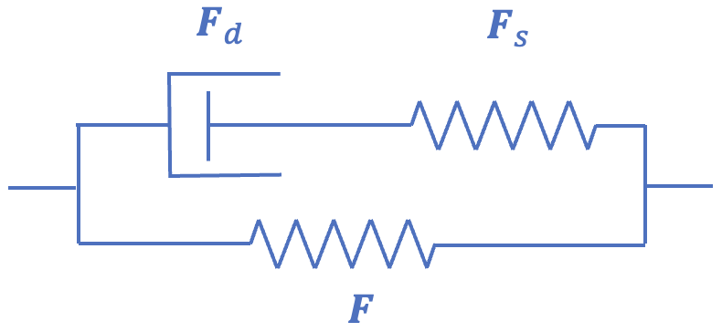
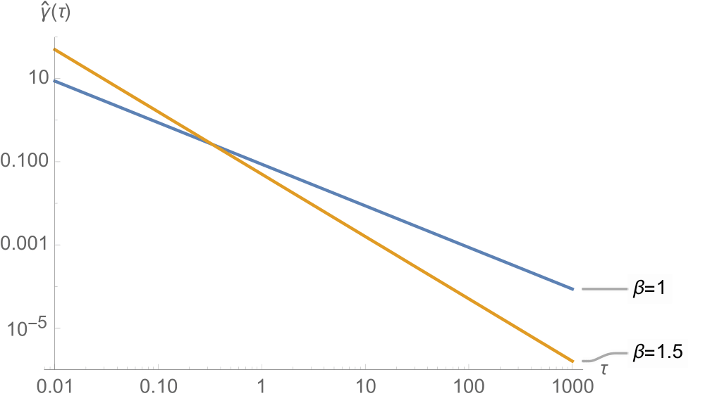
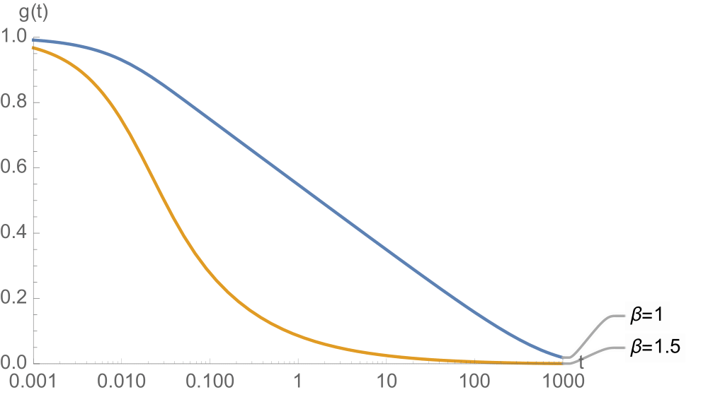
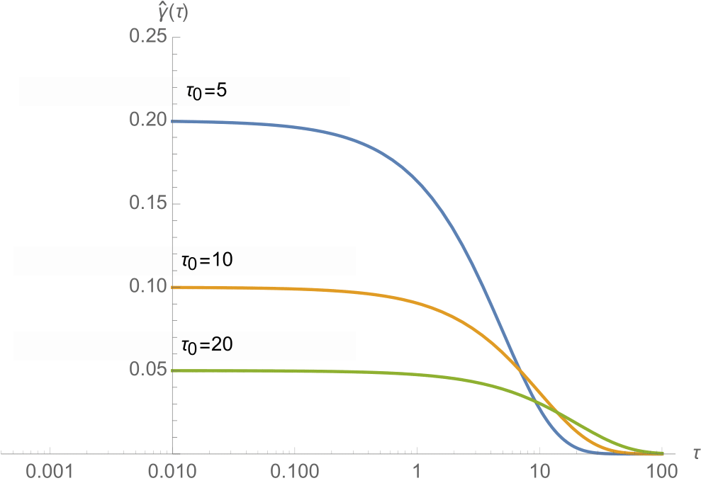
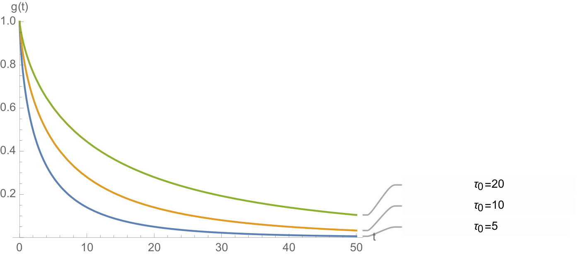

# 5.4 Viscoelasticity {: #sec:Viscoelasticity }

When some of the energy stored during mechanical loading of a material gets dissipated into heat, the material's response is called inelastic. Inelastic behaviors include viscoelasticity and plasticity, although this presentation focuses exclusively on viscoelasticity. In continuum mechanics, we can identify three forms of viscoelasticity in materials. Viscoelasticity may occur due to (1) friction between molecules of the same material, (2) friction between solid and fluid matter in a porous deformable medium, and (3) breaking and reforming of weak bonds between molecules of the same material. The first form is classically described as the viscous response of a material, whereby the friction between molecules of the same material is represented by the material's viscosity [^5.4-1]. The second form is classically described by poroelasticity [^5.4-2][^5.4-3] or biphasic [^5.4-4] theory, whereby the frictional drag between the porous solid and its interstitial fluid is represented by the hydraulic permeability (also known as Darcy's law of permeation), see Section [Biphasic Material](../chapter2/2.7-biphasic-material.md#sec:Biphasic-Material). The last form was proposed by Green and Tobolsky [^5.4-5][^5.4-6] as the fundamental mechanism for viscoelasticity in polymers. Recently, we presented a constrained reactive mixture approach to formulate a reactive viscoelasticity theory that embodies the molecular mechanism of viscoelasticity proposed by those authors [^5.4-7][^5.4-8], see Section [Reactive Viscoelasticity](#sec:Reactive-Viscoelasticity). A conventional approach for modeling viscoelasticity uses the framework of internal state variables [^5.4-9], whereby we may decompose the deformation gradient $\mathbf{F}$ into deformations occurring in a microstructural model of the material, consisting of a spring and dashpot in series [^5.4-10][^5.4-11][^5.4-12], see Section[Internal State Variable Theory](#subsec:Internal-State-Variable).

## Internal State Variable Theory {: #subsec:Internal-State-Variable }

We may model a continuum version of the standard linear solid using quasilinear viscoelasticity, as shown for example by Simo [^5.4-11], though we make minor modifications and extensions to his presentation here. Consider that the microstructural model of this viscoelastic material consists of a spring and dashpot in series (a Maxwell model), combined with a spring in parallel, which is equivalent to the Maxwell representation of a standard linear solid in linear viscoelasticity (Figure [Figure (5.4)](#fig:spring-dashpot-model)). The total deformation gradient, associated with the parallel spring, is $\mathbf{F}=\mathbf{F}_{s}\cdot\mathbf{F}_{d}$, where $\mathbf{F}_{s}$ is the internal state variable representing the deformation gradient associated with the series spring of the Maxwell model, and $\mathbf{F}_{d}$ is that associated with the dashpot. The second Piola-Kirchhoff stress in the parallel spring is given by

/// figure-caption

Spring-dashpot model for Maxwell representation of the standard solid.

///

\[ \begin{equation} \mathbf{S}^{e}\left(\mathbf{F}\right)=\frac{\partial\Psi_{r}^{e}}{\partial\mathbf{E}}\,,\label{eq:IVT-parallel-spring-stress} \end{equation} \]

where $\mathbf{E}=\frac{1}{2}\left(\mathbf{F}^{T}\cdot\mathbf{F}-\mathbf{I}\right)$ is the Lagrange strain tensor derived from $\mathbf{F}$. In this quasilinear viscoelasticity theory, the second Piola-Kirchhoff stress in the Maxwell spring is given by

\[ \begin{equation} \mathbf{M}\left(\mathbf{F}_{s}\right)=\gamma\mathbf{S}^{e}\left(\mathbf{F}_{s}\right)\,,\label{eq:IVT-series-spring-stress} \end{equation} \]

where $\gamma\ge0$ is a user-defined non-dimensional parameter that produces standard hyperelasticity in the limit when $\gamma=0$. Note that $\mathbf{S}^{e}$ in eq.\eqref{eq:IVT-series-spring-stress} uses the same constitutive model as in eq.\eqref{eq:IVT-parallel-spring-stress}, but its argument is different ($\mathbf{F}_{s}$ instead of $\mathbf{F}$). By recognizing that $\mathbf{M}$ should also be the stress in the Maxwell dashpot, we use eq.\eqref{eq:IVT-series-spring-stress} to find that

\[ \begin{equation} \dot{\mathbf{S}}^{e}\left(\mathbf{F}_{s}\left(t\right)\right)+\frac{1}{\tau}\mathbf{S}^{e}\left(\mathbf{F}_{s}\left(t\right)\right)=\dot{\mathbf{S}}^{e}\left(\mathbf{F}\left(t\right)\right)\,,\quad\mathbf{S}^{e}\left(\mathbf{F}_{s}\left(0\right)\right)=\mathbf{0}\,,\label{eq:IVT-ODE} \end{equation} \]

where the time constant $\tau$ is the ratio of the damping coefficient in the dashpot to the Maxwell spring stiffness, and the dot operator represents the material time derivative in the material frame. The solution to this _linear_ ordinary differential equation (hence, quasi_-linear_ viscoelasticity theory) is

\[ \begin{equation} \mathbf{S}^{e}\left(\mathbf{F}_{s}\left(t\right)\right)=\int_{0}^{t}e^{-\left(t-s\right)/\nu}\frac{d\mathbf{S}^{e}\left(\mathbf{F}\left(s\right)\right)}{ds}\,ds\,.\label{eq:IVT-P-solution} \end{equation} \]

Now, the total stress $\mathbf{S}$ in this material, which is the sum of stresses in the two springs, $\mathbf{S}=\mathbf{S}^{e}\left(\mathbf{F}\right)+\gamma\mathbf{S}^{e}\left(\mathbf{F}_{s}\right)$, reduces to the familiar form

\[ \begin{equation} \mathbf{S}=\int_{0}^{t}G\left(t-s\right)\frac{d\mathbf{S}^{e}\left(\mathbf{F}\left(s\right)\right)}{ds}\,ds\,,\label{eq:IVT-total-stress} \end{equation} \]

where

\[ \begin{equation} G\left(t\right)=1+\gamma e^{-t/\tau}\label{eq:IVT-relaxation-fcn} \end{equation} \]

is called the relaxation function. A convenient and efficient numerical scheme for solving for $\mathbf{S}$ in eq.\eqref{eq:IVT-total-stress} was given previously by Puso and Weiss [^5.4-13], where they used $\mathbf{H}$ to denote $\mathbf{S}^{e}\left(\mathbf{F}_{s}\right)$ (see Section [Puso and Weiss Numerical Scheme](#subsec:Puso-Weiss-Scheme)). Of course, the last step in this analysis is to evaluate the Cauchy stress from eq.\eqref{eq:IVT-total-stress} using the standard push-forward formula $\boldsymbol{\sigma}=J^{-1}\mathbf{F}\cdot\mathbf{S}\cdot\mathbf{F}^{T}$.

The strain energy density associated with this viscoelastic material corresponds to that stored in the two springs. Its continuum form is

\[ \begin{equation} \Psi_{r}=\Psi_{r}^{e}\left(\mathbf{F}\right)+\gamma\Psi_{r}^{e}\left(\mathbf{F}_{s}\right)\,.\label{eq:IVT-SED} \end{equation} \]

It is important to note that this presentation does not provide an explicit solution for $\mathbf{F}_{s}\left(t\right)$. In principle, it is possible to extract a suitable measure of strain associated with $\mathbf{F}_{s}\left(t\right)$ by inverting eq.\eqref{eq:IVT-P-solution}, since $\mathbf{S}^{e}\left(\mathbf{F}_{s}\left(t\right)\right)$ must be evaluated explicitly in this scheme as part of the solution for $\mathbf{S}$ in eq.\eqref{eq:IVT-total-stress}. This inversion requires the adoption of suitable constitutive assumptions about the multiplicative decomposition $\mathbf{F}=\mathbf{F}_{s}\cdot\mathbf{F}_{d}$; it may possibly be numerically expensive.

In the context of reactive viscoelasticity (see Section [Reactive Viscoelasticity](#sec:Reactive-Viscoelasticity)), in eq.\eqref{eq:IVT-SED} we can refer to $\Psi_{r}^{e}\left(\mathbf{F}\right)$ as the strong bond strain energy density, since it persists under a non-zero strain, whereas $\gamma\Psi_{r}^{e}\left(\mathbf{F}_{s}\right)$ represents the weak bond strain energy density, since it decays to zero under a constant strain as $t\to\infty$.

### Strain Energy Density in Standard Solid {: #subsec:SED-Standard-Solid }

For example, in the special case of a stress-relaxation response to an instantaneous step strain, evaluated from $\mathbf{F}\left(0^{+}\right)$, we may let $\mathbf{F}_{s}\left(0^{+}\right)=\mathbf{F}\left(0^{+}\right)$ since the dashpot cannot deform instantaneously, under the reasonable constitutive assumption that there is no rigid body rotation associated with the dashpot distinct from that of the Maxwell series spring, thus $\mathbf{F}_{d}\left(0^{+}\right)=\mathbf{I}$. If we adopt this assumption for all times $t$, then we can also conclude that the right stretch tensor $\mathbf{U}_{s}$ of the Maxwell spring deformation gradient tends toward $\mathbf{I}$ in the limit as $t\to\infty$, as the dashpot elongates or contracts to match the right-stretch tensor of the parallel spring, also implying that $\Psi_{r}^{e}\left(\mathbf{F}_{s}\right)\to0$ in this limit.

Building upon this example, we can assume more generally that $\mathbf{U}=\mathbf{U}_{s}\cdot\mathbf{U}_{d}$ under the constitutive assumption that the rotation tensor $\mathbf{R}$ in the polar decomposition of $\mathbf{F}=\mathbf{R}\cdot\mathbf{U}$ is the same in both branches of the microstructural model. However, for self-consistency, we must also assume that $\mathbf{U}_{s}$ and $\mathbf{U}_{d}$ share the same eigenvectors as $\mathbf{U}$ to preserve the symmetry of all three right-stretch tensors. Thus, a valid constitutive model for the multiplicative decomposition is to let $\mathbf{U}_{s}=\mathbf{U}^{\alpha}$ and $\mathbf{U}_{d}=\mathbf{U}^{1-\alpha}$, where the exponent $\alpha\left(t\right)$ is a scalar function of time that can be obtained by solving eq.\eqref{eq:IVT-total-stress} in the form $\gamma\mathbf{S}^{e}\left(\mathbf{U}^{\alpha}\right)=\mathbf{S}\left(\mathbf{U}\right)-\mathbf{S}^{e}\left(\mathbf{U}\right)$ at the current time $t$. This constitutive model is insensitive to flipping the spring and dashopt sequence in the Maxwell element, as should be expected. Now, for an instantaneous step strain, we would have $\alpha\left(0^{+}\right)=1$, whereas the steady-state response to a step strain would produce $\lim_{t\to\infty}\alpha\left(t\right)=0$. Logically, it would be reasonable to expect that $\alpha\left(t\right)$ must remain in the range $0\le\alpha\le1$, since we cannot physically justify that the Maxwell spring would stretch (expand or contract) by a greater amount than the parallel spring. A more formal enforcement of thermodynamic constraints of this internal variable theory [^5.4-9], not provided here, should confirm this expectation.

### Puso and Weiss Numerical Scheme {: #subsec:Puso-Weiss-Scheme }

Here we consider the slightly more general case where the relaxation function is given by a Prony series

\[ \begin{equation} G\left(t\right)=\gamma_{0}+\sum\limits_{i=1}^{N}\gamma_{i}\exp\left(-t/\tau_{i}\right)\,.\label{eq486} \end{equation} \]

With this function chosen for the relaxation function, we can write the total stress as

\[ \begin{equation} \mathbf{S}\left(t\right)=\int\limits_{0}^{t}\left(\gamma_{0}+\sum\limits_{i=1}^{N}\gamma_{i}\exp\left(\left(-t+s\right)/\tau_{i}\right)\frac{d\mathbf{S}^{e}}{ds}\right)\,ds\,.\label{eq487} \end{equation} \]

Introducing the internal variables,

\[ \begin{equation} \mathbf{H}^{\left(i\right)}\left(t\right)=\int\limits_{0}^{t}\exp\left[-\left(t-s\right)/\tau_{i}\right]\frac{d\mathbf{S}^{e}}{ds}\,ds\,,\label{eq488} \end{equation} \]

we can rewrite \eqref{eq487} as follows,

\[ \begin{equation} \mathbf{S}\left(t\right)=\gamma_{0}\mathbf{S}^{e}\left(t\right)+\sum\limits_{i=1}^{N}\gamma_{i}\mathbf{H}^{\left(i\right)}\left(t\right)\,.\label{eq489} \end{equation} \]

In FEBio, $\gamma_{0}=1$, so $\mathbf{S}^{e}$ is the long-term elastic response of the material.

The question now remains how to evaluate the internal variables. From equation \eqref{eq488} it appears that we have to integrate over the entire time domain. However, we can find a recurrence relationship that will allow us to evaluate the internal variables at a time $t+\Delta t$ given the values at time $t$.

\[ \begin{equation} \begin{aligned}\mathbf{H}^{\left(i\right)}\left(t+\Delta t\right) & =\int\limits_{0}^{t+\Delta t}\exp\left[-\left(t+\Delta t-s\right)/\tau_{i}\right]\frac{d\mathbf{S}^{e}}{ds}\,ds\\ & =\exp\left(-\Delta t/\tau_{i}\right)\int\limits_{0}^{t}\exp\left[-\left(t-s\right)/\tau_{i}\right]\frac{d\mathbf{S}^{e}}{ds}\,ds+\int\limits_{t}^{t+\Delta t}\exp\left[-\left(t+\Delta t-s\right)/\tau_{i}\right]\frac{d\mathbf{S}^{e}}{ds}\,ds\\ & =\exp\left(-\Delta t/\tau_{i}\right)\mathbf{H}^{\left(i\right)}\left(t\right)+\int\limits_{t}^{t+\Delta t}\exp\left[-\left(t+\Delta t-s\right)/\tau_{i}\right]\frac{d\mathbf{S}^{e}}{ds}\,ds\,. \end{aligned} \label{eq490} \end{equation} \]

The last term can now be simplified using the midpoint rule to approximate the derivate. In that case we find the recurrence relation:

\[ \begin{equation} \mathbf{H}^{\left(i\right)}\left(t+\Delta t\right)=\exp\left(-\Delta t/\tau_{i}\right)\mathbf{H}^{\left(i\right)}\left(t\right)+\frac{1-\exp\left(-\Delta t/\tau_{i}\right)}{\Delta t/\tau_{i}}\left(\mathbf{S}^{e}\left(t+\Delta t\right)-\mathbf{S}^{e}\left(t\right)\right)\,.\label{eq491} \end{equation} \]

The following procedure can now be applied to calculate the new stress. Given $\mathbf{S}_{n}^{e}$ and $\mathbf{H}_{n}^{\left(i\right)}$ corresponding to time $t$, find $\mathbf{S}_{n+1}^{e}$ and $\mathbf{H}_{n+1}^{\left(i\right)}$ corresponding to time $t+\Delta t$:

1. calculate elastic stress:

    \[ \mathbf{S}_{n+1}^{e}=2\frac{\partial\Psi_{r}^{e}}{\partial\mathbf{C}_{n+1}}\,, \]

1. evaluate internal variables:

    \[ \mathbf{H}_{n+1}^{i}=\exp\left(-\Delta t/\tau_{i}\right)\mathbf{H}_{n}^{i}+\frac{1-\exp\left(-\Delta t/\tau_{i}\right)}{\Delta t/\tau_{i}}\left(\mathbf{S}_{n+1}^{e}-\mathbf{S}_{n}^{e}\right)\,, \]

1. find the total stress:

    \[ \mathbf{S}_{n+1}=\gamma_{0}\mathbf{S}_{n+1}^{e}+\sum\limits_{i=1}^{N}\gamma_{i}\mathbf{H}_{n+1}^{i}\,. \]

## Reactive Viscoelasticity {: #sec:Reactive-Viscoelasticity }

Reactive viscoelasticity models a material as a mixture of strong bonds, which are permanent, and weak bonds, which break and reform in response to loading [^5.4-7][^5.4-14]. This framework is based on constrained reactive mixtures of solids (Section [Constrained Reactive Mixture of Solids](../chapter2/2.10-constrained-reactive-mixture-of-solids.md#sec:Mixture-of-Solids)). Strong bonds produce the equilibrium elastic response, whereas weak bonds produce the transient viscous response. Strong bonds are in a stress-free state when in their reference configuration $\mathbf{X}$. Their deformation gradient is defined as usual, $\mathbf{F}\left(\mathbf{X},t\right)=\partial\boldsymbol{\chi}\left(\mathbf{X},t\right)/\partial\mathbf{X}$. When weak bonds break in response to loading at some time $u$, they reform instantaneously in a stress-free configuration $\mathbf{X}^{u}$ that coincides with the current configuration at time $u$, thus, $\mathbf{X}^{u}=\boldsymbol{\chi}\left(\mathbf{X},u\right)$. Therefore, a reaction transforms intact loaded bonds into reformed unloaded bonds. Weak bonds that reform at time $u$ may be called $u-$generation bonds. The deformation gradient of $u-$generation weak bonds relative to their reference configuration $\mathbf{X}^{u}$ is denoted by $\mathbf{F}^{u}\left(\mathbf{X},t\right)$, which may be evaluated from the chain rule,

\[ \begin{equation} \mathbf{F}\left(\mathbf{X},t\right)=\mathbf{F}^{u}\left(\mathbf{X},t\right)\cdot\bar{\mathbf{R}}\left(\mathbf{X},u\right)\cdot\mathbf{U}\left(\mathbf{X},u\right)\,,\label{eq492} \end{equation} \]

where $\mathbf{U}$ is the right-stretch tensor of $\mathbf{F}=\mathbf{R}\cdot\mathbf{U}$ and $\bar{\mathbf{R}}=\left(\mathbf{R}^{u}\right)^{T}\cdot\mathbf{R}$ is the relative rotation between generation $u$ and the master generation. The strain energy density $\Psi_{r}$ in a reactive viscoelastic material is given by

\[ \begin{equation} \Psi_{r}\left(\mathbf{F}\right)=\Psi_{r}^{e}\left(\mathbf{F}\right)+\sum\limits_{u}w^{u}\Psi_{0}^{b}\left(\mathbf{F}^{u}\right)\,,\label{eq493} \end{equation} \]

where $\Psi_{r}^{e}$ is the strain energy density of strong bonds and $\Psi_{0}^{b}$ is the strain energy density of weak bonds, when they all belong to the same generation. In this expression, $w^{u}\left(\mathbf{X},t\right)$ is the mass fraction of $u-$generation weak bonds, which evolves over time as described below. The summation is taken over all generations $u$ that were created prior to the current time $t$. Based on eq.[(2.10-15)](../chapter2/2.10-constrained-reactive-mixture-of-solids.md#mjx-eqn:eq:febio-mixture-stress), the mixture Cauchy stress $\sigma$ in a reactive viscoelastic material is similarly given by

\[ \begin{equation} \boldsymbol{\sigma}\left(\mathbf{F}^{s}\right)=\boldsymbol{\sigma}^{e}\left(\mathbf{F}^{s}\right)+\sum\limits_{u}w^{u}J^{-1}\left(u\right)\boldsymbol{\sigma}_{0}^{b}\left(\mathbf{F}^{u}\right)\,,\label{eq494} \end{equation} \]

where $\boldsymbol{\sigma}^{e}$ is the stress in the strong bonds and $\boldsymbol{\sigma}_{0}^{b}$ is the stress in the weak bonds. These stresses are related to the respective strain energy densities of strong and weak bonds according to

\[ \begin{equation} \boldsymbol{\sigma}^{e}\left(\mathbf{F}^{s}\right)=\frac{1}{J^{s}}\frac{\partial\Psi_{r}^{e}\left(\mathbf{F}^{s}\right)}{\partial\mathbf{F}^{s}}\cdot\left(\mathbf{F}^{s}\right)^{T},\quad\boldsymbol{\sigma}_{0}^{b}\left(\mathbf{F}^{u}\right)=\frac{1}{J^{u}}\frac{\partial\Psi_{0}^{b}\left(\mathbf{F}^{u}\right)}{\partial\mathbf{F}^{u}}\cdot\left(\mathbf{F}^{u}\right)^{T}\,.\label{eq495} \end{equation} \]

The mass fractions $w^{u}\left(\mathbf{X},t\right)$ are obtained by solving the equation of mass balance for reactive constrained mixtures,

\[ \begin{equation} \dot{w}^{u}=\hat{w}^{u}\left(\mathbf{F},w^{\gamma}\right)\,,\label{eq496} \end{equation} \]

where the mass fraction supply $\hat{w}^{u}$ must be specified as a constitutive function of the deformation gradient $\mathbf{F}$ and the mass fractions $w^{\gamma}$ from all generations. Since mass must be conserved over all generations, it follows that

\[ \begin{equation} \sum\limits_{u}\hat{w}^{u}=0,\quad\sum\limits_{u}w^{u}=1\,.\label{eq497} \end{equation} \]

Any number of valid solutions may exist for $w^{u}$, based on constitutive assumptions for $\hat{w}^{u}$. For example, for $u-$generation bonds reforming in an unloaded state during the time interval $u\leqslant t<v$, and subsequently breaking in response to loading at $t=v$, Type I bond kinetics provides a solution of the form

\[ \begin{equation} w^{u}\left(\mathbf{X},t\right)=\begin{cases} 0 & t<u\\ f^{u}\left(\mathbf{X},t\right) & u\leqslant t<v\\ f^{u}\left(\mathbf{X},v\right)g\left(\mathbf{F}\left(v\right);\mathbf{X},t-v\right) & v\leqslant t \end{cases}\,,\label{eq498} \end{equation} \]

where

\[ \begin{equation} f^{u}\left(\mathbf{X},t\right)=1-\sum\limits_{\gamma<u}w^{\gamma}\left(\mathbf{X},t\right)\,,\label{eq499} \end{equation} \]

and $g\left(\mathbf{F}\left(v\right);\mathbf{X},t-v\right)$ is a reduced relaxation function which may assume any number of valid forms. (A reduced relaxation function $g\left(t\right)$ satisfies $g\left(0\right)=1$ and $g\left(t\to\infty\right)=0$, and decreases monotonically with $t$.) In particular, $g$ may depend on the state of strain at time $v$ when the $u-$generation starts breaking and reforming. In the recursive expression of eq.\eqref{eq498}, the earliest generation $u=-\infty$, which is initially at rest, produces $w^{u}\left(t\right)=1$ for $t<v$ and $w^{u}\left(t\right)=g\left(\mathbf{F}\left(v\right);\mathbf{X},t-v\right)$ for $t\geqslant v$; this latter expression seeds the recursion for subsequent generations. Therefore, providing a functional form for $g$ suffices to produce the solution for all bond generations $u$.

For Type II bond kinetics, the solution for the mass fractions is given by

\[ \begin{equation} w^{u}\left(t\right)=\begin{cases} 0 & t<u\\ 1-g\left(t-u\right) & u\leqslant t<v\\ g\left(t-v\right)-g\left(t-u\right) & v\leqslant t \end{cases}\,.\label{eq500} \end{equation} \]

For this type of bond kinetics, the reduced relaxation function $g$ cannot depend on the magnitude of the strain, because strain-dependence might violate the constraint $0\leqslant w^{u}\leqslant1$. Thus, type II bond kinetics is only valid for quasilinear viscoelasticity, whereas type I bond kinetics also encompasses nonlinear viscoelasticity.

For all bond kinetics, it is also possible to constrain the occurrence of the breaking-and-reforming reaction to specific forms of the strain. For example, the reaction may be allowed to proceed only in the case of dilatational strain, or only in the case of distortional strain.

The finite element implementation of reactive viscoelasticity stores the value of time $v$, mass fraction of reformed bonds $f^{u}\left(\mathbf{X},v\right)$, and the right stretch tensor $\mathbf{U}\left(\mathbf{X},v\right)$ needed to evaluate $w^{u}$ in eq.\eqref{eq498} and $\mathbf{F}^{v}\left(\mathbf{X},t\right)$ in eq.\eqref{eq492}.

### Constitutive Model for $\bar{\mathbf{R}}$ {: #subsec:Constitutive-Model-Rbar }

In reactive viscoelasticity we adopt the constitutive assumption that $\mathbf{U}^{u}=\mathbf{I}$, thus $\mathbf{F}^{u}=\mathbf{R}^{u}$, at time $t^{u}$ when generation $u$ must come into existence in a stress-free state. Since $\bar{\mathbf{R}}$ in eq.\eqref{eq492} must be a proper orthogonal transformation, we may select

\[ \begin{equation} \begin{aligned}\bar{\mathbf{R}} & =\mathbf{I}\,.\end{aligned} \label{eq:A-R-identity} \end{equation} \]

Since this choice is invariant to any transformation $\mathbf{Q}$ it remains valid for all material symmetries, ranging from triclinic to isotropic. Therefore, eq.\eqref{eq492} now takes the form

\[ \begin{equation} \mathbf{F}^{u}\left(\mathbf{X},t\right)=\mathbf{F}\left(\mathbf{X},t\right)\cdot\mathbf{U}^{-1}\left(\mathbf{X},u\right)\label{eq:rv-Fu-model} \end{equation} \]

where $\mathbf{U}$ is the right stretch tensor of $\mathbf{F}$.

There remains one special case that must be addressed with a separate choice for $\bar{\mathbf{R}}$. In biomechanics we often find it convenient to model fibrous or fibrillar materials using one-dimensional fibers that can only sustain tension. Typically, such fibers are represented with a strain energy density function

\[ \begin{equation} \begin{aligned}\Psi_{0}\left(\mathbf{C}\right) & =H\left(I_{n}-1\right)\Psi_{n}\left(I_{n}\right)\,, & I_{n} & =\mathbf{n}_{r}\cdot\mathbf{C}\cdot\mathbf{n}_{r}\end{aligned} \label{eq:A-fiber-models} \end{equation} \]

where $\mathbf{n}_{r}$ is the unit vector along the fiber in its reference configuration, and $I_{n}$ is the square of the stretch ratio along the fiber. The Heaviside unit step function $H\left(I_{n}-1\right)$ in eq.\eqref{eq:A-fiber-models} ensures that the fiber contributes strain energy only when it is under tension ($I_{n}>1$); thus, the constitutive model $\Psi_{n}\left(I_{n}\right)$ for the tensile response of the fiber must reduce to zero when $I_{n}=1$.

In the reactive viscoelasticity framework, each generation $u$ comes into existence at time $t^{u}$, thus the constitutive model for the fiber must account for the fact that the fiber orientation is no longer along $\mathbf{n}_{r}$ at time $t^{u}$. Indeed, the total weak bond free energy in a reactive viscoelastic material now reduces to

\[ \begin{equation} \begin{aligned}\sum_{u}w^{u}\Psi_{0}^{b}\left(\mathbf{F}^{u}\left(t\right)\right) & =\sum_{u}w^{u}H\left(I_{n}^{u}-1\right)\Psi_{n}\left(I_{n}^{u}\right)\\ I_{n}^{u} & =\mathbf{n}_{r}^{u}\cdot\mathbf{C}^{u}\cdot\mathbf{n}_{r}^{u} \end{aligned} \label{eq:A-fiber-SED} \end{equation} \]

where $\mathbf{n}_{r}^{u}$ is the fiber orientation at time $t^{u}$ and $I_{n}^{u}$ is the square of the stretch ratio of the fiber relative to its reference configuration at time $t^{u}$. Recall that the elemental line along $\mathbf{n}_{r}$ gets transformed in the material frame at any time $t$ by $\mathbf{U}$ to $\lambda_{n}\mathbf{n}=\mathbf{U}\cdot\mathbf{n}_{r}$ where

\[ \begin{equation} \begin{aligned}\lambda_{n} & =\sqrt{\mathbf{n}_{r}\cdot\mathbf{C}\cdot\mathbf{n}_{r}}\,, & \mathbf{n} & =\frac{1}{\lambda_{n}}\mathbf{U}\cdot\mathbf{n}_{r}\end{aligned} \label{eq:A-fiber-current} \end{equation} \]

At time $t^{u}$ when generation $u$ forms in a stress-free state, it follows that the fiber material is now based on the orientation $\mathbf{n}_{r}^{u}\equiv\mathbf{n}\left(t^{u}\right)$, evaluated using $\mathbf{U}\left(\mathbf{X},t^{u}\right)$ as shown in eq.\eqref{eq:A-fiber-current}. In general, $\mathbf{n}_{r}^{u}$ and $\mathbf{n}_{r}$ need not be collinear, therefore we can find the rotation $\bar{\mathbf{R}}$ that transforms $\mathbf{n}_{r}^{u}$ to $\mathbf{n}_{r}$,

\[ \begin{equation} \bar{\mathbf{R}}=\left(1-\cos\gamma\right)\mathbf{m}\otimes\mathbf{m}+\cos\gamma\mathbf{I}-\mathbb{E}\cdot\left(\sin\gamma\,\mathbf{m}\right)\label{eq:A-R-fiber} \end{equation} \]

with $\cos\gamma=\mathbf{n}_{r}^{u}\cdot\mathbf{n}_{r}$ and $\sin\gamma\,\mathbf{m}=\mathbf{n}_{r}^{u}\times\mathbf{n}_{r}$. In this expression, $\mathbf{m}$ is the unit vector along the rotation axis, $\gamma$ is the rotation angle about the axis, and $\mathbb{E}$ represents the (pseudo-)third-order permutation tensor whose components are equal to the permutation symbol $\varepsilon_{ijk}$. Thus, $-\mathbb{E}\cdot\boldsymbol{\omega}$ is the antisymmetric second-order tensor $\boldsymbol{\Omega}$ whose dual vector is $\boldsymbol{\omega}$, from which it follows that $\boldsymbol{\Omega}\cdot\mathbf{a}=\boldsymbol{\omega}\times\mathbf{a}$ for any vector $\mathbf{a}$. Here again, since $\bar{\mathbf{R}}$ represents a relative rotation between the material vectors $\mathbf{n}_{r}^{u}$ and $\mathbf{n}_{r}$, it is invariant to any transformation $\mathbf{Q}$.

In practice it is not necessary to evaluate $\bar{\mathbf{R}}$ in eq.\eqref{eq:A-R-fiber} for each generation $u$ of each fiber in a material model; instead one can reset the fiber direction from $\mathbf{n}_{r}$ to $\mathbf{n}_{r}^{u}=\mathbf{n}\left(u\right)$, where $\mathbf{n}$ is evaluated as per eq.\eqref{eq:A-fiber-current}, requiring only the storage of $\mathbf{U}\left(\mathbf{X},u\right)$ for each generation $u$. This scheme may also be used with continuous fiber distributions [^5.4-15]. As explained in [^5.4-14], this constitutive model for $\bar{\mathbf{R}}$ ensures that cyclical loading of a reactive viscoelastic fibrous material never produces compressive fiber stresses.

### Reduced Relaxation Functions {: #subsec:Reduced-Relaxation-Functions }

Reduced relaxation functions are monotonically decreasing functions of time $g\left(t\right)$ that satisfy $g\left(0\right)=1$ and $\lim_{t\to\infty}g\left(t\right)=0$. Many different forms of reduced relaxation functions are available in FEBio, given in the [_FEBio User's Manual_](https://febio.org/knowledgebase/). The simplest and most commonly used relaxation function is the exponential function $g\left(t\right)=e^{-t/\tau}$, where $\tau$ is the relaxation constant. In viscoelasticity theory it is common to use a combination of relaxation functions with distinct relaxation constants $\tau_{i}$, described as a Prony series of the form

\[ \begin{equation} g\left(t\right)=\frac{\sum_{i}\gamma_{i}e^{-t/\tau_{i}}}{\sum_{i}\gamma_{i}}\,.\label{eq:rrf-Prony} \end{equation} \]

The coefficients $\gamma_{i}$ are normalized by $\sum_{i}\gamma_{i}$ to enforce $g\left(0\right)=1$. Alternatively, we could have written

\[ \begin{equation} g\left(t\right)=\sum_{i}\hat{\gamma}_{i}e^{-t/\tau_{i}}\,,\quad\sum_{i}\hat{\gamma}_{i}=1\,.\label{eq:rrf-Prony-alt} \end{equation} \]

This type of relaxation function $g\left(t\right)$ is said to have a discrete spectrum of coefficients $\hat{\gamma}_{i}$ corresponding to each $\tau_{i}$.

It is also possible to define a continuous relaxation spectrum $\hat{\gamma}\left(\tau\right)$ such that the reduced relaxation function is given by

\[ \begin{equation} g\left(t\right)=\int_{0}^{\infty}\hat{\gamma}\left(\tau\right)e^{-t/\tau}\,d\tau\,.\label{eq:rrf-g-continuous-spectrum} \end{equation} \]

To satisfy $g\left(0\right)=1$ the continous relaxation spectrum $\hat{\gamma}\left(\tau\right)$ must satisfy

\[ \begin{equation} \int_{0}^{\infty}\hat{\gamma}\left(\tau\right)\,d\tau=1\,.\label{eq:rrf-continuous-spectrum-constraint} \end{equation} \]

For example, Fung [^5.4-16] proposed a relaxation spectrum of the form

\[ \begin{equation} \hat{\gamma}\left(\tau\right)=\begin{cases} \frac{1}{\ln\frac{\tau_{2}}{\tau_{1}}}\frac{1}{\tau} & \tau_{1}\le\tau\le\tau_{2}\\ 0 & \text{otherwise} \end{cases}\,.\label{eq:rrf-Fung-spectrum-72} \end{equation} \]

When substituted into eq.\eqref{eq:rrf-g-continuous-spectrum} it produces

\[ \begin{equation} g\left(t\right)=\frac{\Gamma\left(0,\frac{t}{\tau_{2}}\right)-\Gamma\left(0,\frac{t}{\tau_{1}}\right)}{\ln\frac{\tau_{2}}{\tau_{1}}}=\frac{-\Ei\left(-\frac{t}{\tau_{2}}\right)+\Ei\left(-\frac{t}{\tau_{1}}\right)}{\ln\frac{\tau_{2}}{\tau_{1}}}\,,\label{eq:rrf-Fung-72} \end{equation} \]

where $\Gamma\left(a,z\right)$ is the incomplete gamma function and $\Ei\left(z\right)$ is the exponential integral function, which satisfy $\Gamma\left(0,z\right)=-\Ei\left(-z\right)$. An alternative model proposed later by Fung [^5.4-17] is

\[ \begin{equation} \hat{\gamma}\left(\tau\right)=\begin{cases} \frac{1}{\tau_{2}-\tau_{1}} & \tau_{1}\le\tau\le\tau_{2}\\ 0 & \text{otherwise} \end{cases}\,,\label{eq:rrf-Fung-spectrum-81} \end{equation} \]

which produces

\[ \begin{equation} g\left(t\right)=\frac{\tau_{2}e^{-t/\tau_{2}}-\tau_{1}e^{-t/\tau_{1}}+t\left[\Ei\left(-\frac{t}{\tau_{2}}\right)-\Ei\left(-\frac{t}{\tau_{1}}\right)\right]}{\tau_{2}-\tau_{1}}\,.\label{eq:rrf-Fung-81} \end{equation} \]

A generalization of Fung's earlier continuous relaxation spectrum may be derived from the work of Malkin [^5.4-18] who proposed to use a function proportional to $\tau^{-\beta}$. If we constrain this spectrum to the range $\tau_{1}\le\tau\le\tau_{2}$ it takes the form (Figure [Figure (5.4)](#fig:Malkin-relaxation-spectrum))

/// figure-caption

Continuous relaxation spectrum $\hat{\gamma}\left(\tau\right)$ of eq.\eqref{eq:rrf-Malkin-spectrum}, based on the work of Malkin [^5.4-18], for two representative values of $\beta$.

///

\[ \begin{equation} \hat{\gamma}\left(\tau\right)=\begin{cases} \frac{\beta-1}{\tau_{1}^{1-\beta}-\tau_{2}^{1-\beta}}\frac{1}{\tau^{\beta}} & \tau_{1}\le\tau\le\tau_{2}\\ 0 & \text{otherwise} \end{cases}\,.\label{eq:rrf-Malkin-spectrum} \end{equation} \]

When substituted into \eqref{eq:rrf-g-continuous-spectrum} this continuous relaxation spectrum produces the reduced relaxation function (Figure [Figure (5.4)](#fig:Malkin-reduced-relaxation))

/// figure-caption

Malkin's reduced relaxation function $g\left(t\right)$, eq.\eqref{eq:rrf-Malkin}, for $\tau_{1}=10^{-2}$ and $\tau_{2}=10^{3}$, for two representative values of $\beta$.

///

\[ \begin{equation} g\left(t\right)=\frac{\left(\beta-1\right)t^{1-\beta}}{\tau_{1}^{1-\beta}-\tau_{2}^{1-\beta}}\left[\Gamma\left(\beta-1,\frac{t}{\tau_{2}}\right)-\Gamma\left(\beta-1,\frac{t}{\tau_{1}}\right)\right]\,.\label{eq:rrf-Malkin} \end{equation} \]

In the limit as $\beta\to1$, the expression of eq.\eqref{eq:rrf-Malkin} reduces to eq.\eqref{eq:rrf-Fung-72}. For proper evaluation of the $\Gamma$ function we must have $\beta\ge1$.

Another example for a continuous relaxation spectrum is the exponential spectrum (Figure [Figure (5.4)](#fig:exponential-relaxation-spectrum))

/// figure-caption

Continuous exponential relaxation spectrum $\hat{\gamma}\left(\tau\right)$ of eq.\eqref{eq:rrf-exponential-spectrum}, for three representative values of $\tau_{0}$.

///

\[ \begin{equation} \hat{\gamma}\left(\tau\right)=\frac{1}{\tau_{0}}e^{-\tau/\tau_{0}}\,,\quad0\le\tau<\infty\,,\label{eq:rrf-exponential-spectrum} \end{equation} \]

which produces

\[ \begin{equation} g\left(t\right)=2\sqrt{\frac{t}{\tau_{0}}}K_{1}\left(2\sqrt{\frac{t}{\tau_{0}}}\right)\,,\label{eq:rrf-exponential} \end{equation} \]

where $K_{1}\left(z\right)$ is the modified Bessel function of the second kind, of order 1 (Figure \eqref{fig:relaxation-continuous-exponential}).

/// figure-caption

Reduced relaxation function $g\left(t\right)$ of eq.\eqref{eq:rrf-exponential} for continuous exponential relaxation spectrum, for three representative values of $\tau_{0}$.

///

### Viscous Friction {: #subsec:Viscous-Friction }

The Cauchy stress in a viscous material [^5.4-1] is given by

\[ \begin{equation} \boldsymbol{\sigma}=\boldsymbol{\sigma}^{e}+\boldsymbol{\tau}\,,\label{eq:viscous-friction-stress} \end{equation} \]

where $\boldsymbol{\sigma}^{e}$ is the elastic part of the stress as given in eq.[(2.6-10)](../chapter2/2.6-hyperelasticity.md#mjx-eqn:eq:hyperelastic-stress-C) and $\boldsymbol{\tau}$ is the viscous stress, which depends on the rate of deformation tensor $\mathbf{D}$ (the symmetric part of the velocity gradient). For example, in an isotropic Newtonian viscous response, $\boldsymbol{\tau}=\lambda\left(\text{tr}\mathbf{D}\right)\mathbf{I}+2\mu\mathbf{D}$, where $\lambda$ and $\mu$ are viscosity coefficients. Since $\boldsymbol{\tau}$ reduces to zero under static loading (when $\mathbf{D}=\mathbf{0}$), it follows that $\boldsymbol{\sigma}^{e}$ is the equilibrium response of this type of viscoelastic material. For a viscous fluid, the elastic stress tensor simplifies to $\boldsymbol{\sigma}^{e}=-p\mathbf{I}$, where $p$ is the fluid pressure. In a compressible fluid, $p$ is a function of the volumetric strain (e.g., a function of $J$) and the absolute temperature.

By the nature of eq.\eqref{eq:viscous-friction-stress}, we may interpret this type of viscous material microscopically as a spring and dashpot in parallel, often called a Voigt model in linear viscoelasticity [^5.4-19][^5.4-20], though the general continuum mechanics expression of eq.\eqref{eq:viscous-friction-stress} may encompass nonlinear behaviors for $\boldsymbol{\sigma}^{e}$ and for $\boldsymbol{\tau}$. The energy density dissipated in this type of material is $\boldsymbol{\tau}:\mathbf{D}$.

Though we include this type of viscoelastic model here for completeness, in practice, investigators in biomechanics have rarely adopted this model to describe biological tissues, because it predicts that the stress $\boldsymbol{\tau}$ becomes infinite under a step increase in strain.

[^5.4-1]: Coleman, Bernard D; Noll, Walter. "The thermodynamics of elastic materials with heat conduction and viscosity." *Arch Ration Mech An*, vol. 13, pp. 167--178 (1963).
[^5.4-2]: Cryer, CWA. "A comparison of the three-dimensional consolidation theories of Biot and Terzaghi." *The Quarterly Journal of Mechanics and Applied Mathematics*, vol. 16, pp. 401--412 (1963).
[^5.4-3]: Rice, James R; Cleary, Michael P. "Some basic stress diffusion solutions for fluid-saturated elastic porous media with compressible constituents." *Reviews of Geophysics*, vol. 14, pp. 227--241 (1976).
[^5.4-4]: Mow, V.C.; Kuei, S.C.; Lai, W.M.; Armstrong, C.G.. "Biphasic creep and stress relaxation of articular cartilage in compression: Theory and experiments." *J. Biomech. Eng.*, vol. 102, pp. 73-84 (1980).
[^5.4-5]: Green, MS; Tobolsky, AV. "A new approach to the theory of relaxing polymeric media." *J Chem Phys*, vol. 14, pp. 80--92 (1946).
[^5.4-6]: Tobolsky, Arthur Victor. "Properties and structure of polymers." *New York and London.; John Wiley \&; Sons. Inc.* (1960).
[^5.4-7]: Ateshian, Gerard A. "Viscoelasticity using reactive constrained solid mixtures." *J Biomech*, vol. 48, pp. 941-7 (2015).
[^5.4-8]: Ateshian, Gerard A; Petersen, Courtney A; Maas, Steve A; Weiss, Jeffrey A. "A Numerical Scheme for Anisotropic Reactive Nonlinear Viscoelasticity." *J Biomech Eng*, vol. 145 (2023).
[^5.4-9]: Coleman, Bernard D; Gurtin, Morton E. "Thermodynamics with internal state variables." *J Chem Phys*, vol. 47, pp. 597--613 (1967).
[^5.4-10]: Lubliner, J. "A model of rubber viscoelasticity." *Mech Res Commun*, vol. 12, pp. 93--99 (1985).
[^5.4-11]: Simo, JC. "On a fully three-dimensional finite-strain viscoelastic damage model: formulation and computational aspects." *Computer methods in applied mechanics and engineering*, vol. 60, pp. 153--173 (1987).
[^5.4-12]: Holzapfel, Gerhard A; Simo, Juan C. "A new viscoelastic constitutive model for continuous media at finite thermomechanical changes." *Int J Solids Struct*, vol. 33, pp. 3019--3034 (1996).
[^5.4-13]: Puso, M. A.; Weiss, J. A.. "Finite element implementation of anisotropic quasi-linear viscoelasticity using a discrete spectrum approximation." *J Biomech Eng*, vol. 120, pp. 62-70 (1998).
[^5.4-14]: Ateshian, Gerard A; Kroupa, Kimberly; Petersen, Courtney A; Zimmerman, Brandon; Maas, Steve A; Weiss, Jeffrey A. "Damage Mechanics of Biological Tissues in Relation to Viscoelasticity." *J Biomech Eng* (2022).
[^5.4-15]: Hou, C; Ateshian, G.A.. "A Gauss-Kronrod-Trapezoidal integration scheme for modeling biological tissues with continuous fiber distributions.." *Computer Methods in Biomechanics and Biomedical Engineering*, vol. 19, pp. 883-893 (2016).
[^5.4-16]: Fung, Y. C; Perrone, Nicholas; Anliker, M. "Biomechanics, its foundations and objectives." *Prentice-Hall* (1972).
[^5.4-17]: Fung, Y. C. "Biomechanics: mechanical properties of living tissues." *Springer-Verlag* (1981).
[^5.4-18]: Malkin, A Ya. "Continuous relaxation spectrum-its advantages and methods of calculation." *Applied Mechanics and Engineering*, vol. 11, pp. 235 (2006).
[^5.4-19]: Bland, David Russell. "The theory of linear viscoelasticity." *Courier Dover Publications* (2016).
[^5.4-20]: Coleman, Bernard D; Noll, Walter. "Foundations of linear viscoelasticity." *Reviews of modern physics*, vol. 33, pp. 239 (1961).
