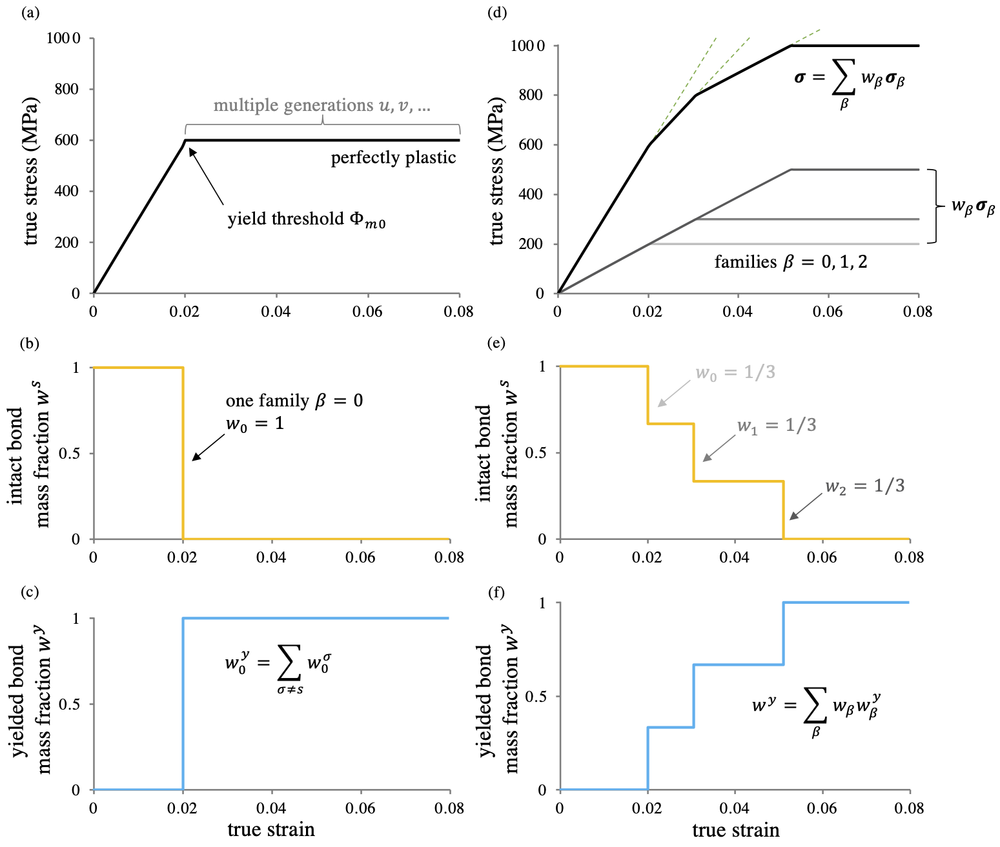
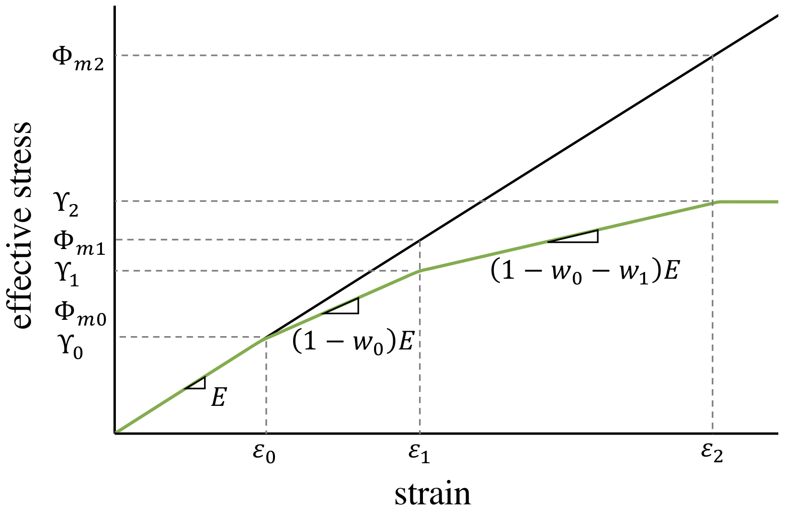
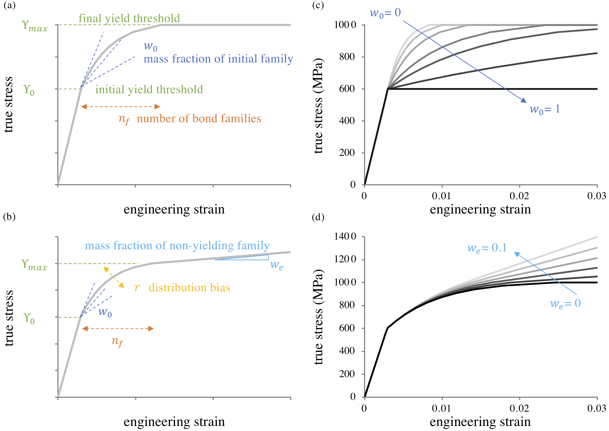

# 5.6 Reactive Plasticity {: #sec:Reactive-Plasticity }

Reactive plasticity models a material as a mixture of bonds that break in response to loading and reform in a stressed state [^5.6-1]. This framework is based on constrained reactive mixtures of solids (Section [Constrained Reactive Mixture of Solids](../chapter2/2.10-constrained-reactive-mixture-of-solids.md#sec:Mixture-of-Solids)).

## Elastic-Perfectly Plastic Response {: #subsec:Elastic-Perfectly-Plastic-Response }

This section describes a reactive framework in which all loaded bonds in an elemental region break and reform simultaneously into a stressed state with a new reference configuration, resulting in elastic-perfectly plastic behavior. The theory outlined here is similar to reactive viscoelasticity (Section [Reactive Viscoelasticity](5.4-viscoelasticity.md#sec:Reactive-Viscoelasticity)) [^5.6-2][^5.6-3], although bonds now reform in a stressed rather than a stress-free state.

The elastic response of this material is achieved when bonds have not yet failed in response to loading. In this case it is assumed that the bonds belong to generation $s$ (the master constituent) whose reference configuration is represented by material points located at $\mathbf{X}^{s}$. When bonds break and reform at time $t^{\sigma}$, a new $\sigma-$generation is formed. Consider that bonds of the $\sigma-$generation yield based on a scalar _yield measure_ $\Phi\left(\mathbf{U}^{\sigma}\right)$ (e.g., the von Mises stress), where $\mathbf{U}^{\sigma}$ is the right stretch tensor from the polar decomposition $\mathbf{F}^{\sigma}=\mathbf{R}\cdot\mathbf{U}^{\sigma}$, and $\mathbf{R}$ is the rotation tensor, assumed to also be the rotation tensor of $\mathbf{F}^{s}$. Thus, according to eq.[(2.10-2)](../chapter2/2.10-constrained-reactive-mixture-of-solids.md#mjx-eqn:eq:general-total-def-grad), $\mathbf{U}^{s}=\mathbf{U}^{\sigma}\cdot\mathbf{F}^{\sigma s}$.

Let the _yield threshold_ for the $\sigma-$generation be given by $\Phi_{m}$, which represents the threshold value at which yielding begins. For $\sigma-$generation bonds the _yield criterion_ may thus be defined as

\[ \begin{equation} \varphi\left(\mathbf{U}^{\sigma}\right)=\Phi\left(\mathbf{U}^{\sigma}\right)-\Phi_{m}\le0\,,\label{eq:plasticity-yield-criterion} \end{equation} \]

where $\varphi\left(\mathbf{U}^{\sigma}\right)$ represents the _yield surface_ of $\sigma-$generation bonds whose _tensorial normal_ is

\[ \begin{equation} \mathbf{N}^{\sigma}=\frac{\partial\varphi}{\partial\mathbf{U}^{\sigma}}=\frac{\partial\Phi\left(\mathbf{U}^{\sigma}\right)}{\partial\mathbf{U}^{\sigma}}\,.\label{eq:plasticity-yield-surface-normal} \end{equation} \]

When yield thresholds are formulated in stress space, the dependence on the deformation takes the form $\Phi=\Phi\left(\boldsymbol{\sigma}^{\sigma}\left(\mathbf{U}^{\sigma}\right)\right)$.

Consider two consecutive generations $\sigma$, denoted by $u$ and $v$, such that the bond-breaking-and-reforming reaction is $\mathcal{E}^{u}\to\mathcal{E}^{v}$. Upon breaking of the $u-$generation to form the $v-$generation the plastic consistency condition is given by $d\varphi=0$, which reduces to

\[ \begin{equation} \mathbf{N}^{u}\left(u\right):\left(\mathbf{U}^{v}\left(v\right)-\mathbf{U}^{u}\left(u\right)\right)=0\,.\label{eq:plastic-consistency-condition} \end{equation} \]

The constitutive model for $\mathbf{F}^{\sigma s}$ is given by

\[ \begin{equation} \left(\mathbf{F}^{vs}\right)^{-1}=\left(\mathbf{F}^{us}\right)^{-1}\cdot\left(\mathbf{I}-\lambda\hat{\mathbf{N}}^{v}\right)\label{eq:plasticity-Fvsi-normality} \end{equation} \]

where

\[ \begin{equation} \hat{\mathbf{N}}^{v}=\frac{\mathbf{N}^{v}}{\sqrt{\mathbf{N}^{v}:\mathbf{N}^{v}}}\, \end{equation} \]

is the unit tensor along $\mathbf{N}^{v}$ and $\lambda$ is a non-dimensional scalar which may be determined analytically by enforcing the plastic consistency condition in eq.\eqref{eq:plastic-consistency-condition}. When the plastic deformation is assumed to be isochoric the solution for $\lambda$ is obtained while enforcing $\det\mathbf{F}^{\sigma s}=1$. For the earliest yielded generation $u$, the preceding $s-$generation is in the elastic regime; therefore, $\mathbf{F}^{us}=\mathbf{I}$ at the start of the recursive relation in eq.\eqref{eq:plasticity-Fvsi-normality}.

The stress response of this solid mixture is given generically by eq.[(2.10-13)](../chapter2/2.10-constrained-reactive-mixture-of-solids.md#mjx-eqn:eq:general-mixture-stress-redux), specialized to the case where each generation $\sigma$ is assumed to have the same constitutive model $\Psi_{0}$ for its strain energy density, $\Psi_{r}^{\sigma}=J^{\sigma s}\Psi_{0}$. For example, in the case of the three consecutive $\sigma$ generations $s$, $u$ and $v$, the strain energy density is $\Psi_{r}\left(\mathbf{F}^{s}\right)=\sum_{\sigma}w^{\sigma}J^{\sigma s}\Psi_{0}\left(\mathbf{U}^{\sigma}\right)$ and the stress is

\[ \begin{equation} \boldsymbol{\sigma}=w^{s}\boldsymbol{\sigma}_{0}\left(\mathbf{U}^{s}\right)+w^{u}\boldsymbol{\sigma}_{0}\left(\mathbf{U}^{u}\right)+w^{v}\boldsymbol{\sigma}_{0}\left(\mathbf{U}^{v}\right)\,,\label{eq:epp-mixture-stress} \end{equation} \]

where $\mathbf{U}^{u}$ and $\mathbf{U}^{v}$ are evaluated from $\mathbf{U}^{s}\cdot\left(\mathbf{F}^{\sigma s}\right)^{-1}=\mathbf{U}^{\sigma}$ ($\sigma=u,v$) and eq.\eqref{eq:plasticity-Fvsi-normality}, and $\boldsymbol{\sigma}_{0}$ is given in eq.[(2.10-16)](../chapter2/2.10-constrained-reactive-mixture-of-solids.md#mjx-eqn:eq:febio-stress-function). For an elastic-perfectly plastic response the bond mass fractions are constitutively assumed to satisfy

\[ \begin{equation} \begin{aligned}w^{s} & =1-H\left(t-t^{u}\right)\end{aligned} \,,\quad w^{u}=H\left(t-t^{u}\right)-H\left(t-t^{v}\right)\,,\quad\begin{aligned}w^{v} & =H\left(t-t^{v}\right)\,,\end{aligned} \label{eq:epp-mass-fractions} \end{equation} \]

where $H\left(\cdot\right)$ is the Heaviside unit step function. The corresponding constitutive models for $\hat{\rho}_{r}^{\sigma}$ may be obtained by substituting these expressions into [(2.10-5)](../chapter2/2.10-constrained-reactive-mixture-of-solids.md#mjx-eqn:eq:mass-balance-alpha-1). The onset of yielding of generations $u$ and $v$ is the time $t$ when $\varphi\left(\mathbf{U}^{s}\right)=0$ ($\mathcal{E}^{s}\to\mathcal{E}^{u}$, $t=t^{u}$) and $\varphi\left(\mathbf{U}^{u}\right)=0$ ($\mathcal{E}^{u}\to\mathcal{E}^{v}$, $t=t^{v}$), respectively. In summary $w^{\sigma}=1$ during the lifetime of generation $\sigma$ ($t^{\sigma}\le t<t^{\sigma+1}$) and $0$ at other times $t$.

## Kinematic “Hardening” Response {: #subsec:Kinematic-Hardening-Response }

The framework presented in Section [Elastic-Perfectly Plastic Response](#subsec:Elastic-Perfectly-Plastic-Response) has considered an elastic-perfectly plastic response, i.e., all the bonds yield when a single yield threshold $\Phi_{m}$ is met. However, a wealth of experimental results show a more progressive yielding, rather than a sudden onset, and an increase in the stress with increasing plastic deformation, a phenomenon alternately termed strain hardening or work hardening. Real materials typically exhibit the Bauschinger effect, where loading to yield in one direction changes the yield threshold in the reverse direction. The hardening behavior that accounts for this effect is known as kinematic hardening; for a load reversal, it predicts yielding occurs when the change in load achieves twice the monotonic yield strength. The reactive plasticity framework can be extended to allow for kinematic hardening by introducing multiple families of bonds. In the current FEBio implementation each bond family $\beta$ shares the same yield criterion $\Phi$ but distinct associated yield thresholds $\Phi_{m\beta}$, and it follows the elastic-perfectly plastic behavior for multiple generations outlined in Section [Elastic-Perfectly Plastic Response](#subsec:Elastic-Perfectly-Plastic-Response). The superposition of multiple bond families $\beta$ in parallel naturally develops behavior consistent with kinematic hardening, as different bond families yield at different thresholds.

We consider $n_{f}$ _bond families_ $\beta=0,\dots,n_{f}-1$, which may yield under different thresholds, where each bond family may evolve over multiple generations $\sigma$. This framework requires us to update our notation to include a subscript $\beta$ for suitable variables introduced in the presentation above. In particular, the reference configuration of generation $\sigma$ in bond family $\beta$ is now denoted by $\mathbf{X}_{\beta}^{\sigma}$ and the corresponding deformation gradient is $\mathbf{F}_{\beta}^{\sigma}$. We assume that the free energy density of each bond family $\beta$ is $\Psi_{\beta r}=J_{\beta}^{\sigma s}\Psi_{0}\left(\mathbf{F}_{\beta}^{\sigma}\right)$, when the mixture consists entirely of bonds of family $\beta$ in generation $\sigma$. The master reference configuration of all bond families remains $\mathbf{X}^{s}$ and the associated (total) deformation gradient is still $\mathbf{F}^{s}$. Therefore, each bond family $\beta$ requires a constitutive relation for the function of state $\mathbf{F}_{\beta}^{\sigma s}$ in the updated form of eq.[(2.10-2)](../chapter2/2.10-constrained-reactive-mixture-of-solids.md#mjx-eqn:eq:general-total-def-grad), such as that given in eq.\eqref{eq:plasticity-Fvsi-normality}, where each term should now include a subscript $\beta$.

The referential mass density of bond family $\beta$ is $\rho_{r\beta}$, such that the mixture referential mass density is given by $\rho_{r}=\sum_{\beta}\rho_{r\beta}$. The referential mass density of generation $\sigma$ in bond family $\beta$ is $\rho_{r\beta}^{\sigma}$, which satisfies $\sum_{\sigma}\rho_{r\beta}^{\sigma}=\rho_{r\beta}$, as per eq.[(2.10-6)](../chapter2/2.10-constrained-reactive-mixture-of-solids.md#mjx-eqn:eq:general-mass-balance). For convenience, we define

\[ \begin{equation} w_{\beta}\equiv\frac{\rho_{r\beta}}{\rho_{r}}\,,\quad\sum_{\beta}w_{\beta}=1\,,\label{eq:multiplebonds-family-mass-balance} \end{equation} \]

which represents the mass fraction of each bond family $\beta$ within the constrained solid mixture, and

\[ \begin{equation} w_{\beta}^{\sigma}=\frac{\rho_{r\beta}^{\sigma}}{\rho_{r\beta}}\,,\quad\sum_{\sigma}w_{\beta}^{\sigma}=1\,,\label{eq:multiplebonds-bond-species-mass-fractions} \end{equation} \]

which represents the mass fraction of each generation $\sigma$ within the bond family $\beta$. From these definitions, it follows that bond family mass fractions $w_{\beta}$ are time-invariant (thus user-selected for a particular material response), whereas generation mass fractions $w_{\beta}^{\sigma}$ evolve with bond-breaking-and-reforming reactions.

The mixture strain energy density $\Psi_{r}$ is now given by

\[ \begin{equation} \Psi_{r}=\sum_{\beta}w_{\beta}\sum_{\sigma}w_{\beta}^{\sigma}J_{\beta}^{\sigma s}\Psi_{0}\left(\mathbf{F}_{\beta}^{\sigma}\right)\,,\label{eq:multiplebonds-mixture-energy} \end{equation} \]

whereas the mixture stress is

\[ \begin{equation} \boldsymbol{\sigma}=\sum_{\beta}w_{\beta}\underbrace{\sum_{\sigma}w_{\beta}^{\sigma}\boldsymbol{\sigma}_{0}\left(\mathbf{F}_{\beta}^{\sigma}\right)}_{\boldsymbol{\sigma}_{\beta}}\,,\quad\boldsymbol{\sigma}_{0}\left(\mathbf{F}_{\beta}^{\sigma}\right)=\frac{1}{J_{\beta}^{\sigma}}\frac{\partial\Psi_{0}}{\partial\mathbf{F}_{\beta}^{\sigma}}\cdot\left(\mathbf{F}_{\beta}^{\sigma}\right)^{T}\,.\label{eq:multiplebonds-mixture-stress} \end{equation} \]

To simplify the remainder of this presentation, we introduce the concept of _yielded bonds_, denoted by $y$, to represent bonds of the current extant generation in a plasticity formulation. The yielded bond fraction for each family $\beta$ is given by

\[ \begin{equation} w_{\beta}^{y}=\sum_{\sigma\neq s}w_{\beta}^{\sigma}=1-w_{\beta}^{s}\label{eq:hardening-yielded-mass-fraction} \end{equation} \]

where the summation runs over all possible yielded generations $\sigma\neq s$. In particular, at time $t=u$, eq.\eqref{eq:hardening-yielded-mass-fraction} reduces to the statement $w_{\beta}^{y}=w_{\beta}^{u}$. We then define the relative deformation gradient of yielded bonds as $\mathbf{F}_{\beta}^{y}$, which equals $\mathbf{F}_{\beta}^{\sigma}$ for the extant generation $\sigma$ in family $\beta$. With these notational changes, we may write the yielding reactions in the form

\[ \begin{equation} \mathcal{E}^{s}\to\underbrace{\mathcal{E}^{u}\rightarrow\mathcal{E}^{v}\rightarrow\dots}_{\mathcal{E}^{y}}\,.\label{eq:hardening-yielded-rxn} \end{equation} \]

Then the mixture stress in eq.\eqref{eq:multiplebonds-mixture-stress} may be rewritten as $\boldsymbol{\sigma}=\sum_{\beta}w_{\beta}\boldsymbol{\sigma}_{\beta}$ where $\boldsymbol{\sigma}_{\beta}=w_{\beta}^{s}\boldsymbol{\sigma}_{0}\left(\mathbf{F}^{s}\right)+\left(1-w_{\beta}^{s}\right)\boldsymbol{\sigma}_{0}\left(\mathbf{F}_{\beta}^{y}\right)$. We may also define the total fraction $w^{s}$ of intact bonds in the mixture as $w^{s}=\sum_{\beta}w_{\beta}w_{\beta}^{s}$, and the total fraction of yielded bonds as $w^{y}=\sum_{\beta}w_{\beta}w_{\beta}^{y}=1-w^{s}$, such that $w^{s}+w^{y}=1$. Then $\boldsymbol{\sigma}=w^{s}\boldsymbol{\sigma}_{0}\left(\mathbf{F}^{s}\right)+\sum_{\beta}w_{\beta}\left(1-w_{\beta}^{s}\right)\boldsymbol{\sigma}_{0}\left(\mathbf{F}_{\beta}^{y}\right)$. The summation in this last expression does not simplify further since $\mathbf{F}_{\beta}^{y}$ is different for each bond family $\beta$.

Let each bond family $\beta$ exhibit an elastic-perfectly plastic response, following the model of Section [Elastic-Perfectly Plastic Response](#subsec:Elastic-Perfectly-Plastic-Response). Once the yield threshold $\Phi_{m\beta}$ is reached, all the intact bonds of that family yield at once, such that $w_{\beta}^{s}=0$ and $w_{\beta}^{y}=1$ as shown for the mixture stress response in Figure [Figure (5.6)](#fig:hardening-families-superposition)a-c. Now consider that there are three bond families, $\beta=0,1,2$ which are weighted evenly, $w_{\beta}=1/3\,\forall\beta$. The stress response for this illustrative example is shown in Figure [Figure (5.6)](#fig:hardening-families-superposition)d-f. Though each bond family is elastic-perfectly plastic, their superposition develops “hardening”-like behavior. At the onset of yielding, when family $\beta=0$ yields, its bond mass fractions are $w_{0}^{s}=0$ and $w_{0}^{y}=1$, implying that this entire family has yielded. However, since the family has a mass fraction $w_{0}=1/3$ in the solid mixture, two-thirds of the bonds in the mixture remain intact at this juncture, $1-w_{0}^{s}=2/3$. As subsequent families $\beta$ yield, their bonds transition from intact to yielded generations in the same manner. Though the resulting stress response in Figure [Figure (5.6)](#fig:hardening-families-superposition)d is classically described as a “hardening” behavior, the reactive plasticity mixture framework proposes a different interpretation, namely that there are multiple elastic-perfectly plastic bond families in the material, each with a different threshold of yielding.

/// figure-caption

The phenomenon described as “kinematic hardening” in classical plasticity may be represented by the superposition of multiple elastic-perfectly plastic bond families with different yield thresholds. The elastic-perfectly plastic stress response of a single bond family $\beta=0$ in the reactive framework is presented in (a), with the initial linear response contributed by the intact bonds $s$; upon yielding at the threshold $\Phi_{m0}$, the perfectly plastic response consists of multiple generations of breaking and reforming bonds $\sigma=u,v,\dots$. The evolution of mass fractions $w_{0}^{s}$ of intact and $w_{0}^{y}$ of yielded bonds is presented in (b) and (c), respectively. The stress response obtained from the superposition of three bond families $\beta=0,1,2$ is shown in (d), where each family occupies the same mass fraction $w_{\beta}$ in the mixture, $w_{0}=w_{1}=w_{2}=\frac{1}{3}$, reproducing the classical kinematic hardening behavior. Green dashed lines help indicate changes in slope due to yielding of each bond family. The corresponding mixture mass fractions of (e) intact bonds $w^{s}$, and (f) yielded bonds $w^{y}=1-w^{s}$ further illustrates the occurence of each yielding reaction.

///

For each bond family $\beta$, the family mass fraction $w_{\beta}$ and the associated yield threshold $\Phi_{m\beta}$ must be provided by constitutive assumption, along with a single constitutive model for $\Psi_{0}$ which applies to all generations of all bond families. The total number $n_{f}$ of bond families must also be provided. Parameters $n_{f}$ and $\left\{ w_{\beta},\Phi_{m\beta}\right\},\,\beta\in\left[0,n_{f}-1\right]$ suffice to define an elastoplastic material which exhibits classical kinematic hardening behavior, for a given elastic response $\Psi_{0}$ and yield criterion $\Phi$.

## Constitutive Modeling of Yield Response {: #subsec:Yield-Constitutive-Modeling }

Here, we provide basic constitutive relations for the parameters $\left\{ w_{\beta},\Phi_{m\beta}\right\},\,\beta\in\left[0,n_{f}-1\right]$ which define an elastoplastic material. We also demonstrate how these various parameters affect the uniaxial stress-strain response of a material. The example in Figure [Figure (5.6)](#fig:hardening-families-superposition)d shows how superposition of multiple elastic-perfectly plastic bond families may create a hardening-like curve.

/// figure-caption

Schematic stress-strain curve illustrating derivation of constitutive models for $\Phi_{m\beta}$. $E$ is Young's modulus of the elastic solid (whose value does not matter here), $\Upsilon_{\beta}$ are the effective yield thresholds for the global material (given), $\varepsilon_{\beta}$ are the yield strains and $\Phi_{m\beta}$ are the true yield thresholds for each bond family, which need to be determined, and $w_{\beta}$ are the family mass fractions (given).

///

In particular, we present a constitutive modeling framework that requires at most six scalar parameters, regardless of the value of $n_{f}$.

Since each family behaves elastically until it yields, a family's yield threshold $\Phi_{m\beta}$ is generally not the value recorded on a stress-strain curve when the slope changes (Figure [Figure (5.6)](#fig:hardening-constitutive-diagram)). That value may be called the _apparent yield threshold_ $\Upsilon_{\beta}$, which can be related to the true yield threshold $\Phi_{m\beta}$ by assuming a linear elastic stress-strain relationship prior to yielding. For simplicity, we assume that $\Upsilon_{\beta}$ values are evenly distributed between an _initial yield threshold_ $\Upsilon_{\text{0}}$ and a _final yield threshold_ $\Upsilon_{\text{max}}$, parameters which may be identified from a stress strain curve (Figure [Figure (5.6)](#fig:hardening-family-parametric-curves)a-b). Beyond $\Upsilon_{\text{max}}$, the material either behaves as if it is perfectly plastic (a scenario which may be valid around the ultimate strength, for example), or it transitions to a linear hardening regime. The constitutive model thus specifies

\[ \begin{equation} \begin{aligned}\Upsilon_{\beta} & =\Upsilon_{\text{0}}+\beta\frac{\Upsilon_{\text{max}}-\Upsilon_{\text{0}}}{n_{f}-1}, & \beta & =0,\ldots,n_{f}-1\\ \Phi_{m\beta} & =\Phi_{m,\beta-1}+\frac{\Upsilon_{\beta}-\Upsilon_{\beta-1}}{1-\sum_{b=0}^{\beta-1}w_{b}}, & \Phi_{m0} & =\Upsilon_{0} \end{aligned} \label{eq:hardening-phi-model-no-r} \end{equation} \]

The relationships between $\Upsilon_{\beta}$ and $\Phi_{m\beta}$ embodied in eq.\eqref{eq:hardening-phi-model-no-r} are illustrated graphically in Figure [Figure (5.6)](#fig:hardening-constitutive-diagram). Through this relationship, only the values of $\Upsilon_{\text{0}}$ and $\Upsilon_{\text{max}}$ must be specified, along with $n_{f}$.

The family mass fractions $w_{\beta}$ govern the influence of each family on the overall material response. The simplest model for $w_{\beta}$ involves specifying the mass fraction of the first yielding family $w_{0}$, which controls the slope of the initial post-yield response (Figure [Figure (5.6)](#fig:hardening-family-parametric-curves)a), and then evenly weighting the rest of the bond families, $w_{\beta}=\left(1-w_{0}\right)/\left(n_{f}-1\right)$. However, in cases where the material transitions to a linear hardening regime, we can recover this behavior by adding one more bond family, $\beta=n_{f}$, that never yields, thus remaining elastic. The associated mass fraction $w_{\beta}$ for $\beta=n_{f}$ is called the _elastic mass fraction_ and denoted $w_{e}$; a non-zero value for this parameter may be specified whenever we wish to include linear hardening behavior (Figure [Figure (5.6)](#fig:hardening-family-parametric-curves)b). Given initial and elastic mass fractions $w_{0}$ and $w_{e}$, the simplest constitutive assumption for the remaining $w_{\beta}$'s assumes the remaining mass is evenly divided, such that

\[ \begin{equation} w_{\beta}=\frac{1-w_{e}-w_{0}}{n_{f}-1},\,\beta\in\left[1,n_{f}-1\right]\,.\label{eq:hardening-m-model-no-r} \end{equation} \]

The effect of the mass fraction parameters $w_{0}$ and $w_{e}$ is explored parametrically in Figure [Figure (5.6)](#fig:hardening-family-parametric-curves)c and Figure [Figure (5.6)](#fig:hardening-family-parametric-curves)d, respectively. In general, most ductile materials have $w_{0}$ very close to unity, which provides hardening behavior over a finite strain range. As $w_{0}\to1$ the stress-strain behavior approaches perfect plasticity. In contrast, when $w_{e}=0$, the material response becomes perfectly plastic once the final yield threshold $\Upsilon_{\text{max}}$ has been exceeded.

/// figure-caption

Modeling uniaxial stress-strain curves using the constitutive model for scalar bond family parameters given in Section [Constitutive Modeling of Yield Response](#subsec:Yield-Constitutive-Modeling). Identification of parameters on idealized stress-strain curves showing (a) a plateau in the stress, or (b) exhibiting a region of linear hardening. The yielding behavior is fully described by the set of parameters $\left\{ n_{f},\Upsilon_{0},\Upsilon_{\text{max}},w_{0},w_{e},r\right\}$. Parametric variations of (c) $w_{0}$ and (d) $w_{e}$ illustrate their influence on the stress-strain response; other parameters are held fixed. In (c-d) $n_{f}=10$, $\Upsilon_{0}=600$ MPa, $\Upsilon_{\text{max}}=1000$ MPa, and $r=1$. In (c), $w_{e}=0$ and in (d) $w_{0}=0.75$. For all cases, $E=200\,\text{GPa}$ and $\nu=0.3$.

///

As $w_{e}$ increases, a region of linear hardening is seen on a plot of the true stress against strain. For most ductile materials, $w_{e}$ is usually $0$ or on the order of $0.001$.

It is also possible to refine the constitutive relations of Eqs. \eqref{eq:hardening-phi-model-no-r}-\eqref{eq:hardening-m-model-no-r} by introducing a _bias factor_ $r$, which allows a geometric progression rather than uniform spacing of the apparent yield thresholds and family mass fractions. The bias factor $r$ has the effect of modifying the shape of the hardening region between $\Upsilon_{0}$ and $\Upsilon_{\text{max }}$ (Figure [Figure (5.6)](#fig:hardening-family-parametric-curves)b). The modified constitutive relations for $w_{\beta}$ and $\Phi_{m\beta}$ take the form

\[ \begin{equation} \begin{aligned}c & =\frac{1-r}{1-r^{n_{f}-1}} & \Phi_{m0} & =\Upsilon_{0}\\ \Upsilon_{1} & =\Upsilon_{0}+c\left(\Upsilon_{\text{max}}-\Upsilon_{0}\right), & \Phi_{m1} & =\Upsilon_{0}+\frac{\Upsilon_{1}-\Upsilon_{0}}{1-w_{0}}\\ \Upsilon_{\beta} & =\Upsilon_{\beta-1}+r\left(\Upsilon_{\beta-1}-\Upsilon_{\beta-2}\right), & \Phi_{m\beta} & =\Phi_{m,\beta-1}+\frac{\Upsilon_{\beta}-\Upsilon_{\beta-1}}{1-\sum_{b=0}^{\beta-1}w_{b}} \end{aligned} \label{eq:hardening-phi-model-bias} \end{equation} \]

The mass fractions $w_{\beta}$ are similarly biased, where $w_{0}$ and $w_{e}$ are specified and

\[ \begin{equation} \begin{aligned}w_{1} & =c\left(1-w_{e}-w_{0}\right)\\ w_{\beta} & =w_{\beta-1}r \end{aligned} \label{eq:hardening-m-bias} \end{equation} \]

The full set of parameters is then given by $\left\{ n_{f},\Upsilon_{0},\Upsilon_{\text{max}},w_{0},w_{e},r\right\}$. Setting $r=1$ recovers the uniform distribution presented in Eqs.\eqref{eq:hardening-phi-model-no-r}-\eqref{eq:hardening-m-model-no-r}. Figure [Figure (5.6)](#fig:hardening-family-parametric-curves)a-b graphically describes the influence of each parameter on simplified stress-strain curves, showing how these parameters may be extracted from experimental data.

[^5.6-1]: Brandon K. Zimmerman; David Jiang; Jeffrey A. Weiss; Lucas H. Timmins; Gerard A. Ateshian. "On the use of constrained reactive mixtures of solids to model finite deformation isothermal elastoplasticity and elastoplastic damage mechanics." *Journal of the Mechanics and Physics of Solids*, pp. 104534 (2021).
[^5.6-2]: Ateshian, Gerard A. "Viscoelasticity using reactive constrained solid mixtures." *J Biomech*, vol. 48, pp. 941-7 (2015).
[^5.6-3]: Nims, Robert J; Ateshian, Gerard A. "Reactive constrained mixtures for modeling the solid matrix of biological tissues." *Journal of Elasticity*, vol. 129, pp. 69--105 (2017).
