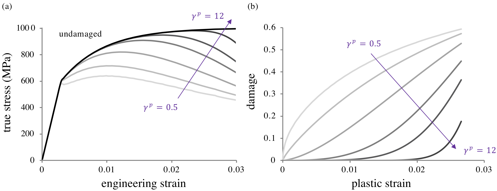

# 5.7 Reactive Elastoplastic Damage Mechanics {: #sec:Plasticity-with-damage }

Plastic deformation (Section [Reactive Plasticity](5.6-reactive-plasticity.md#sec:Reactive-Plasticity)) is often coupled with damage, as the finite deformation and plastic flow of a loaded material typically induces some amount of failure. Within the constrained reactive mixture framework adopted in FEBio (Section [Constrained Reactive Mixture of Solids](../chapter2/2.10-constrained-reactive-mixture-of-solids.md#sec:Mixture-of-Solids)), damage is produced by bonds breaking permanently (Section [Reactive Damage Mechanics](5.5-reactive-damage-mechanics.md#sec:Reactive-Damage-Mechanics)), which reduces the generation mass fractions $w_{\beta}^{\sigma}$ [^5.7-1]. In our treatment of elastoplastic damage we assume that both intact and yielded bonds may become damaged. Damage to intact bonds may represent some initial damage value for a material with defects, or damage due to intermolecular failure of bonds that never yielded; we refer to this as _elastic damage_. Damage to yielded bonds represents _plastic damage_. The mechanism of damage and the failure measure may be different for these two types of bonds, particularly since a stress- or energy-based failure measure may not be appropriate for plastic damage. Intact bonds belong to the $s-$generation which is present at $t=-\infty$. Once yielding occurs, all successive generations of that family are labeled as yielded bonds $y$. This distinction is necessary so we can then distinguish between damage to intact bonds (elastic damage) and damage to yielded bonds (plastic damage), since intact bonds which get damaged never have the ability to yield. It is important to note that the nature of the plastic deformation described in Section [Reactive Plasticity](5.6-reactive-plasticity.md#sec:Reactive-Plasticity) remains unchanged. Damage modifies the material behavior by reducing the fraction of bonds in various generations, which scales the response accordingly.

In a reactive constrained mixture framework the insertion of damage into the reactive plasticity formulation is straightforward. Since bonds break permanently in a damage reaction, there is no need to define a function of state $\mathbf{F}_{\beta}^{\sigma s}$ to describe a (non-existing) reformed configuration. Furthermore, the specific free energy of broken bonds is zero. The scalar _elastic damage criterion_ $\Xi^{e}\left(\mathbf{F}^{s}\right)$, which is taken to have the same functional form for all bond families $\beta$, is the analog to the yield criterion $\Phi$ for plasticity. As shown in Section [Reactive Damage Mechanics](5.5-reactive-damage-mechanics.md#sec:Reactive-Damage-Mechanics), the main contrast with reactive plasticity is that not all bonds in the family $\beta$ break simultaneously at a single _elastic damage threshold_ $\Xi_{m\beta}^{e}$. Instead, the fraction of broken bonds varies as a function of $\Xi^{e}\left(\mathbf{F}^{s}\right)$, denoted by $F^{e}\left(\Xi_{\beta}^{e}\right)$, such that $0\le F^{e}\left(\Xi_{\beta}^{e}\right)\le1$. Here, $F^{e}\left(\Xi_{\beta}^{e}\right)$ is a function of state; it must be a monotonically increasing function of its argument to satisfy the Clausius-Duhem inequality [^5.7-2]. We may view $F^{e}$ as a cumulative distribution function (CDF), whose corresponding probability distribution function (PDF) represents the probability of damage at a particular value of $\Xi_{\beta}^{e}$.

## Theoretical Formulation

We first briefly sketch the structure of the elastoplastic damage theory in FEBio for a single bond family $\beta$. Since each bond family in reactive plasticity yields all at once, we can easily split an elastoplastic damage theory into two parts to represent elastic and plastic damage regimes. Assume that the first yielding reaction for bond family $\beta$ occurs at time $t=u_{\beta}$. Prior to this initial yielding, the damage behavior described in Section [Reactive Damage Mechanics](5.5-reactive-damage-mechanics.md#sec:Reactive-Damage-Mechanics) applies, and the material composition is generally a mixture of intact ($\sigma=s$) and broken ($\sigma=b$) bonds satisfying the reaction $\mathcal{E}_{\beta}^{s}\to\mathcal{E}_{\beta}^{b}$. The corresponding bond mass fractions satisfy $1=w_{\beta}^{s}+w_{\beta}^{b}$ and $w_{\beta}^{y}=0$, where $w_{\beta}^{b}=F^{e}\left(\Xi_{\beta}^{e}\right)$ is the elastic damage in bond family $\beta$. At $t=u_{\beta}$, the remaining intact bonds $w_{\beta}^{s}=1-w_{\beta}^{b}$ all yield, following the reaction in eq.[(5.6-13)](5.6-reactive-plasticity.md#mjx-eqn:eq:hardening-yielded-rxn). The family mass balance is then given as $1=w_{\beta}^{y}+w_{\beta}^{b}$, since $w_{\beta}^{s}=0$ after yielding. The mass fraction of broken bonds $w^{b}=\sum_{\beta}w_{\beta}w_{\beta}^{b}$ is equal to the elastic damage variable $D$ as defined in classical damage mechanics.

For time $t>u_{\beta}$, yielded bonds may continue to yield, but they may also sustain damage according to the reaction $\mathcal{E}_{\beta}^{y}\to\mathcal{E}_{\beta}^{b}$, which reduces their mass fraction $w_{\beta}^{y}$. Damage to yielded bonds may occur based on a function of state (often described as a plastic strain, though it is not an observable kinematic variable), which is distinct from the measure of elastic damage. Therefore, we denote the _plastic damage measure_ as $\Xi^{p}\left(\mathbf{F}_{\beta}^{ys}\right)$ and its cumulative distribution function by $F^{p}\left(\Xi_{\beta}^{p}\right)$, under the assumption that all bond families $\beta$ share the same functional forms for $\Xi^{p}$ and $F^{p}$. For each bond family $\beta$, only the remaining undamaged fraction $1-F^{p}\left(\Xi_{\beta}^{p}\right)$ of yielded bonds may break and reform as the next yielded generation.

The modern understanding is that plastic strain is ill-defined and not a suitable state variable. It must be recognized that, just as $\mathbf{F}_{\beta}^{ys}$ is a constitutively-prescribed function of state and does not carry the meaning of a plastic deformation gradient, the plastic damage measure $\Xi^{p}\left(\mathbf{F}_{\beta}^{ys}\right)$ is also a function of state. This quantity is called a plastic strain for convenience only.

When plastic deformation occurs simultaneously with damage, the mass fraction of each successive yielded generation will have decreased. The following treatment now considers the superposition of multiple plastic bond families, as described in Section [Kinematic “Hardening” Response](5.6-reactive-plasticity.md#subsec:Kinematic-Hardening-Response).

### Damage to Intact Bonds

At any given time $t$, there is a maximum value of $\Xi^{e}$ that has been achieved over the past deformation history. This maximum value may be distinct for each bond family $\beta$, since intact bond families may yield at different values of $\mathbf{F}^{s}$; it is thus denoted by $\Xi_{m\beta}^{e}$,

\[ \begin{equation} \Xi_{m\beta}^{e}=\max_{\begin{aligned}-\infty<\tau\le t<u_{\beta}\end{aligned} }\Xi^{e}\left(\mathbf{F}^{s}\left(\tau\right)\right)\,.\label{eq:plasticdmg-intact-ximax-family} \end{equation} \]

Any damage sustained by intact bonds reduces their mass fraction, such that

\[ \begin{equation} \left\{ \begin{aligned}w_{\beta}^{s} & =1-F^{e}\left(\Xi_{m\beta}^{e}\right)\\ w_{\beta}^{y} & =0\\ w_{\beta}^{b} & =F^{e}\left(\Xi_{m\beta}^{e}\right) \end{aligned} \right.\,,\quad t<u_{\beta}\,,\label{eq:plasticdmg-massfraction-pre-yield} \end{equation} \]

and hence the mass balance of eq.[(5.6-9)](5.6-reactive-plasticity.md#mjx-eqn:eq:multiplebonds-bond-species-mass-fractions) is satisfied. Since all remaining intact bonds yield at $t=u_{\beta}$ and thus no intact bonds are left to sustain damage, $F^{e}\left(\Xi_{m\beta}^{e}\right)$ remains constant constant for bond family $\beta$ when $t\geq u_{\beta}$.

### Damage to Yielded Bonds

At time $t=u_{\beta}$, the yield threshold $\Phi_{m\beta}$ for family $\beta$ is reached and all remaining intact bonds in family $\beta$ yield such that

\[ \begin{equation} \left\{ \begin{aligned}w_{\beta}^{s} & =0\\ w_{\beta}^{y} & =1-F^{e}\left(\Xi_{m\beta}^{e}\right)\\ w_{\beta}^{b} & =F^{e}\left(\Xi_{m\beta}^{e}\right) \end{aligned} \right.\,,\quad t=u_{\beta}\,.\label{eq:plasticdmg-mass-fraction-yield} \end{equation} \]

Once they have formed, yielded bonds may sustain plastic damage. The maximum value of the plastic damage measure $\Xi^{p}$ experienced by family $\beta$ up until the current time $t$ is denoted by $\Xi_{m\beta}^{p}$,

\[ \begin{equation} \Xi_{m\beta}^{p}=\max_{\begin{aligned}u_{\beta}\leq\tau<t\end{aligned} }\Xi^{p}\left(\mathbf{F}_{\beta}^{y}\left(\tau\right)\right)\,.\label{eq:plasticdmg-yielded-ximax-family} \end{equation} \]

For $t>u_{\beta}$, yielded bonds may continue to yield, breaking and reforming into successive generations. However, in contrast to Section [Reactive Plasticity](5.6-reactive-plasticity.md#sec:Reactive-Plasticity), the mass fraction $w_{\beta}^{y}$ of yielded bonds in family $\beta$ no longer remains constant over successive yield generations, due to the plastic damage reaction. Each time a yielded bond breaks and reforms into a new generation, $w_{\beta}^{y}$ is given by the undamaged fraction of yielded bonds,

\[ \begin{equation} \left\{ \begin{aligned}w_{\beta}^{s} & =0\\ w_{\beta}^{y} & =\left(1-F^{p}\left(\Xi_{m\beta}^{p}\right)\right)\left(1-F^{e}\left(\Xi_{m\beta}^{e}\right)\right)\\ w_{\beta}^{b} & =F^{e}\left(\Xi_{m\beta}^{e}\right)+F^{p}\left(\Xi_{m\beta}^{p}\right)\left(1-F^{e}\left(\Xi_{m\beta}^{e}\right)\right) \end{aligned} \right.\,,\quad t>u_{\beta}\,.\label{eq:plasticdmg-mass-fraction-post-yield} \end{equation} \]

Equations \eqref{eq:plasticdmg-massfraction-pre-yield},\eqref{eq:plasticdmg-mass-fraction-yield}, and \eqref{eq:plasticdmg-mass-fraction-post-yield} govern the temporal behavior of the bond species mass fractions.

### Strain Energy Density, Stress, and Damage

Recognizing that damaged (broken) bonds do not store free energy, the referential mixture free energy density in eq.[(5.6-10)](5.6-reactive-plasticity.md#mjx-eqn:eq:multiplebonds-mixture-energy) may be rewritten as

\[ \begin{equation} \Psi_{r}=\sum_{\beta}w_{\beta}\left(w_{\beta}^{s}\Psi_{0}\left(\mathbf{F}^{s}\right)+w_{\beta}^{y}J^{ys}\Psi_{0}\left(\mathbf{F}_{\beta}^{y}\right)\right)\,,\label{eq:plasticdmg-free-energy} \end{equation} \]

where the bond mass fractions $w_{\beta}^{s}$ and $w_{\beta}^{y}$ are given in Eqs.\eqref{eq:plasticdmg-massfraction-pre-yield}-\eqref{eq:plasticdmg-mass-fraction-post-yield} prior to, during, and after yielding of each bond family $\beta$. Similarly, the mixture stress may be evaluated from eq.[(5.6-11)](5.6-reactive-plasticity.md#mjx-eqn:eq:multiplebonds-mixture-stress) as

\[ \begin{equation} \boldsymbol{\sigma}=\sum_{\beta}w_{\beta}\left(w_{\beta}^{s}\boldsymbol{\sigma}_{0}\left(\mathbf{F}^{s}\right)+w_{\beta}^{y}\boldsymbol{\sigma}_{0}\left(\mathbf{F}_{\beta}^{y}\right)\right)\,,\label{eq:plasticdmg-mixture-stress} \end{equation} \]

where the stresses $\boldsymbol{\sigma}_{0}$ are given by the standard hyperelasticity relation in eq.[(5.6-11)](5.6-reactive-plasticity.md#mjx-eqn:eq:multiplebonds-mixture-stress). These expressions may be simplified further when assuming that the functional form of $\psi_{\beta}$ remains the same for all bond families $\beta$. Finally, the reactive mixture equivalent of the damage variable $D$ may be evaluated for elastoplastic damage as the fraction of all bonds that are broken,

\[ \begin{equation} D=w^{b}=\sum_{\beta}w_{\beta}w_{\beta}^{b}\,.\label{eq:plasticdmg-damage-variable} \end{equation} \]

### Damage Measures {: #subsec:Yielded-damage-reaction }

For elastic damage, we may use the same functional measure as proposed for plastic yielding (e.g., the von Mises stress); this implies that the functions $\Xi^{e}$ and $\Phi$ have the same form. For plastic damage, experimental results show that during plastic flow damage is coupled with measures of plastic strain [^5.7-3], necessitating a (pseudo-)strain-based plastic damage measure $\Xi^{p}$. For yielded bonds in a bond family $\beta$, we can use the constitutively-determined mapping $\mathbf{F}_{\beta}^{ys}$ to define plastic right Cauchy-Green and Lagrange strain tensors through

\[ \begin{equation} \begin{aligned}\mathbf{C}_{\beta}^{ys} & =\left(\mathbf{F}_{\beta}^{ys}\right)^{T}\cdot\mathbf{F}_{\beta}^{ys}\\ \mathbf{E}_{\beta}^{ys} & =\frac{1}{2}\left(\mathbf{C}_{\beta}^{ys}-\mathbf{I}\right) \end{aligned} \,. \end{equation} \]

One possible constitutive relation for $\Xi^{p}$, which remains valid for general deformations, is to set it equal to the _effective plastic strain_ $e_{\beta}^{p}$ for the various bond families $\beta$,

\[ \begin{equation} e_{\beta}^{p}=\sqrt{\frac{2}{3}\dev\mathbf{E}_{\beta}^{ys}:\dev\mathbf{E}_{\beta}^{ys}}\,.\label{eq:plasticdmg-effective-plastic-strain} \end{equation} \]

In a numerical implementation, the effective plastic strain $e_{0}^{p}$ of the first bond family to yield may be reported as the effective plastic strain in the entire material, for consistency with plastic strain measures in classical models of plasticity.

Quantities in this section do not represent plastic strains or plastic strain tensors, though we adopt the terminology due to similarities. Recall that the non-observable function of state $\mathbf{F}_{\beta}^{ys}=\mathbf{F}_{\beta}^{ys}\left(\mathbf{F}^{s},\rho_{r\beta}^{\alpha}\right)$ is a time-invariant mapping providing the reference configuration of a yielded bond $y$ with respect to the reference configuration of the master constituent $s$, for family $\beta$. The quantities $\mathbf{C}_{\beta}^{ys}$ and $\mathbf{E}_{\beta}^{ys}$ then also represent non-observable functions of state calculated as strain tensors. Consequently, $e_{\beta}^{p}$ is a measure of the relative motion of the reference configuration of bond family $\beta$, expressed as a scalar “strain”. Physically, this amounts to the modeling assumption that once the breaking-and-reforming process takes a bond family out of a local neighborhood centered about its original position, the bond begins to degrade with further breaking-and-reforming processes. That each of these quantities exists for every bond family $\beta$ emphasizes the lack of any true or unique plastic strain measure in this framework.

### Cumulative Damage Distribution Functions {: #subsec:Cumulative-Damage-Distribution }

The final set of constitutive relations required to fully define an elastoplastic damage material are the two CDFs, $F^{e}\left(\Xi_{m\beta}^{e}\right)$ and $F^{p}\left(\Xi_{m\beta}^{p}\right)$. As shown by [^5.7-2], the only requirement imposed by the Clausius-Duhem inequality is that these be monotonically increasing functions.

/// figure-caption

Parametric study of the effect of the damage parameter $\gamma^{p}$ for a Weibull distribution, with no intact damage taking place. (a) As $\gamma^{p}$ increases, the onset of noticeable damage shifts to higher strains and becomes more rapid. (b) Plot of the damage variable $D=\sum_{\beta}w_{\beta}F^{p}\left(\Xi_{m\beta}^{p}\right)$. The response becomes more nonlinear as $\gamma^{p}$ deviates from unity. Other plasticity and damage parameters are $n_{f}=20$, $\Upsilon_{0}=600$ MPa, $\Upsilon_{\text{max}}=1000$ MPa, $w_{0}=0.75$, $w_{e}=0$, $r=1$, and $\kappa^{p}=0.03$.

///

Whereas these CDFs may be characterized directly from experimental data, here we illustrate the FEBio elastoplastic damage framework using a Weibull distribution of the form

\[ \begin{equation} F\left(\Xi\right)=1-\exp\left(-\left(\frac{\Xi}{\kappa}\right)^{\gamma}\right)\,,\label{eq:Weibull-cdf} \end{equation} \]

where $\kappa$ (same units as $\Xi$) is the value of $\Xi$ at which the fraction $1-e^{-1}$ of bonds have failed and the exponent $\gamma$ (unitless) controls the slope of the response, such that $F\left(\Xi\right)$ approaches a step function with a jump at $\Xi=\kappa$ as $\gamma\to\infty$. Therefore, each damage function has two free parameters $\kappa$ and $\gamma$. Based on experimental evidence, we may let $\Xi^{e}$ be given by the von Mises (effective) stress, while $\Xi^{p}$ is taken to be the effective plastic strain (Section [Damage Measures](#subsec:Yielded-damage-reaction)). Figure [1](#fig:damage-parametric) shows the effect of the Weibull parameter $\gamma^{p}$ on the stress-strain and damage-strain responses, with $\kappa^{p}$ fixed. The damage response as a function of plastic strain is identically the prescribed CDF (Figure [1](#fig:damage-parametric)b). The shape of the CDF changes from logarithmic-like to exponential as $\gamma^{p}$ increases, demonstrating the ability of this formulation to recover a broad variety of experimentally measured damage-strain behaviors [^5.7-4].

[^5.7-1]: Brandon K. Zimmerman; David Jiang; Jeffrey A. Weiss; Lucas H. Timmins; Gerard A. Ateshian. "On the use of constrained reactive mixtures of solids to model finite deformation isothermal elastoplasticity and elastoplastic damage mechanics." *Journal of the Mechanics and Physics of Solids*, pp. 104534 (2021).
[^5.7-2]: Nims, Robert J; Durney, Krista M; Cigan, Alexander D; Duss{\'e}aux, Antoine; Hung, Clark T; Ateshian, Gerard A. "Continuum theory of fibrous tissue damage mechanics using bond kinetics: application to cartilage tissue engineering." *Interface Focus*, vol. 6, pp. 20150063 (2016).
[^5.7-3]: Lemaitre, Jean; Desmorat, Rodrigue. "Engineering damage mechanics: ductile, creep, fatigue and brittle failures." *Springer Science \& Business Media* (2005).
[^5.7-4]: Bonora, Nicola. "A nonlinear CDM model for ductile failure." *Engineering fracture mechanics*, vol. 58, pp. 11--28 (1997).
