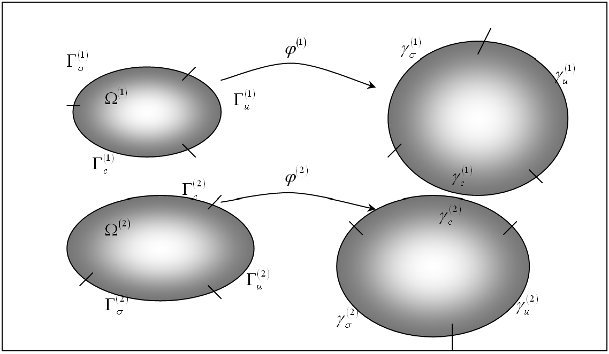

# 7.1 Sliding Interfaces {: #sec:Sliding-Interfaces }

FEBio allows the user to connect the different parts of the model in various ways. Deformable parts can be connected to rigid bodies. Deformable objects can be brought in contact with each other. Rigid bodies can be connected with rigid joints. This chapter describes the different ways to couple parts together.

This section summarizes the theoretical developments of the two body contact problem. After introducing some notation and terminology, the contact integral is presented, which contains the contribution to the virtual work equation from the contact tractions. Since the nonlinear contact problem is solved using a Newton based iterative method, the contact integral is linearized. Next, anticipating a finite element implementation, the contact integral and its linearization are discretized using a standard finite element approach. Finally the augmented Lagrangian method for enforcing the contact constraints is described.

## Contact Kinematics {: #subsec:Sliding-Contact-Kinematics }

For the most part the notation of this section follows [^7.1-1], with a few simplifications here and there since the implementation in FEBio is currently for quasi-static, frictionless, two body contact problem.

The volume occupied by body $i$ in the reference configuration is denoted by $\Omega^{\left(i\right)}\subset\mathbb{R}^{3}$where $i=1,2$. The boundary of body $i$ is denoted by $\Gamma^{\left(i\right)}$ and is divided into three regions $\Gamma^{\left(i\right)}=\Gamma_{\sigma}^{\left(i\right)}\cup\Gamma_{u}^{\left(i\right)}\cup\Gamma_{c}^{\left(i\right)}$, where $\Gamma_{\sigma}^{\left(i\right)}$ is the boundary where tractions are applied, $\Gamma_{u}^{\left(i\right)}$ the boundary where the solution is prescribed and $\Gamma_{c}^{\left(i\right)}$ the part of the boundary that will be in contact with the other body. It is assumed that $\Gamma_{\sigma}^{\left(i\right)}\cap\Gamma_{u}^{\left(i\right)}\cap\Gamma_{c}^{\left(i\right)}=\emptyset$.

The deformation of body $i$ is defined by $\boldsymbol{\varphi}^{\left(i\right)}$. The boundary of the deformed body $i$, that is the boundary of $\boldsymbol{\varphi}^{\left(i\right)}\left(\Omega^{\left(i\right)}\right)$ is denoted by $\gamma^{\left(i\right)}=\gamma_{\sigma}^{\left(i\right)}\cup\gamma_{u}^{\left(i\right)}\cup\gamma_{c}^{\left(i\right)}$ where $\gamma_{\sigma}^{\left(i\right)}=\boldsymbol{\varphi}^{\left(i\right)}\left(\Gamma_{\sigma}^{\left(i\right)}\right)$ is the boundary in the current configuration where the tractions are applied and similar definitions for $\gamma_{u}^{\left(i\right)}$ and $\gamma_{c}^{\left(i\right)}$. See the figure below for a graphical illustration of the defined regions.

{: style="display:block; margin-left:auto; margin-right:auto;" }**The two-body contact problem.**

Points in body 1 are denoted by **$\mathbf{X}$** in the reference configuration and **$\mathbf{x}$** in the current configuration. For body 2 these points are denoted by **$\mathbf{Y}$** and **$\mathbf{y}$**. To define contact, the location where the two bodies are in contact with each other must be established. If body 1 is the _slave body_ and body 2 is the _master body_, then for a given point **$\mathbf{X}$** on the slave reference contact surface there is a point $\mathbf{\bar{Y}}\left(\mathbf{X}\right)$ on the master contact surface that is in some sense closest to point **$\mathbf{X}$**. This closest point is defined in a closest point projection sense:

\[ \begin{equation} \mathbf{\bar{Y}}\left(\mathbf{X}\right)=\arg\min\limits_{\mathbf{Y}\in\Gamma_{c}^{\left(2\right)}}\left\Vert \boldsymbol{\varphi}^{\left(1\right)}\left(\mathbf{X}\right)-\boldsymbol{\varphi}^{\left(2\right)}\left(\mathbf{Y}\right)\right\Vert \,.\label{eq564} \end{equation} \]

With the definition of $\mathbf{\bar{Y}}\left(\mathbf{X}\right)$ established the _gap function_ can be defined, which is a measure for the distance between **$\mathbf{X}$** and $\mathbf{\bar{Y}}\left(\mathbf{X}\right)$,

\[ \begin{equation} g\left(\mathbf{X}\right)=-\boldsymbol{\nu}\cdot\left(\boldsymbol{\varphi}^{\left(1\right)}\left(\mathbf{X}\right)-\boldsymbol{\varphi}^{\left(2\right)}\left(\mathbf{\bar{Y}}\left(\mathbf{X}\right)\right)\right)\,,\label{eq565} \end{equation} \]

where $\boldsymbol{\nu}$ is the local surface normal of surface $\gamma_{c}^{\left(2\right)}$ evaluated at $\mathbf{\bar{y}}=\boldsymbol{\varphi}^{\left(2\right)}\left(\mathbf{\bar{Y}}\left(\mathbf{X}\right)\right)$. Note that $g>0$ when **$\mathbf{X}$** has penetrated body 2, so that the constraint condition to be satisfied at all time is $g\leqslant0$.

## Weak Form of Two Body Contact {: #subsec:Weak-Form-Two-Body }

The balance of linear momentum can be written for each of the two bodies in the reference configuration,

\[ \begin{equation} G^{\left(i\right)}\left(\boldsymbol{\varphi}^{\left(i\right)},\mathbf{w}^{\left(i\right)}\right)=\int\limits_{\Omega^{\left(i\right)}}\Grad\mathbf{w}^{\left(i\right)}:\mathbf{P}^{\left(i\right)}\,d\Omega-\int\limits_{\Omega^{\left(i\right)}}\mathbf{w}^{\left(i\right)}\cdot\mathbf{F}^{\left(i\right)}\,d\Omega-\int\limits_{\Gamma_{s}^{\left(i\right)}}\mathbf{w}^{\left(i\right)}\cdot\mathbf{T}^{\left(i\right)}\,d\Gamma-\int\limits_{\Gamma_{c}^{\left(i\right)}}\mathbf{w}^{\left(i\right)}\cdot\mathbf{T}^{\left(i\right)}\,d\Gamma=0\,,\label{eq566} \end{equation} \]

where $\mathbf{w}^{\left(i\right)}$ is a weighting function and **$\mathbf{P}$** is the $1^{\text{st}}$ Piola-Kirchhoff stress tensor. The last term corresponds to the virtual work of the contact tractions on body $i$. For notational convenience, the notations $\varphi$and $w$ are introduced to denote the collection of the respective mappings $\boldsymbol{\varphi}^{\left(i\right)}$ and $\mathbf{w}^{\left(i\right)}$ (for $i=$1,2). In other words,

\[ \begin{equation} \begin{aligned}\varphi &:\bar{\Omega}^{\left(1\right)}\cup\bar{\Omega}^{\left(2\right)}\to\mathbb{R}^{3}\,,\\ w &:\bar{\Omega}^{\left(1\right)}\cup\bar{\Omega}^{\left(2\right)}\to\mathbb{R}^{3}\,. \end{aligned} \label{eq567} \end{equation} \]

The variational principle for the two body system is the sum of \eqref{eq566} for body 1 and 2 and can be expressed as,

\[ \begin{equation} \begin{aligned}G\left(\boldsymbol{\varphi},\mathbf{w}\right) &:=\sum\limits_{i=1}^{2}G^{\left(i\right)}\left(\boldsymbol{\varphi}^{\left(i\right)},\mathbf{w}^{\left(i\right)}\right)\\ & =\underbrace{\sum\limits_{i=1}^{2}\left\{ \int\limits_{\Omega^{\left(i\right)}}\Grad\mathbf{w}^{\left(i\right)}:\mathbf{P}^{\left(i\right)}\,d\Omega-\int\limits_{\Omega^{\left(i\right)}}\mathbf{w}^{\left(i\right)}\cdot\mathbf{F}^{\left(i\right)}\,d\Omega-\int\limits_{\Gamma_{s}^{\left(i\right)}}\mathbf{w}^{\left(i\right)}\cdot\mathbf{T}^{\left(i\right)}\,d\Gamma\right\} }_{G^{\text{int},\text{ext}}\left(\boldsymbol{\varphi},\mathbf{w}\right)}\\ & \underbrace{-\sum\limits_{i=1}^{2}\int\limits_{\Gamma_{c}^{\left(i\right)}}\mathbf{w}^{\left(i\right)}\cdot\mathbf{T}^{\left(i\right)}\,d\Gamma}_{G^{c}\left(\boldsymbol{\varphi},\mathbf{w}\right)}\,. \end{aligned} \label{eq568} \end{equation} \]

Or in short,

\[ \begin{equation} G\left(\boldsymbol{\varphi},\mathbf{w}\right)=G^{\text{int},\text{ext}}\left(\boldsymbol{\varphi},\mathbf{w}\right)+G^{c}\left(\boldsymbol{\varphi},\mathbf{w}\right)\,.\label{eq569} \end{equation} \]

Note that the minus sign is included in the definition of the contact integral $G^{c}$. The contact integral can be written as an integration over the contact surface of body 1 by balancing linear momentum across the contact surface:

\[ \begin{equation} \mathbf{t}^{\left(2\right)}\left(\mathbf{\bar{y}}\left(\mathbf{x}\right)\right)d\Gamma^{\left(2\right)}=-\mathbf{t}^{\left(1\right)}\left(\mathbf{x}\right)\,d\Gamma^{\left(1\right)}\,.\label{eq570} \end{equation} \]

The contact integral can now be rewritten over the contact surface of body 1:

\[ \begin{equation} G^{c}=-\int\limits_{\Gamma_{c}^{\left(1\right)}}\mathbf{t}^{\left(1\right)}\left(\mathbf{x}\right)\cdot\left[\mathbf{w}^{\left(1\right)}\left(\mathbf{x}\right)-\mathbf{w}^{\left(2\right)}\left(\mathbf{\bar{y}}\left(\mathbf{x}\right)\right)\right]\,d\Gamma\,.\label{eq571} \end{equation} \]

In the case of frictionless contact, the contact traction is taken as perpendicular to surface 2 and therefore can be written as, $\mathbf{t}^{\left(1\right)}=t_{N}\boldsymbol{\nu}$ where $\boldsymbol{\nu}$ is the (outward) surface normal and $t_{N}$ is to be determined from the solution strategy. For example in a Lagrange multiplier method the $t_{N}$'s would be the Lagrange multipliers.

By noting that the variation of the gap function is given by

\[ \begin{equation} \delta g=-\boldsymbol{\nu}\cdot\left(\mathbf{w}^{\left(1\right)}\left(\mathbf{x}\right)-\mathbf{w}^{\left(2\right)}\left(\mathbf{\bar{y}}\left(\mathbf{x}\right)\right)\right)\,,\label{eq572} \end{equation} \]

equation \eqref{eq571} can be simplified as,

\[ \begin{equation} G^{c}=\int\limits_{\Gamma_{c}^{\left(1\right)}}t_{N}\delta g\,d\Gamma\,.\label{eq573} \end{equation} \]

## Linearization of the Contact Integral {: #subsec:Linearization-Contact-Integral }

In a Newton-Raphson implementation the contact integral must be linearized with respect to the current configuration:

\[ \begin{equation} \Delta G^{c}\left(\boldsymbol{\varphi},\mathbf{w}\right)=\int\limits_{\Gamma_{c}^{\left(1\right)}}\Delta\left(t_{N}\delta g\right)\,d\Gamma\,.\label{eq574} \end{equation} \]

Examining the normal contact term first, the directional derivative of $t_{N}$ is given (for the case of the penalty regularization) by:

\[ \begin{equation} \begin{aligned}\Delta t_{N} & =\Delta\left\{ \varepsilon_{N}\left\langle g\right\rangle \right\} \\ & =H\left(g\right)\varepsilon_{N}\Delta g \end{aligned} \,,\label{eq575} \end{equation} \]

where $\varepsilon_{N}$ is the penalty factor and $H\left(g\right)$ is the Heaviside function. The quantity $\Delta\left(\delta g\right)$ is given by

\[ \begin{equation} \begin{aligned}\Delta\left(\delta g\right) & =g\left[\boldsymbol{\nu}\cdot\delta\varphi_{,\gamma}^{\left(2\right)}\left(\mathbf{\bar{Y}}\left(\mathbf{X}\right)\right)+\kappa_{\alpha\gamma}\left(\mathbf{\bar{Y}}\left(\mathbf{X}\right)\right)\delta\bar{\xi}_{\alpha}\right]m^{\gamma\beta}\\ & \left[\boldsymbol{\nu}\cdot\Delta\varphi_{,\beta}^{\left(2\right)}\left(\mathbf{\bar{Y}}\left(\mathbf{X}\right)\right)+\kappa_{\alpha\beta}\left(\mathbf{\bar{Y}}\left(\mathbf{X}\right)\right)\Delta\bar{\xi}^{\alpha}\right]\\ & +\delta\bar{\xi}^{\beta}\boldsymbol{\nu}\cdot\left[\Delta\varphi_{,\beta}^{\left(2\right)}\left(\mathbf{\bar{Y}}\left(\mathbf{X}\right)\right)\right]+\Delta\bar{\xi}^{\beta}\boldsymbol{\nu}\cdot\left[\delta\boldsymbol{\varphi}_{,\beta}^{\left(2\right)}\left(\mathbf{\bar{Y}}\left(\mathbf{X}\right)\right)\right]\\ & +\kappa_{\alpha\beta}\left(\mathbf{\bar{Y}}\left(\mathbf{X}\right)\right)\delta\bar{\xi}^{\beta}\Delta\bar{\xi}^{\alpha}\,. \end{aligned} \label{eq576} \end{equation} \]

## Discretization of the Contact Integral {: #subsec:Discretization-Contact-Integral }

The contact integral, which is repeated here,

\[ \begin{equation} G^{c}\left(\boldsymbol{\varphi},\mathbf{w}\right)=\int\limits_{\Gamma^{\left(1\right)}}t_{N}\delta g\,d\Gamma\,,\label{eq577} \end{equation} \]

will now be discretized using a standard finite element procedure. First it is noted that the integration can be written as a sum over the surface element areas:

\[ \begin{equation} G^{c}\left(\boldsymbol{\varphi},\mathbf{w}\right)=\sum\limits_{e=1}^{N_{sel}}\int\limits_{\Gamma^{\left(1\right)e}}t_{N}\delta g\,d\Gamma\,,\label{eq578} \end{equation} \]

where $N_{sel}$ is the number of surface elements. The integration can be approximated using a quadrature rule,

\[ \begin{equation} G^{c}\left(\boldsymbol{\varphi},\mathbf{w}\right)\cong\sum\limits_{e=1}^{N_{sel}}\left\{ \sum\limits_{i=1}^{N_{int}^{e}}w^{i}j\left(\boldsymbol{\xi}_{i}\right)t_{N}\left(\boldsymbol{\xi}_{i}\right)\delta g\left(\boldsymbol{\xi}_{i}\right)\right\} \,,\label{eq579} \end{equation} \]

where $N_{int}^{e}$ are the number of integration points for element $e$. It is now assumed that the integration points coincide with the element's nodes (e.g. for a quadrilateral surface element we have $\boldsymbol{\xi}_{1}=\left(-1,-1\right)$, $\boldsymbol{\xi}_{2}=\left(1,-1\right)$, $\boldsymbol{\xi}_{3}=\left(1,1\right)$ and $\boldsymbol{\xi}_{4}=\left(-1,1\right))$. With this quadrature rule, we have

\[ \begin{equation} \begin{aligned}w^{\left(1\right)}\left(\boldsymbol{\xi}_{i}\right) & =\mathbf{c}_{i}^{\left(1\right)}\\ w^{\left(2\right)}\left(\bar{\boldsymbol{\xi}}_{i}\right) & =\sum\limits_{j=1}^{n}N_{j}\left(\bar{\boldsymbol{\xi}}_{i}\right)\mathbf{c}_{j}^{\left(2\right)} \end{aligned} \,,\label{eq580} \end{equation} \]

so that,

\[ \begin{equation} \delta g\left(\boldsymbol{\xi}_{i}\right)=-\boldsymbol{\nu}\cdot\left(\mathbf{c}_{i}^{\left(1\right)}-\sum\limits_{j=1}^{n}N_{j}^{\left(2\right)}\left(\bar{\boldsymbol{\xi}}_{i}\right)\mathbf{c}_{j}^{\left(2\right)}\right)\,.\label{eq581} \end{equation} \]

If the following vectors are defined,

\[ \begin{equation} \begin{aligned}\delta\boldsymbol{\Phi}^{T} & =\left[\begin{array}{cccc} \mathbf{c}_{i}^{\left(1\right)} & \mathbf{c}_{1}^{\left(2\right)} & \cdots & \mathbf{c}_{n}^{\left(2\right)}\end{array}\right]\\ \mathbf{N}^{T} & =\left[\begin{array}{cccc} \boldsymbol{\nu} & -\boldsymbol{\nu}N_{1}^{\left(2\right)} & \cdots & -\boldsymbol{\nu}N_{n}^{\left(2\right)}\end{array}\right] \end{aligned} \,,\label{eq582} \end{equation} \]

equation \eqref{eq579} can then be rewritten as follows,

\[ \begin{equation} G^{c}\left(\boldsymbol{\varphi},\mathbf{w}\right)\cong\sum\limits_{e=1}^{N_{sel}}\left\{ \sum\limits_{i=1}^{N_{int}^{e}}w^{i}j\left(\boldsymbol{\xi}_{i}\right)t_{N}\left(\boldsymbol{\xi}_{i}\right)\delta\boldsymbol{\Phi}^{T}\mathbf{N}^{T}\right\} \,.\label{eq583} \end{equation} \]

The specific form for $t_{N}$will depend on the method employed for enforcing the contact constraint.

## Discretization of the Contact Stiffness {: #subsec:Discretization-Contact-Stiffness }

A similar procedure can now be used to calculate the discretized contact stiffness matrix. The linearization of the contact integral is repeated here:

\[ \begin{equation} \begin{aligned}\Delta G^{c}\left(\boldsymbol{\varphi},\mathbf{w}\right) & =\sum\limits_{e=1}^{N_{sel}}\int\limits_{\Gamma^{\left(1\right)e}}\Delta\left(t_{N}\delta g\right)\,d\Gamma\\ & =\sum\limits_{e=1}^{N_{sel}}\sum\limits_{i=1}^{N_{int}^{e}}w_{i}j\left(\boldsymbol{\xi}_{i}\right)\Delta\left(t_{N}\delta g\right)\left(\boldsymbol{\xi}_{i}\right) \end{aligned} \,.\label{eq584} \end{equation} \]

Using matrix notation we can rewrite equation \eqref{eq584} as,

\[ \begin{equation} \Delta W^{c}\left(\boldsymbol{\varphi},\mathbf{w}\right)=\sum\limits_{e=1}^{N_{sel}}\sum\limits_{i}^{N_{int}^{e}}w_{i}j\left(\mathbf{\xi}_{i}\right)\delta\boldsymbol{\Phi}\cdot\mathbf{k}^{c}\Delta\boldsymbol{\Phi}\,,\label{eq585} \end{equation} \]

where $\delta\boldsymbol{\Phi}$ is as above and $\Delta\boldsymbol{\Phi}$ similar to $\delta\boldsymbol{\Phi}$ with $\delta$ replaced with $\Delta$, and $\mathbf{k}^{c}$ is

\[ \begin{equation} \begin{aligned}\mathbf{k}^{c} & =\varepsilon_{N}H\left(\lambda_{N}^{k}+\varepsilon_{N}g\right)\mathbf{NN}^{T}+t_{N}\left\{ g\left[m^{11}\mathbf{\bar{N}}_{1}\mathbf{\bar{N}}_{1}^{T}\right.\right.\\ & +m^{12}\left(\mathbf{\bar{N}}_{1}\mathbf{\bar{N}}_{2}^{T}+\mathbf{\bar{N}}_{2}\mathbf{\bar{N}}_{1}^{T}\right)+\left.m^{22}\mathbf{\bar{N}}_{2}\mathbf{\bar{N}}_{2}^{T}\right]-\mathbf{D}_{1}\mathbf{N}_{1}^{T}\\ & -\mathbf{D}_{2}\mathbf{N}_{2}^{T}-\mathbf{N}_{1}\mathbf{D}_{1}^{T}-\mathbf{N}_{2}\mathbf{D}_{2}^{T}+\left.\kappa_{12}\left(\mathbf{D}_{1}\mathbf{D}_{2}^{T}+\mathbf{D}_{2}\mathbf{D}_{1}^{T}\right)\right\} \end{aligned} \,,\label{eq586} \end{equation} \]

where,

\[ \begin{equation} \begin{aligned}\mathbf{N}= & \left[\begin{array}{c} \boldsymbol{\nu}\\ -N_{1}\left(\bar{\boldsymbol{\xi}}\right)\boldsymbol{\nu}\\ \vdots\\ -N_{4}\left(\bar{\boldsymbol{\xi}}\right)\boldsymbol{\nu} \end{array}\right]\,, & \mathbf{T}_{\alpha} & =\left[\begin{array}{c} \boldsymbol{\tau}_{\alpha}\\ -N_{1}\left(\bar{\boldsymbol{\xi}}\right)\boldsymbol{\tau}_{\alpha}\\ \vdots\\ -N_{4}\left(\bar{\boldsymbol{\xi}}\right)\boldsymbol{\tau}_{\alpha} \end{array}\right]\,, & \mathbf{N}_{\alpha} & =\left[\begin{array}{c} \mathbf{0}\\ -N_{1,\alpha}\left(\bar{\boldsymbol{\xi}}\right)\boldsymbol{\nu}\\ \vdots\\ -N_{4,\alpha}\left(\bar{\boldsymbol{\xi}}\right)\boldsymbol{\nu} \end{array}\right]\,.\end{aligned} \label{eq587} \end{equation} \]

The following vectors are also defined which depend on the vectors of \eqref{eq587}:

\[ \begin{equation} \begin{aligned}\mathbf{D}_{1} & =\frac{1}{\det\mathbf{A}}\left[A_{22}\left(\mathbf{T}_{1}+g\mathbf{N}_{1}\right)-A_{12}\left(\mathbf{T}_{2}+g\mathbf{N}_{2}\right)\right]\\ \mathbf{D}_{2} & =\frac{1}{\det\mathbf{A}}\left[A_{11}\left(\mathbf{T}_{2}+g\mathbf{N}_{2}\right)-A_{12}\left(\mathbf{T}_{1}+g\mathbf{N}_{1}\right)\right]\\ \mathbf{\bar{N}}_{1} & =\mathbf{N}_{1}-\kappa_{12}\mathbf{D}_{2}\\ \mathbf{\bar{N}}_{2} & =\mathbf{N}_{2}-\kappa_{12}\mathbf{D}_{1} \end{aligned} \,,\label{eq588} \end{equation} \]

where the matrix **$\mathbf{A}$** is defined as,

\[ \begin{equation} A_{ij}=m_{ij}+g\kappa_{ij}\,.\label{eq589} \end{equation} \]

Here, $m_{ij}=\boldsymbol{\tau}_{i}\cdot\boldsymbol{\tau}_{j}$ is the surface metric tensor and $\kappa_{ij}=\boldsymbol{\nu}\cdot\boldsymbol{\varphi}_{t,ij}^{\left(2\right)}\left(\mathbf{\bar{Y}}\right)$ denotes the components of the surface curvature at $\bar{\boldsymbol{\xi}}$.

## Augmented Lagrangian Method {: #subsec:Augmented-Lagrangian-Method }

The augmented Lagrangian method is used in FEBio to enforce the contact constraints to a user-specified tolerance. This implies that the normal contact tractions are given by,

\[ \begin{equation} t_{N}=\left\langle \lambda_{N}+\varepsilon_{N}g\right\rangle \,.\label{eq590} \end{equation} \]

Note that this assumption is consistent with the approach that was used in establishing the discretization of the linearization of the contact integral \eqref{eq586}. In \eqref{eq590} $\varepsilon_{N}$ is a penalty factor that is chosen arbitrarily.

The Newton-Raphson iterative method is now used to solve the nonlinear contact problem where Uzawa's method (REF) is employed to calculate the Lagrange multipliers $\lambda_{N}$. This implies that the Lagrange multipliers are kept fixed during the Newton-Raphson iterations. After convergence the multipliers are updated and a new NR procedure is started. This procedure can be summarized by the following four steps.

1. **Initialize** the augmented Lagrangian iteration counter $k$, and the initial guesses for the multipliers:

    \[ \begin{equation} \begin{aligned}\lambda_{N_{n+1}}^{\left(0\right)} & =\lambda_{N_{n}}\,,\\ k & =0\,. \end{aligned} \label{eq591} \end{equation} \]

1. **Solve** for $\mathbf{d}_{n+1}^{\left(k\right)}$, the solution vector corresponding to the fixed $k$th iterate for the multipliers,

    \[ \begin{equation} \mathbf{F}^{int}\left(\mathbf{d}_{n+1}^{\left(k\right)}\right)+\mathbf{F}^{c}\left(\mathbf{d}_{n+1}^{\left(k\right)}\right)=\mathbf{F}_{n+1}^{ext}\,,\label{eq592} \end{equation} \]

    where the contact tractions used to compute $\mathbf{F}^{c}$, the contact force, are governed by

    \[ \begin{equation} t_{N_{n+1}}^{\left(k\right)}=\left\langle \lambda_{N_{n+1}}^{\left(k\right)}+\varepsilon_{N}g_{n+1}^{k}\right\rangle \,.\label{eq593} \end{equation} \]

1. **Update** the Lagrange multipliers and iteration counters:

    \[ \begin{equation} \begin{aligned}\lambda_{N_{n+1}}^{\left(k+1\right)} & =\left\langle \lambda_{N_{n+1}}^{\left(k\right)}+\varepsilon_{N}g_{n+1}^{\left(k\right)}\right\rangle \,,\\ k & =k+1\,. \end{aligned} \label{eq594} \end{equation} \]

1. **Return** to the solution phase.

Steps 2-4 of the above algorithm are generally repeated until all contact constraints are satisfied to a user-specified tolerance or little change in the solution vector from augmentation to augmentation is noted.

## Automatic Penalty Calculation {: #subsec:Automatic-Penalty-Calculation }

The determination of the penalty factor $\varepsilon_{N}$ can be a difficult task, since a good value may depend on both material parameters and geometrical factors. In FEBio the value of this penalty factor can be determined automatically. In this case FEBio will calculate a penalty factor for each facet using the following formula.

\[ \begin{equation} \varepsilon_{i}=\frac{f_{SI}E_{i}A_{i}}{V_{i}}\,.\label{eq595} \end{equation} \]

Here, $E_{i}$ is the effective Young's modulus along the facet normal, $A_{i}$ the surface area of the facet, $V_{i}$ the volume of the element to which this facet belongs and $f_{SI}$ a user defined scale factor. The parameter $E_{i}$ is evaluated from the elasticity tensor $\boldsymbol{\mathcal{C}}$ and the facet unit normal $\mathbf{n}$ according to

\[ \begin{equation} \frac{1}{E_{i}}=\left(\mathbf{n}\otimes\mathbf{n}\right):\boldsymbol{\mathcal{C}}^{-1}:\left(\mathbf{n}\otimes\mathbf{n}\right)\,,\label{eq596} \end{equation} \]

where $\boldsymbol{\mathcal{C}}^{-1}$ is the compliance tensor.

## Facet-To-Facet Sliding {: #subsec:Alternative-Formulations }

As of FEBio version 1.2, two alternative formulations for sliding contact are available. The first method, which is referred to as the _facet-to-facet sliding_, is very similar to the formulation described above. It only differs in that it uses a Gaussian quadrature rule instead of nodal integration. Because of the more accurate integration rule, it was noted that this method in many situations was more stable and resulted in better convergence.

## Sliding-Elastic {: #subsec:Sliding-Elastic }

This algorithm was presented in [^7.1-2] and differs considerably from the previous two. Consider a domain $b$ consisting of two bodies $b^{(1)}$ and $b^{(2)}$ with respective boundaries $\partial b^{(1)}$ and $\partial b^{(2)}$. The two bodies are in contact over portions of $\partial b^{(1)}$ and $\partial b^{(2)}$, respectively denoted $\gamma^{(1)}$ and $\gamma^{(2)}$. The contribution of contact to the external virtual work may be written as

\[ \begin{equation} \delta G_{c}=\sum_{i=1}^{2}\intop_{\gamma^{(i)}}\delta\mathbf{v}^{(i)}\cdot\mathbf{t}^{(i)}\,da^{(i)} \end{equation} \]

where $\delta\mathbf{v}^{(i)}$ is a virtual velocity, $\mathbf{t}^{(i)}$ represents the traction on $\gamma^{(i)}$, and $da^{(i)}$ is an elemental area of $\gamma^{(i)}$. In contact analyses, the tractions on $\gamma^{\left(i\right)}$ are equal and opposite, $\mathbf{t}^{(1)}=-\mathbf{t}^{(2)}$, and the contact surfaces are shared, hence we may select one surface to perform the integration over. The virtual work arising from contact may be written as an integral over the primary surface $\gamma^{(1)}$ only, yielding

\[ \begin{equation} \delta G_{c}=\intop_{\gamma^{(1)}}\left(\delta\mathbf{v}^{(1)}-\delta\mathbf{v}^{(2)}\right)\cdot\mathbf{t}^{(1)}\,da^{(1)}\label{eq:contact_int} \end{equation} \]

eq.\eqref{eq:contact_int} is commonly referred to as the contact integral.

To evaluate the directional derivatives of $\delta G_{c}$ along increments in the displacements $\Delta\mathbf{u}^{(i)}$ of $\gamma^{\left(i\right)}$, as required for an iterative technique such as Newton's method, it is necessary to formulate the integration over an invariant domain so that the directional derivative may be brought inside the integral without concern for variations in the domain of integration. In our approach the integral is formulated over the invariant parametric space of $\gamma^{\left(1\right)}$ [^7.1-3][^7.1-4].

Each surface $\gamma^{(i)}$ is expressed in parametric form using coordinates $\eta_{(i)}^{\alpha}$, and material points $X^{(i)}$ are identified through their parametric coordinates. On each surface $\gamma^{(i)}$, covariant basis vectors are given by

\[ \begin{equation} \mathbf{g}_{\alpha}^{(i)}=\frac{\partial\mathbf{x}^{(i)}}{\partial\eta_{(i)}^{\alpha}}\,.\label{eq:basis_vectors} \end{equation} \]

Here, $\mathbf{x}^{(i)}\left(\eta_{(i)}^{\alpha},t\right)$ is the spatial representation of surface $\gamma^{(i)}$ as it deforms over time $t$, in terms of contravariant surface parametric coordinates $\eta_{(i)}^{\alpha}$. These covariant basis vectors are tangent to $\gamma^{(i)}$, and it follows that the unit outward normal to $\gamma^{\left(i\right)}$ is

\[ \begin{equation} \mathbf{n}^{(i)}=\frac{\mathbf{g}_{1}^{(i)}\times\mathbf{g}_{2}^{(i)}}{\left|\mathbf{g}_{1}^{(i)}\times\mathbf{g}_{2}^{(i)}\right|}\,.\label{eq:n} \end{equation} \]

Furthermore, the elemental area on $\gamma^{\left(i\right)}$ is evaluated as

\[ \begin{equation} \begin{aligned}da^{(i)} & =J_{\eta}^{(i)}\,d\eta_{(i)}^{1}d\eta_{(i)}^{2}\,, & J_{\eta}^{(i)} & =\left|\mathbf{g}_{1}^{(i)}\times\mathbf{g}_{2}^{(i)}\right|\,.\end{aligned} \label{eq:da_jeta} \end{equation} \]

Therefore the contact integral of eq.\eqref{eq:contact_int} may be placed into matrix form and rewritten as

\[ \begin{equation} \delta G_{c}=\int_{\Gamma_{\eta}^{(1)}}\begin{bmatrix}\delta\mathbf{v}^{(1)} & \delta\mathbf{v}^{(2)}\end{bmatrix}\cdot\begin{bmatrix}\mathbf{t}^{(1)}\\ -\mathbf{t}^{(1)} \end{bmatrix}\,J_{\eta}^{(1)}\,d\eta_{(1)}^{1}d\eta_{(1)}^{2}\,,\label{eq:contact-int-invariant} \end{equation} \]

where $\Gamma_{\eta}^{(1)}$ represents the invariant parametric space of surface $\gamma^{(1)}$ and integration is performed over points $X^{(1)}$ with prescribed parametric coordinates $\eta_{(1)}^{\alpha}$. Since $\Gamma_{\eta}^{(1)}$ represents a material frame, it is possible to linearize $\delta G_{c}$ by applying the directional derivative operator directly to the integrand,

\[ \begin{equation} D\delta G_{c}=\int_{\Gamma_{\eta}^{(1)}}D\left(\begin{bmatrix}\delta\mathbf{v}^{(1)} & \delta\mathbf{v}^{(2)}\end{bmatrix}\cdot\begin{bmatrix}\mathbf{t}^{(1)}\\ -\mathbf{t}^{(1)} \end{bmatrix}\,J_{\eta}^{(1)}\right)d\eta_{(1)}^{1}d\eta_{(1)}^{2}\,,\label{eq:dgc} \end{equation} \]

where it is understood that for any function $f$,

\[ \begin{equation} Df\equiv\sum_{i=1}^{2}Df\left[\Delta\mathbf{u}^{(i)}\right]\,. \end{equation} \]

To proceed with this linearization, it is necessary to formulate the kinematics of points on $\gamma^{\left(i\right)}$ and provide expressions for the contact traction $\mathbf{t}^{(1)}$ that can differentiate between frictional stick and slip.

### Slip Kinematics {: #subsec:SE-Slip-Kinematics }

During contact slip, $\gamma^{(1)}$ and $\gamma^{(2)}$ move relative to one another as their configurations evolve. Performing a contact analysis requires mapping points between these surfaces. For the spatial position $\mathbf{x}^{(1)}\left(\eta_{(1)}^{\alpha},t\right)$ of each material point on the primary surface, we define the intersection point $\mathbf{x}^{(2)}\left(\eta_{(2)}^{\alpha},t\right)$ on the secondary surface as the point intersected by a ray directed along the unit outward normal to the primary surface $\mathbf{n}^{(1)}\left(\eta_{(1)}^{\alpha},t\right)$,

\[ \begin{equation} \mathbf{x}^{(2)}=\mathbf{x}^{(1)}+g\mathbf{n}^{(1)},\label{eq:slip_x2} \end{equation} \]

where the gap function $g$ is defined to be positive when the surfaces $\gamma^{(1)}$ and $\gamma^{(2)}$ are separated, and negative when they penetrate,

\[ \begin{equation} g=\left(\mathbf{x}^{(2)}-\mathbf{x}^{(1)}\right)\cdot\mathbf{n}^{(1)}.\label{eq:slip_gap} \end{equation} \]

The ray intersects $\gamma^{\left(2\right)}$ at a spatial position $\mathbf{x}^{\left(2\right)}$ through which different material points $X^{(2)}$ identified by parametric coordinates $\eta_{(2)}^{\alpha}$ may convect. Computationally, this ray intersection and contact detection is performed with an Octree method [^7.1-5].

The projection approach of eq.\eqref{eq:slip_x2}, described in our previous study [^7.1-3] and commonly termed_ ray-tracing _[^7.1-6], can be characterized as an inverse projection relative to the classical contact mechanics approach used for NTS contact [^7.1-1][^7.1-7]. Although the definition of this projection and its associated gap function is not new, it has typically been employed mostly for mortar contact (e.g. as in Tur et al. [^7.1-8]). The benefits associated with a projection method such as eq.\eqref{eq:slip_x2} for non-mortar contact have been developed in detail [^7.1-6]. Here it suffices to note that avoiding a reliance on secondary surface normal vectors eliminates many contact-searching difficulties that plague NTS algorithms [^7.1-9], and also serves to greatly reduce the complexity of the linearizations and the resulting stiffness matrices.

### Stick Kinematics {: #subsec:SE-Stick-Kinematics }

Equations \eqref{eq:slip_x2} and \eqref{eq:slip_gap} describe searching for evolving contact and are only valid during slip. In stick no relative motion occurs between contacting points, thus the intersection point $X^{\left(2\right)}$ on $\gamma^{(2)}$ does not evolve during the iterative solution process, allowing the development of kinematics of sticking contact. Implicit in this condition is the assumption that the contact projection was previously resolved, and thus contact searching is not performed again; rather, the contact point on $\gamma^{(2)}$ is given by the parametric coordinates of intersection $\eta_{(2)}^{\alpha}$ found from the previous time point, which will be denoted as $\eta_{(2)p}^{\alpha}$, with the subscripted $p$ referring to the previous time. Thus, we write the spatial position of $X^{\left(2\right)}$ in stick as

\[ \begin{equation} \mathbf{x}_{s}^{(2)}=\mathbf{x}^{(2)}\left(\eta_{(2)p}^{\alpha},t\right)=\mathbf{x}^{(1)}\left(\eta_{(1)}^{\alpha},t\right)+\mathbf{g}_{s}\,,\label{eq:stick_x2} \end{equation} \]

where $\mathbf{g}_{s}$ is a vectorial gap function,

\[ \begin{equation} \mathbf{g}_{s}=\mathbf{x}_{s}^{(2)}-\mathbf{x}^{(1)}\,.\label{eq:stick_gap} \end{equation} \]

Here, $\mathbf{g}_{s}$ is the vectorial distance, at the current time $t$, between material points which were in contact at the previous time step; for perfect stick we must have $\mathbf{g}_{s}=\mathbf{0}$. In a finite element implementation however, it is important to note that the intersection point $\mathbf{x}_{s}^{(2)}$ is not in general the point that would be found from a ray directed from $\eta_{(1)}^{\alpha}$ along the unit outward normal $\mathbf{n}^{(1)}$. This is because stick will not be enforced exactly, so the points $\mathbf{x}^{(1)}$ and $\mathbf{x}_{s}^{(2)}$ will separate slightly when using a penalty method for enforcing this constraint. How to minimize this separation and enforce perfect stick behavior is the subject of the forthcoming sections.

### Velocities {: #subsec:SE-Velocities }

The kinematics developed above can be used to formulate velocities. The formulation for stick developed in Section [Coulomb Frictional Contact](#subsec:SE-Coulomb-Friction) does not rely on velocity constraints, therefore we are only concerned with velocities of opposing contact points in slip. The development of velocities presented below anticipates the need for a relative velocity as required by Coulomb's law of kinetic friction, which aligns the friction force with this slip direction.

Since the parametric coordinates $\eta_{(1)}^{\alpha}$ of integration points represent material points on $\gamma^{\left(1\right)}$, the velocity $\mathbf{v}^{\left(1\right)}$ of these points on the primary surface is evaluated from the material time derivative in the material frame,

\[ \begin{equation} \mathbf{v}^{(1)}\left(\eta_{(1)}^{\alpha},t\right)=\frac{\partial\mathbf{x}^{(1)}\left(\eta_{(1)}^{\alpha},t\right)}{\partial t}\,.\label{eq:v1} \end{equation} \]

In contrast, since material may convect through the intersection point of the ray with $\gamma^{\left(2\right)}$, the total velocity $\mathbf{v}^{(2)}$ at the intersection point on $\gamma^{\left(2\right)}$ needs to be evaluated using the material time derivative in the spatial frame,

\[ \begin{equation} \mathbf{v}^{(2)}\left(\eta_{(2)}^{\alpha},t\right)=\frac{\partial\mathbf{x}^{(2)}\left(\eta_{(2)}^{\alpha},t\right)}{\partial t}+\dot{\eta}_{(2)}^{\alpha}\mathbf{g}_{\alpha}^{(2)}\,.\label{eq:both_v2} \end{equation} \]

Here, $\partial\mathbf{x}^{(2)}/\partial t$ represents the velocity of the intersection point on $\gamma^{\left(2\right)}$, whereas $\dot{\eta}_{(2)}^{\alpha}$ are the contravariant components of the convective velocity of material passing through this intersection point. In effect, $\dot{\eta}_{(2)}^{\alpha}\mathbf{g}_{\alpha}^{(2)}$ represents the relative (slip) velocity between the material on $\gamma^{\left(2\right)}$ and that on $\gamma^{\left(1\right)}$. Importantly, as noted below when performing time discretization and linearization, by definition $\partial\mathbf{x}^{(2)}/\partial t$ is evaluated while keeping $\eta_{(2)}^{\alpha}$ constant.

We now use these relations to produce a more practical formulation of the slip velocity for our frictional contact implementation. Taking the material time derivative of eq.\eqref{eq:slip_x2} and using the contact persistency condition $\dot{g}=0$ [^7.1-10] produces $\mathbf{v}^{\left(2\right)}=\mathbf{v}^{\left(1\right)}+g\dot{\mathbf{n}}^{\left(1\right)}$. Substituting Eqs.\eqref{eq:v1}-\eqref{eq:both_v2} into this expression yields a frame-invariant measure of relative velocity between $\gamma^{(1)}$ and $\gamma^{(2)}$ [^7.1-6][^7.1-11],

\[ \begin{equation} \mathbf{v}^{r}\equiv\dot{\eta}_{(2)}^{\alpha}\mathbf{g}_{\alpha}^{(2)}=g\dot{\mathbf{n}}^{(1)}+\frac{\partial\mathbf{x}^{(1)}\left(\eta_{(1)}^{\alpha},t\right)}{\partial t}-\frac{\partial\mathbf{x}^{(2)}\left(\eta_{(2)}^{\alpha},t\right)}{\partial t},\label{eq:vr} \end{equation} \]

where $\dot{\mathbf{n}}^{(1)}$ is the material time derivative of $\mathbf{n}^{(1)}$ in the parametric material frame of $\gamma^{\left(1\right)}$, evaluated from eq.\eqref{eq:n} as

\[ \begin{equation} \dot{\mathbf{n}}^{(1)}=\mathbf{P}_{N}\cdot\frac{\dot{\mathbf{g}}_{1}^{(1)}\times\mathbf{g}_{2}^{(1)}+\mathbf{g}_{1}^{(1)}\times\dot{\mathbf{g}}_{2}^{(1)}}{J_{\eta}^{(1)}}\,.\label{eq:n_dot} \end{equation} \]

Here, $\dot{\mathbf{g}}_{\alpha}^{(1)}$ denotes the material time derivative of $\mathbf{g}_{\alpha}^{(1)}$ in the material frame,

\[ \begin{equation} \dot{\mathbf{g}}_{\alpha}^{(1)}\left(\eta_{\left(1\right)}^{\beta},t\right)=\frac{\partial\mathbf{g}_{\alpha}^{(1)}\left(\eta_{\left(1\right)}^{\beta},t\right)}{\partial t}\,, \end{equation} \]

and we define the tangential plane projection tensor $\mathbf{P}_{N}$ as

\[ \begin{equation} \mathbf{P}_{N}=\mathbf{I}-\mathbf{n}^{(1)}\otimes\mathbf{n}^{(1)}\,.\label{eq:Pn} \end{equation} \]

Previous authors have utilized $\mathbf{v}^{r}=\dot{\eta}_{(2)}^{\alpha}\mathbf{g}_{\alpha}^{(2)}$ directly instead of the right-hand-side of eq.\eqref{eq:vr}; this expression requires the evaluation of time derivatives of parametric coordinates [^7.1-12][^7.1-10][^7.1-13], which necessitates special integration algorithms to handle crossing element boundaries [^7.1-14]. The relative velocity measure on the right-hand-side of eq.\eqref{eq:vr} obviates the need for any such special treatment. In particular, the choice of $\partial\mathbf{x}^{(2)}/\partial t$ ensures that element boundaries will never be crossed when calculating this velocity, since it is evaluated while keeping $\eta_{(2)}^{\alpha}$ constant.

The tangential frictional traction in slip depends only on the tangential component of the relative velocity, therefore we may define the slip direction $\mathbf{s}^{(1)}$ as the unit vector of the projection $\mathbf{P}_{N}\cdot\mathbf{v}^{r}$ of $\mathbf{v}^{r}$ onto the tangent plane of $\gamma^{\left(1\right)}$,

\[ \begin{equation} \mathbf{s}^{(1)}=\frac{\mathbf{P}_{N}\cdot\mathbf{v}^{r}}{\left|\mathbf{P}_{N}\cdot\mathbf{v}^{r}\right|}\,,\label{eq:s1} \end{equation} \]

These definitions of contact kinematics may now be used to formulate frictional contact.

### Coulomb Frictional Contact {: #subsec:SE-Coulomb-Friction }

This work considers Coulomb frictional contact, with no distinction made between static and kinetic coefficients of friction. Although classical Coulomb friction is the most frequently adopted behavior, it should be noted that other constitutive equations, including micromechanically-inspired formulations which consider local phenomena, have been proposed as well [^7.1-12][^7.1-7]. During frictional contact, the contact traction $\mathbf{t}^{(i)}$ on the opposing surfaces is determined by the sticking or slipping behavior. For Coulomb friction, the relationship between sticking and slipping is described by a slip criterion $\Phi$, where on the primary surface

\[ \begin{equation} \Phi=\left|\mathbf{t}_{T}^{(1)}\right|-\mu\left|t_{n}\right|\,. \end{equation} \]

Here, $t_{n}=\mathbf{t}^{(1)}\cdot\mathbf{n}^{(1)}$ is the normal component of the contact traction (negative in compression), $\mathbf{t}_{T}^{(1)}=\mathbf{t}^{(1)}-t_{n}\mathbf{n}^{(1)}$ is the tangential component of the contact traction, and $\mu$ is the friction coefficient. The value of the slip criterion determines the stick-slip status,

\[ \begin{equation} \Phi\begin{cases} <0 & \text{sticking}\\ =0 & \text{slipping} \end{cases}\label{eq:slip-criterion} \end{equation} \]

Algorithmically, stick and slip are typically based on a predictor-corrector approach derived from an analogy with elastoplasticity [^7.1-15], leading to constitutive relations for the rate of the traction and thus requiring numerical integration [^7.1-14]. Variations of this approach have been utilized in differing forms [^7.1-12][^7.1-10][^7.1-13].

In contrast, this presentation proposes to treat stick and slip separately, controlled by an exact return mapping based on the slip criterion. The return mapping defines a rule for correcting a calculated traction which exceeds the slip limit and is thus not permissible. Stick will be treated as a special case of a tied interface, whereas in slip the traction will be directly prescribed. The formulation of Coulomb frictional contact is presented for both penalty and augmented Lagrangian regularization schemes.

### Penalty Scheme {: #subsec:SE-Penalty-Scheme }

During stick, no relative motion may occur between surfaces; thus, points on $\gamma^{(1)}$ and $\gamma^{(2)}$ that were in contact at the previous time must remain in contact. The stick traction may be obtained by penalizing any relative motion between such points,

\[ \begin{equation} \mathbf{t}^{(1)}=\varepsilon\mathbf{g}_{s}\,,\label{eq:stick_traction} \end{equation} \]

where $\varepsilon$ is the penalty parameter and we have employed eq.\eqref{eq:stick_gap}.

During slip, we first calculate the normal component of the contact traction by penalizing the normal gap of eq.\eqref{eq:slip_gap},

\[ \begin{equation} t_{n}=\varepsilon g\,.\label{eq:slip_tn} \end{equation} \]

The total traction vector is then directly obtained as

\[ \begin{equation} \mathbf{t}^{(1)}=t_{n}\left(\mathbf{n}^{(1)}+\mu\mathbf{s}^{(1)}\right)\,.\label{eq:slip_traction} \end{equation} \]

Here we have achieved an exact expression for the tangential traction in slip and remark that since $t_{n}$ is strictly negative in contact, the frictional contact traction $\mu t_{n}\mathbf{s}^{(1)}$ acting on $\gamma^{\left(1\right)}$ is in the direction opposing the motion of $\gamma^{\left(1\right)}$ relative to $\gamma^{\left(2\right)}$. A trial state and return map, presented in Section [Stick-Slip Algorithm](#subsec:SE-Stick-Slip-Algorithm), is employed to differentiate between stick and slip.

### Augmented Lagrangian Scheme {: #subsec:SE-Augmented-Lagrangian }

The augmented Lagrangian scheme employed in this study is first order and utilizes Uzawa's algorithm [^7.1-16], where multipliers are updated outside of the Newton step, producing a double loop algorithm (see the texts by Laursen [^7.1-1] and Wriggers [^7.1-7] for a discussion of Uzawa's algorithm applied to frictional contact problems). Such an approach preserves the quadratic convergence of Newton's method near solution points. The presented scheme is a modification of the approach suggested by Simo and Laursen [^7.1-17].

During stick, the traction is calculated by augmenting the vector gap $\mathbf{g}_{s}$,

\[ \begin{equation} \mathbf{t}^{(1)}=\boldsymbol{\lambda}_{s}+\varepsilon\mathbf{g}_{s}\,,\label{eq:AL_stick_traction} \end{equation} \]

where $\boldsymbol{\lambda}_{s}$ is the vectorial Lagrange multiplier in stick. In slip, we first calculate the normal component of the contact traction by augmenting the normal gap $g$,

\[ \begin{equation} t_{n}=\lambda_{n}+\varepsilon g\,,\label{eq:AL_tn} \end{equation} \]

where $\lambda_{n}$ is the normal Lagrange multiplier. The total traction vector in slip is then defined to be

\[ \begin{equation} \mathbf{t}^{(1)}=t_{n}\left(\mathbf{n}^{(1)}+\mu\mathbf{s}^{(1)}\right)\,, \end{equation} \]

where $t_{n}$ is given by eq.\eqref{eq:AL_tn}. In this approach the Lagrange multiplier $\boldsymbol{\lambda}_{s}$ augments the traction $\mathbf{t}^{(1)}$ in stick, but in slip only the normal component of traction $t_{n}$ is augmented by $\lambda_{n}$ and the tangential traction is directly prescribed from the augmented normal component. This approach has the advantage of preserving an exact mapping to the proper tangential traction in slip, which is consistent with the augmented normal traction. As in the penalty case, a trial state and return map controlled by the slip criterion is employed to differentiate between stick and slip, presented in Section [Stick-Slip Algorithm](#subsec:SE-Stick-Slip-Algorithm).

The Lagrange multipliers $\lambda_{n}$ and $\boldsymbol{\lambda}_{s}$ are held constant during each Newton step. Outside of the Newton loop, in this study we propose a novel update scheme where one of these multipliers is considered active and is updated from the kinematic data ($\mathbf{g}_{s}$ or $g$), and the other is considered passive and is derived from the active multiplier. The contact status is determined via eq.\eqref{eq:slip-criterion}. If the current status is stick ($\Phi<0$), we update $\boldsymbol{\lambda}_{s}$ (active) and derive $\lambda_{n}$ (passive),

\[ \begin{equation} \begin{aligned}\boldsymbol{\lambda}_{s} & \leftarrow\boldsymbol{\lambda}_{s}+\varepsilon\mathbf{g}_{s}\\ \lambda_{n} & =\boldsymbol{\lambda}_{s}\cdot\mathbf{n}^{(1)} \end{aligned} \label{eq:AL-stick} \end{equation} \]

Alternatively, if the current contact status is slip ($\Phi=0$), we update $\lambda_{n}$ (active) and derive $\boldsymbol{\lambda}_{s}$ (passive),

\[ \begin{equation} \begin{aligned}\lambda_{n} & \leftarrow\lambda_{n}+\varepsilon g\\ \boldsymbol{\lambda}_{s} & =\lambda_{n}\left(\mathbf{n}^{(1)}+\mu\mathbf{s}^{(1)}\right) \end{aligned} \label{eq:AL-slip} \end{equation} \]

An active-passive strategy for the multipliers ensures consistency when the contact status switches between stick and slip and is made possible due to this formulation's use of a single penalty parameter $\varepsilon$, in conjunction with an exact return mapping for slip.

Augmentations proceed until a tolerance related to a convergence criterion is met. In this formulation, two separate convergence criteria and their associated tolerances are defined. The first criterion considers the relative change of the norms of the active Lagrange multipliers between successive iterations, where the associated unitless tolerance $P_{tol}$ specifies the largest allowable change. Convergence is achieved when

\[ \begin{equation} \left|\frac{L^{r}-L^{r-1}}{L^{r}}\right|<P_{tol}\,, \end{equation} \]

where $L^{r}$ represents the total norm of the active multipliers across the contact surface at augmentation step $r$, calculated by summing all the individual norms,

\[ \begin{equation} L^{r}=\sum_{e=1}^{n_{e}^{(1)}}\sum_{k=1}^{n_{int}^{(e)}}l_{k,e}^{r} \end{equation} \]

In this expression, $n_{e}^{(1)}$ is the number of element faces on $\gamma^{(1)}$, $n_{int}^{(e)}$ is the number of integration points on the $e\text{th}$ element face, and $l_{k,e}^{r}$ is the norm of the active Lagrange multiplier at the $k\text{th}$ integration point on the $e\text{th}$ element of $\gamma^{(1)}$ at augmentation step $r$, defined by

\[ \begin{equation} l_{k,e}^{r}=\begin{cases} \boldsymbol{\lambda}_{s}^{r}\cdot\boldsymbol{\lambda}_{s}^{r} & \Phi<0,\quad\text{sticking}\\ \left(\lambda_{n}^{r}\right)^{2} & \Phi=0,\quad\text{slipping} \end{cases} \end{equation} \]

The second criterion is a gap tolerance, where augmentations will continue until the magnitude of the gap is lower than the specified tolerance $G_{tol}$ at every location. Convergence of the augmentations requires

\[ \begin{equation} \text{max}\,\left(\left|\mathbf{g}_{s}\right|,\left|g\right|\right)<G_{tol} \end{equation} \]

where $\left|\mathbf{g}_{s}\right|$ is associated with points currently sticking and $\left|g\right|$ with those in slip. The tolerance $G_{tol}$ has units of length, allowing enforcement of the non-penetration and stick constraints to arbitrarily small precision.

### Stick-Slip Algorithm {: #subsec:SE-Stick-Slip-Algorithm }

Determination of whether stick or slip is active is accomplished by a trial state and return map, and follows the same procedure for both penalty and augmented Lagrangian regularizations. We begin by calculating a trial traction $\tilde{\mathbf{t}}^{(1)}$ assuming stick, utilizing either eq.\eqref{eq:stick_traction} or eq.\eqref{eq:AL_stick_traction}. The trial normal and tangential components $\tilde{t}_{n}$ and $\tilde{\mathbf{t}}_{T}^{(1)}$ are evaluated from $\tilde{\mathbf{t}}^{(1)}$ and inserted into the slip criterion $\Phi$,

\[ \begin{equation} \Phi=\left|\tilde{\mathbf{t}}_{T}^{(1)}\right|-\mu\left|\tilde{t}_{n}\right|. \end{equation} \]

Based on the slip criterion and trial traction vector, we perform a return mapping and obtain the traction vector as

\[ \begin{equation} \mathbf{t}^{(1)}=\begin{cases} \tilde{\mathbf{t}}^{(1)} & \Phi<0\,,\quad\text{sticking}\\ t_{n}(\mathbf{n}^{(1)}+\mu\mathbf{s}^{(1)}) & \Phi=0\,,\quad\text{slipping} \end{cases} \end{equation} \]

where $t_{n}$ is given by either eq.\eqref{eq:slip_tn} or eq.\eqref{eq:AL_tn}. In the case of first contact, a trial stick traction cannot be calculated, as stick requires a previous intersection point. Consequently, first contact is treated as a case of slip in this framework. The alternative of treating first contact as frictionless is unsatisfying, as the lack of friction at the first iteration can lead to premature failure and thus precludes the modeling of certain problems that rely on frictional forces for stability (such as load-control analyses). After one iteration, the traction can be evaluated via the return map described above.

Computationally, care must be taken to ensure that augmentation does not unnecessarily change the stick-slip status. For normal contact, the update $\lambda_{n}\leftarrow\lambda_{n}+\varepsilon g$ will augment the normal traction until the non-penetration contact constraint is adequately satisfied, with no adverse consequence if $\lambda_{n}$ slightly overshoots the final target value during an intermediate augmentation. For tangential contact however, augmentation of the tangential traction that overshoots the final target value may cross the boundary between stick and slip, thus changing the nature of the solution. For example, at the first augmentation step, the stick traction is $\mathbf{t}^{(1)}=\varepsilon\mathbf{g}_{s}$ and the multiplier $\boldsymbol{\lambda}_{s}$ is augmented from its initial zero value to $\boldsymbol{\lambda}_{s}=\varepsilon\mathbf{g}_{s}$ according to eq.\eqref{eq:AL-stick}. Thus, at the start of the next iteration, when $\mathbf{g}_{s}$ has not yet changed, the traction is calculated as $\mathbf{t}^{(1)}=\boldsymbol{\lambda}_{s}+\varepsilon\mathbf{g}_{s}=2\varepsilon\mathbf{g}_{s}$ according to eq.\eqref{eq:AL_stick_traction}, which essentially counts the gap function twice and can in some cases shift the contact from stick to slip. To circumvent potential error introduced by this step, our implementation freezes the stick-slip status until the completion of the first iteration following an augmentation step. After the first iteration, the gap function has been reduced by the augmentation and the traction is split appropriately between the remaining gap and the multiplier. In this way, the double-counting of the gap function does not unnecessarily shift the contact status, but augmentation is able to modify the stick-slip status if accurate enforcement of the contact constraints requires it.

### Linearization {: #subsec:SE-Linearization }

To evaluate the linearization in eq.\eqref{eq:dgc} requires directional derivatives of kinematic quantities, some of which are dependent on the stick-slip status. In an attempt to simplify the presentation, the continuum linearization of only a few kinematic quantities is described below, and the majority of the linearization will be deferred until after the discretization presented in Section [Discretization](#sec:SE-Discretization). We note that, as a consequence of the double-loop Uzawa algorithm discussed in Section [Augmented Lagrangian Scheme](#subsec:SE-Augmented-Lagrangian), the Lagrange multipliers are updated outside of each Newton step and thus $D\lambda_{n}=0$ and $D\boldsymbol{\lambda}_{s}=\mathbf{0}$ in the following linearizations. Furthermore, in forthcoming sections, $\Delta\mathbf{u}^{(i)}$ refers to an increment in displacement in the trial solution $\boldsymbol{\chi}$. All other expressions which employ $\Delta$ are slight abuses of notation, used to compactly denote changes in a quantity from the previous time step.

#### Stick

Parametric coordinates on the primary surface are always invariant since they represent material points $X^{(1)}$ where the contact integral is to be evaluated (integration points), and in stick the parametric coordinates of contact on the secondary surface are similarly fixed by definition. Accordingly, directional derivatives of $\delta\mathbf{v}^{(i)}$ and $\mathbf{x}^{(i)}$ are given by

\[ \begin{equation} \begin{aligned}D\mathbf{x}^{(1)} & =\Delta\mathbf{u}^{(1)}\,, & D\mathbf{x}^{(2)} & =\Delta\mathbf{u}^{(2)}\\ D\delta\mathbf{v}^{(1)} & =\mathbf{0}\,, & D\delta\mathbf{v}^{(2)} & =\mathbf{0} \end{aligned} \label{eq:stick_xv_linearizations} \end{equation} \]

From the above expressions and Eqs.\eqref{eq:basis_vectors} and \eqref{eq:da_jeta}, we find directional derivatives of $\mathbf{g}_{\alpha}^{(1)}$ and $J_{\eta}^{(1)}$ to be

\[ \begin{equation} \begin{aligned}D\mathbf{g}_{\alpha}^{(1)} & =\frac{\partial\Delta\mathbf{u}^{(1)}}{\partial\eta_{(1)}^{\alpha}}\\ DJ_{\eta}^{(1)} & =\mathbf{n}^{(1)}\cdot\left(\hat{\mathbf{g}}_{1}^{(1)}\cdot\frac{\partial\Delta\mathbf{u}^{(1)}}{\partial\eta_{(1)}^{2}}-\hat{\mathbf{g}}_{2}^{(1)}\cdot\frac{\partial\Delta\mathbf{u}^{(1)}}{\partial\eta_{(1)}^{1}}\right) \end{aligned} \label{eq:Dgcov_Djeta} \end{equation} \]

where $\hat{\mathbf{g}}_{\alpha}^{(1)}$ is a skew-symmetric tensor whose dual vector is $\mathbf{g}_{\alpha}^{(1)}$; thus $\hat{\mathbf{g}}_{\alpha}^{(1)}\cdot\mathbf{z}=\mathbf{\mathbf{g}}_{\alpha}^{(1)}\times\mathbf{z}$ for any vector $\mathbf{z}$. Given the definitions of Eqs.\eqref{eq:stick_gap} and \eqref{eq:stick_traction}, along with the relations of eq.\eqref{eq:stick_xv_linearizations}, it follows that

\[ \begin{equation} D\mathbf{t}^{(1)}=\varepsilon\left(\Delta\mathbf{u}^{(2)}-\Delta\mathbf{u}^{(1)}\right)\,.\label{eq:Dt_stick} \end{equation} \]

The linearization operator may be brought inside the contact integral of eq.\eqref{eq:contact-int-invariant} to find

\[ \begin{equation} \begin{aligned}\begin{aligned}D\delta G_{c}= & \int_{\Gamma_{\eta}^{(1)}}\begin{bmatrix}\delta\mathbf{v}^{(1)} & \delta\mathbf{v}^{(2)}\end{bmatrix}\cdot\left(\begin{bmatrix}1\\ -1 \end{bmatrix}D\mathbf{t}^{(1)}J_{\eta}^{(1)}\right.\\ & \left.+\begin{bmatrix}\mathbf{t}^{(1)}\\ -\mathbf{t}^{(1)} \end{bmatrix}DJ_{\eta}^{(1)}\right)\,d\eta_{(1)}^{1}d\eta_{(1)}^{2} \end{aligned} \end{aligned} \label{eq:stick-linearized-2} \end{equation} \]

where we recall that $D\delta\mathbf{v}^{(1)}=D\delta\mathbf{v}^{(2)}=\mathbf{0}$ from eq.\eqref{eq:stick_xv_linearizations}.

#### Slip

As in stick, the contact integral over $\gamma^{(1)}$ is performed over integration points of prescribed parametric coordinates $\eta_{(1)}^{\alpha}$. However, the point on $\gamma^{(2)}$ in contact with $\gamma^{(1)}$ has parametric coordinates $\eta_{(2)}^{\alpha}$ that change with variations in $\mathbf{x}^{(1)}$ and $\mathbf{n}^{(1)}$, in accordance with eq.\eqref{eq:slip_x2}. Thus, directional derivatives of $\delta\mathbf{v}^{(i)}$ and $\mathbf{x}^{(i)}$ are given by

\[ \begin{equation} \begin{aligned}D\mathbf{x}^{(1)} & =\Delta\mathbf{u}^{(1)}\,, & D\mathbf{x}^{(2)} & =\Delta\mathbf{u}^{(2)}+\mathbf{g}_{\alpha}^{(2)}D\eta_{(2)}^{\alpha}\\ D\delta\mathbf{v}^{(1)} & =\mathbf{0}\,, & D\delta\mathbf{v}^{(2)} & =\frac{\partial\delta\mathbf{v}^{(2)}}{\partial\eta_{(2)}^{\alpha}}D\eta_{(2)}^{\alpha} \end{aligned} \label{eq:slip_xv_linearizations} \end{equation} \]

where we recall that $\mathbf{x}^{(2)}$ is the spatial location of the intersection point $\eta_{(2)}^{\alpha}$ at the current time $t$.

We evaluate $D\eta_{(2)}^{\alpha}$ in terms of increments in solid displacements by means of our modification [^7.1-18] of a method proposed by Laursen and Simo [^7.1-10]. Briefly, recognizing that $\left(\mathbf{x}^{(2)}-\mathbf{x}^{(1)}\right)\cdot\mathbf{g}_{\alpha}^{(1)}=0$, the directional derivative of this expression is evaluated and the resulting linear system is inverted to yield

\[ \begin{equation} D\eta_{(2)}^{\alpha}=\left(\Delta\mathbf{u}^{(1)}-\Delta\mathbf{u}^{(2)}\right)\cdot\bar{\mathbf{g}}_{(2)}^{\alpha}-a^{\alpha\beta}g\mathbf{n}^{(1)}\cdot\frac{\partial\Delta\mathbf{u}^{(1)}}{\partial\eta_{(1)}^{\beta}}\label{eq:Deta} \end{equation} \]

where $a^{\alpha\beta}=(A_{\alpha\beta})^{-1}$, $A_{\alpha\beta}=\mathbf{g}_{\alpha}^{(1)}\cdot\mathbf{g}_{\beta}^{(2)}$, and

\[ \begin{equation} \begin{aligned}\bar{\mathbf{g}}_{(1)}^{\beta}=a^{\alpha\beta}\mathbf{g}_{\alpha}^{(2)}, & \quad\bar{\mathbf{g}}_{(2)}^{\alpha}=a^{\alpha\beta}\mathbf{g}_{\beta}^{(1)}.\end{aligned} \end{equation} \]

In this expression, $\bar{\mathbf{g}}_{(i)}^{\alpha}$ are approximate contravariant basis vectors on $\gamma^{(i)}$. In the limit of perfect contact ($g\to0$), $\gamma^{(1)}$ and $\gamma^{(2)}$ become true mating surfaces and a number of relations emerge, including $\bar{\mathbf{g}}_{(i)}^{\alpha}\to\mathbf{g}_{(i)}^{\alpha}$ since $a^{\alpha\beta}\to\mathbf{g}_{(2)}^{\alpha}\cdot\mathbf{g}_{(1)}^{\beta}$ (see the discussion following eq.(40) in [^7.1-18]). In the present formulation, this simplification to perfect contact is not adopted, as it was determined that retaining all terms provides better convergence and stability.

From eq.\eqref{eq:slip_traction} it follows that

\[ \begin{equation} D\mathbf{t}^{(1)}=Dt_{n}\left(\mathbf{n}+\mu\mathbf{s}^{(1)}\right)+t_{n}\left(D\mathbf{n}^{(1)}+\mu D\mathbf{s}^{(1)}\right)\,.\label{eq:Dt_slip} \end{equation} \]

By eq.\eqref{eq:slip_tn}, $Dt_{n}=\varepsilon Dg$, and

\[ \begin{equation} \begin{aligned}Dg & =\left(\Delta\mathbf{u}^{(2)}-\Delta\mathbf{u}^{(1)}+\mathbf{g}_{\alpha}^{(2)}D\eta_{(2)}^{\alpha}\right)\cdot\mathbf{n}^{(1)}\end{aligned} \,.\label{eq:Dg_slip} \end{equation} \]

Applying the linearization operator to eq.\eqref{eq:s1} yields

\[ \begin{equation} D\mathbf{s}^{(1)}=\frac{1}{\left|\mathbf{P}_{N}\cdot\mathbf{v}^{r}\right|}(\mathbf{I}-\mathbf{s}^{(1)}\otimes\mathbf{s}^{(1)})\cdot\bigg(D\mathbf{P}_{N}\cdot\mathbf{v}^{r}+\mathbf{P}_{N}\cdot D\mathbf{v}^{r}\bigg)\label{eq:Ds} \end{equation} \]

where $D\mathbf{v}^{r}=Dg\,\dot{\mathbf{n}}^{(1)}+g\,D\dot{\mathbf{n}}^{(1)}+D\left(\partial\mathbf{x}^{\left(1\right)}/\partial t\right)-D\left(\partial\mathbf{x}^{\left(2\right)}/\partial t\right)$ according to eq.\eqref{eq:vr}.

To linearize partial time derivatives of positions $\mathbf{x}^{\left(i\right)}$, we adopt Euler integration and find

\[ \begin{equation} \frac{\partial\mathbf{x}^{\left(i\right)}\left(\eta_{\left(i\right)}^{\alpha},t\right)}{\partial t}\approx\frac{\mathbf{x}^{\left(i\right)}\left(\eta_{\left(i\right)}^{\alpha},t\right)-\mathbf{x}^{\left(i\right)}\left(\eta_{\left(i\right)}^{\alpha},t-\Delta t\right)}{\Delta t}=\frac{\Delta\mathbf{x}^{\left(i\right)}}{\Delta t}\label{eq:Euler-integration} \end{equation} \]

where $\Delta t$ represents the time increment and $\Delta\mathbf{x}^{(i)}$ denotes the change in $\mathbf{x}^{(i)}$ from the previous time step. Since $\eta_{\left(i\right)}^{\alpha}$ is kept constant when evaluating the partial time derivative, the linearization of this expression reduces to

\[ \begin{equation} D\left(\frac{\partial\mathbf{x}^{\left(i\right)}\left(\eta_{\left(i\right)}^{\alpha},t\right)}{\partial t}\right)\approx\frac{\Delta\mathbf{u}^{(i)}}{\Delta t}\,.\label{eq:Dx2_velocity} \end{equation} \]

Finally, linearizing Eqs.\eqref{eq:n} and \eqref{eq:Pn} produces

\[ \begin{equation} \begin{aligned}D\mathbf{n}^{(1)} & =\frac{1}{J_{\eta}^{(1)}}\mathbf{P}_{N}\cdot\left(\hat{\mathbf{g}}_{1}^{(1)}\cdot\frac{\partial\Delta\mathbf{u}^{(1)}}{\partial\eta_{(1)}^{2}}-\hat{\mathbf{g}}_{2}^{(1)}\cdot\frac{\partial\Delta\mathbf{u}^{(1)}}{\partial\eta_{(1)}^{1}}\right)\end{aligned} \label{eq:Dn} \end{equation} \]

and

\[ \begin{equation} D\mathbf{P}_{N}=-\left(D\mathbf{n}^{(1)}\otimes\mathbf{n}^{(1)}+\mathbf{n}^{(1)}\otimes D\mathbf{n}^{(1)}\right)\,.\label{eq:DPn} \end{equation} \]

### Discretization {: #sec:SE-Discretization }

Let the continuous variables on the primary and secondary surfaces be interpolated over each element face according to

\[ \begin{equation} \begin{aligned}\delta\mathbf{v}^{(1)} & =\sum_{a=1}^{m^{(1)}}N_{a}^{(1)}\delta\mathbf{v}_{a}^{(1)}\,, & \delta\mathbf{v}^{(2)} & =\sum_{b=1}^{m_{k}^{(2)}}N_{b}^{(2)}\delta\mathbf{v}_{b}^{(2)}\\ \Delta\mathbf{u}^{(1)} & =\sum_{c=1}^{m^{(1)}}N_{c}^{(1)}\Delta\mathbf{u}_{c}^{(1)}\,, & \Delta\mathbf{u}^{(2)} & =\sum_{d=1}^{m_{k}^{(2)}}N_{d}^{(2)}\Delta\mathbf{u}_{d}^{(2)} \end{aligned} \label{eq:u-v-discretization} \end{equation} \]

where $N_{a}^{(i)}$ represent interpolation functions on the element faces of $\gamma^{(i)}$, $m^{(1)}$ is the number of nodes and interpolation functions on each primary element face, $m_{k}^{(2)}$ is the number of nodes and interpolation functions on the secondary element face which is intersected by the ray issued from the $k\text{th}$ integration point on the primary element face, and $\delta\mathbf{v}_{a}^{(i)}$ and $\Delta\mathbf{u}_{a}^{(i)}$ represent respective nodal values of $\delta\mathbf{v}^{(i)}$ and $\Delta\mathbf{u}^{(i)}$. From this point forward, the summation signs will be written simply as $\sum_{a}$, where it is assumed they have the same meaning described above.

#### Stick

Applying the discretization to eq.\eqref{eq:contact-int-invariant}, the contact integral becomes

\[ \begin{equation} \delta G_{c}=\begin{bmatrix}\sum_{a}\delta\mathbf{v}_{a}^{(1)} & \sum_{b}\delta\mathbf{v}_{b}^{(2)}\end{bmatrix}\cdot\int_{\Gamma_{\eta}^{(1)}}\begin{bmatrix}\mathbf{f}_{a}^{(1)}\\ \mathbf{f}_{b}^{(2)} \end{bmatrix}J_{\eta}^{(1)}d\eta_{(1)}^{1}d\eta_{(1)}^{2}\label{eq:contact-int-discretized} \end{equation} \]

where

\[ \begin{equation} \begin{aligned}\mathbf{f}_{a}^{(1)} & =N_{a}^{(1)}\mathbf{t}^{(1)}, & \mathbf{f}_{b}^{(2)} & =-N_{b}^{(2)}\mathbf{t}^{(1)}\end{aligned} \end{equation} \]

and $\mathbf{t}^{(1)}$ is defined by eq.\eqref{eq:stick_traction} in the penalty case and eq.\eqref{eq:AL_stick_traction} when augmented Lagrangian regularization is used. Individual terms may now be discretized and placed into matrix notation, facilitating their substitution into eq.\eqref{eq:stick-linearized-2}. A straightforward application of eq.\eqref{eq:u-v-discretization} to eq.\eqref{eq:Dgcov_Djeta}$_{2}$ yields

\[ \begin{equation} DJ_{\eta}^{(1)}=\begin{bmatrix}\sum_{c}J_{\eta}^{(1)}\mathbf{A}_{c}^{(1)}\cdot\mathbf{n}^{(1)} & \sum_{d}\mathbf{0}\end{bmatrix}\cdot\begin{bmatrix}\Delta\mathbf{u}_{c}^{(1)}\\ \Delta\mathbf{u}_{d}^{(2)} \end{bmatrix}\label{eq:Djeta-discretized} \end{equation} \]

where

\[ \begin{equation} \mathbf{A}_{c}^{(1)}=\frac{1}{J_{\eta}^{(1)}}\left(\frac{\partial N_{c}^{(1)}}{\partial\eta_{(1)}^{1}}\hat{\mathbf{g}}_{2}^{(1)}-\frac{\partial N_{c}^{(1)}}{\partial\eta_{(1)}^{2}}\hat{\mathbf{g}}_{1}^{(1)}\right)\label{eq:Ac} \end{equation} \]

and $\begin{bmatrix}\Delta\mathbf{u}_{c}^{(1)} & \Delta\mathbf{u}_{d}^{(2)}\end{bmatrix}^{T}$ is the vector of incremental changes in the degrees of freedom to the $c\text{th}$ node associated with the element face on $\gamma^{(1)}$, and to the $d\text{th}$ node of the element face on $\gamma^{(2)}$ associated with the current integration point on $\gamma^{(1)}$. Furthermore, discretizing eq.\eqref{eq:Dt_stick} produces

\[ \begin{equation} D\mathbf{t}^{(1)}=\begin{bmatrix}\sum_{c}-\varepsilon N_{c}^{(1)}\mathbf{I} & \sum_{d}\varepsilon N_{d}^{(2)}\mathbf{I}\end{bmatrix}\cdot\begin{bmatrix}\Delta\mathbf{u}_{c}^{(1)}\\ \Delta\mathbf{u}_{d}^{(2)} \end{bmatrix}\,.\label{eq:Dt-stick-discretized} \end{equation} \]

Substituting eq.\eqref{eq:Djeta-discretized} and eq.\eqref{eq:Dt-stick-discretized} into eq.\eqref{eq:stick-linearized-2} and applying the discretization of eq.\eqref{eq:u-v-discretization} yields the directional derivative of the virtual work in stick as

\[ \begin{equation} \begin{aligned}D\delta G_{c}= & \begin{bmatrix}\sum_{a}\delta\mathbf{v}_{a}^{(1)} & \sum_{b}\delta\mathbf{v}_{b}^{(2)}\end{bmatrix}\\ & \cdot\int_{\Gamma_{\eta}^{(1)}}\left(\begin{bmatrix}\sum_{c}-N_{a}^{(1)}N_{c}^{(1)} & \sum_{d}N_{a}^{(1)}N_{d}^{(2)}\\ \sum_{c}N_{b}^{(2)}N_{c}^{(1)} & \sum_{d}-N_{b}^{(2)}N_{d}^{(2)} \end{bmatrix}\varepsilon\mathbf{I}\right.\\ & \left.+\begin{bmatrix}\sum_{c}-N_{a}^{(1)} & \sum_{d}0\\ \sum_{c}N_{b}^{(2)} & \sum_{d}0 \end{bmatrix}\left(-\mathbf{t}^{(1)}\otimes\mathbf{A}_{c}^{(1)}\cdot\mathbf{n}^{(1)}\right)\right)\\ & \times J_{\eta}^{(1)}d\eta_{(1)}^{1}d\eta_{(1)}^{2}\cdot\begin{bmatrix}\Delta\mathbf{u}_{c}^{(1)}\\ \Delta\mathbf{u}_{d}^{(2)} \end{bmatrix} \end{aligned} \label{eq:stick-stiffness} \end{equation} \]

An examination of eq.\eqref{eq:stick-stiffness} shows that the stiffness matrix associated with this contact formulation is not symmetric in stick.

Although the stiffness matrix of eq.\eqref{eq:stick-stiffness} can be cast in a more traditional form,

\[ \begin{equation} \begin{aligned}D\delta G_{c}= & \begin{bmatrix}\sum_{a}\delta\mathbf{v}_{a}^{(1)} & \sum_{b}\delta\mathbf{v}_{b}^{(2)}\end{bmatrix}\\ & \cdot\int_{\Gamma_{\eta}^{(1)}}\begin{bmatrix}\sum_{c}\mathbf{K}_{ac}^{(1,1)} & \sum_{d}\mathbf{K}_{ad}^{(1,2)}\\ \sum_{c}\mathbf{K}_{bc}^{(2,1)} & \sum_{d}\mathbf{K}_{bd}^{(2,2)} \end{bmatrix}\,J_{\eta}^{(1)}d\eta_{(1)}^{1}d\eta_{(1)}^{2}\cdot\begin{bmatrix}\Delta\mathbf{u}_{c}^{(1)}\\ \Delta\mathbf{u}_{d}^{(2)} \end{bmatrix} \end{aligned} \end{equation} \]

as was done in [^7.1-3], splitting up like terms is a more natural way to implement the final equations, and provides some insight into the resulting matrix structure. A discussion of how to numerically evaluate the integrals in the above equations is deferred until Section [Integration Scheme](#subsec:SE-Integration-Scheme).

#### Slip

In the case of slip, the contact integral of eq.\eqref{eq:contact-int-invariant} can be split into normal and tangential parts, $\delta G_{c}=\delta G_{c}^{n}+\delta G_{c}^{t}$, such that

\[ \begin{equation} \begin{aligned}\delta G_{c}= & \int_{\Gamma_{\eta}^{(1)}}\begin{bmatrix}\delta\mathbf{v}^{(1)} & \delta\mathbf{v}^{(2)}\end{bmatrix}\cdot\begin{bmatrix}t_{n}\mathbf{n}^{(1)}\\ -t_{n}\mathbf{n}^{(1)} \end{bmatrix}J_{\eta}^{(1)}d\eta_{(1)}^{1}d\eta_{(1)}^{2}\\ & +\int_{\Gamma_{\eta}^{(1)}}\begin{bmatrix}\delta\mathbf{v}^{(1)} & \delta\mathbf{v}^{(2)}\end{bmatrix}\cdot\begin{bmatrix}\mu t_{n}\mathbf{s}^{(1)}\\ -\mu t_{n}\mathbf{s}^{(1)} \end{bmatrix}J_{\eta}^{(1)}d\eta_{(1)}^{1}d\eta_{(1)}^{2} \end{aligned} \label{eq:slip-contact-int-split} \end{equation} \]

Discretizing this expression yields

\[ \begin{equation} \delta G_{c}=\begin{bmatrix}\sum_{a}\delta\mathbf{v}_{a}^{(1)} & \sum_{b}\delta\mathbf{v}_{b}^{(2)}\end{bmatrix}\cdot\int_{\Gamma_{\eta}^{(1)}}\begin{bmatrix}\mathbf{f}_{a}^{(1)}\\ \mathbf{f}_{b}^{(2)} \end{bmatrix}J_{\eta}^{(1)}d\eta_{(1)}^{1}d\eta_{(1)}^{2}\label{eq:contact-int-discretized-2} \end{equation} \]

where

\[ \begin{equation} \begin{aligned}\mathbf{f}_{a}^{(1)} & =t_{n}N_{a}^{(1)}\left(\mathbf{n}^{(1)}+\mu\mathbf{s}^{(1)}\right), & \mathbf{f}_{b}^{(2)} & =-t_{n}N_{b}^{(2)}\left(\mathbf{n}^{(1)}+\mu\mathbf{s}^{(1)}\right)\end{aligned} \end{equation} \]

and $t_{n}$ is given by eq.\eqref{eq:slip_tn} in the penalty formulation and eq.\eqref{eq:AL_tn} with augmented Lagrangian regularization.

For the following linearization and discretization the normal and tangential components, representing frictionless and frictional contributions to the contact integral, will be treated separately and may then be added together as in eq.\eqref{eq:slip-contact-int-split}.

### Frictionless Terms {: #subsec:SE-Frictionless-Terms }

The linearization of the frictionless contribution $\delta G_{c}^{n}$ makes use of eq.\eqref{eq:slip_xv_linearizations} to find

\[ \begin{equation} \begin{aligned}D\delta G_{c}^{n}= & \int_{\Gamma_{\eta}^{(1)}}\begin{bmatrix}\mathbf{0} & \frac{\partial\delta\mathbf{v}^{(2)}}{\partial\eta_{(2)}^{\alpha}}\end{bmatrix}\cdot\begin{bmatrix}t_{n}\mathbf{n}^{(1)}\\ -t_{n}\mathbf{n}^{(1)} \end{bmatrix}D\eta_{(2)}^{\alpha}J_{\eta}^{(1)}d\eta_{(1)}^{1}d\eta_{(1)}^{2}\\ & +\int_{\Gamma_{\eta}^{(1)}}\begin{bmatrix}\delta\mathbf{v}^{(1)} & \delta\mathbf{v}^{(2)}\end{bmatrix}\cdot\left(\begin{bmatrix}t_{n}\mathbf{n}^{(1)}\\ -t_{n}\mathbf{n}^{(1)} \end{bmatrix}DJ_{\eta}^{(1)}\right.\\ & \left.+\begin{bmatrix}\mathbf{n}^{(1)}\\ -\mathbf{n}^{(1)} \end{bmatrix}Dt_{n}J_{\eta}^{(1)}+\begin{bmatrix}t_{n}\\ -t_{n} \end{bmatrix}D\mathbf{n}^{(1)}J_{\eta}^{(1)}\right)\,d\eta_{(1)}^{1}d\eta_{(1)}^{2} \end{aligned} \label{eq:frictionless-int-linearization} \end{equation} \]

Evaluating eq.\eqref{eq:frictionless-int-linearization} requires $D\mathbf{n}^{(1)}$, $Dt_{n}$, and $D\eta_{(2)}^{\alpha}$. Directly inserting Eqs.\eqref{eq:slip_xv_linearizations} and \eqref{eq:u-v-discretization} into Eqs.\eqref{eq:Deta}, \eqref{eq:Dg_slip}, and \eqref{eq:Dn} yields

\[ \begin{equation} \begin{aligned}D\eta_{(2)}^{\alpha} & =\begin{bmatrix}\sum_{c}N_{c}^{(1)}\bar{\mathbf{g}}_{(2)}^{\alpha}-ga^{\alpha\beta}\frac{\partial N_{c}^{(1)}}{\partial\eta_{(1)}^{\beta}}\mathbf{n}^{(1)} & \sum_{d}-N_{d}^{(2)}\bar{\mathbf{g}}_{(2)}^{\alpha}\end{bmatrix}\cdot\begin{bmatrix}\Delta\mathbf{u}_{c}^{(1)}\\ \Delta\mathbf{u}_{d}^{(2)} \end{bmatrix}\\ Dt_{n} & =\begin{bmatrix}\sum_{c}-\varepsilon N_{c}^{(1)}\bar{\mathbf{N}}^{(1)}\cdot\mathbf{n}^{(1)}-t_{n}\mathbf{N}^{(1)}\cdot\bar{\mathbf{m}}_{c}^{(1)} & \sum_{d}\varepsilon N_{d}^{(2)}\bar{\mathbf{N}}^{(1)}\cdot\mathbf{n}^{(1)}\end{bmatrix}\cdot\begin{bmatrix}\Delta\mathbf{u}_{c}^{(1)}\\ \Delta\mathbf{u}_{d}^{(2)} \end{bmatrix}\\ D\mathbf{n}^{(1)} & =\begin{bmatrix}\sum_{c}-\mathbf{P}_{N}\cdot\mathbf{A}_{c}^{(1)} & \sum_{d}\mathbf{0}\end{bmatrix}\cdot\begin{bmatrix}\Delta\mathbf{u}_{c}^{(1)}\\ \Delta\mathbf{u}_{d}^{(2)} \end{bmatrix} \end{aligned} \label{eq:Deta-Dtn-Dn-discretized} \end{equation} \]

with the definitions

\[ \begin{equation} \begin{aligned}\mathbf{N}^{(1)} & =\mathbf{n}^{(1)}\otimes\mathbf{n}^{(1)}, & \bar{\mathbf{N}}^{(1)} & =\mathbf{I}-\mathbf{g}_{\beta}^{(1)}\otimes\bar{\mathbf{g}}_{(1)}^{\beta}\\ \bar{\mathbf{m}}_{c}^{(1)} & =\frac{\partial N_{c}^{(1)}}{\partial\eta_{(1)}^{\beta}}\bar{\mathbf{g}}_{(1)}^{\beta}, & \bar{\mathbf{m}}_{b}^{(2)} & =\frac{\partial N_{b}^{(2)}}{\partial\eta_{(2)}^{\alpha}}\bar{\mathbf{g}}_{(2)}^{\alpha} \end{aligned} \end{equation} \]

Applying the discretization in eq.\eqref{eq:u-v-discretization} to eq.\eqref{eq:frictionless-int-linearization} and employing the linearizations of Eqs.\eqref{eq:Djeta-discretized} and \eqref{eq:Deta-Dtn-Dn-discretized} to evaluate the resulting matrix products yields the directional derivative of $\delta G_{c}^{n}$ as

\[ \begin{equation} \begin{aligned}D\delta G_{c}^{n}= & \begin{bmatrix}\sum_{a}\delta\mathbf{v}_{a}^{(1)} & \sum_{b}\delta\mathbf{v}_{b}^{(2)}\end{bmatrix}\\ & \cdot\int_{\Gamma_{\eta}^{(1)}}\left(\begin{bmatrix}\sum_{c}-N_{a}^{(1)}N_{c}^{(1)} & \sum_{d}N_{a}^{(1)}N_{d}^{(2)}\\ \sum_{c}N_{b}^{(2)}N_{c}^{(1)} & \sum_{d}-N_{b}^{(2)}N_{d}^{(2)} \end{bmatrix}\varepsilon\tilde{\mathbf{N}}^{(1)}\right.\\ & +\begin{bmatrix}\sum_{c}-N_{a}^{(1)} & \sum_{d}0\\ \sum_{c}N_{b}^{(2)} & \sum_{d}0 \end{bmatrix}t_{n}\left(\mathbf{A}_{c}^{(1)}+\bar{\mathbf{M}}_{c}^{(1)}\cdot\mathbf{N}^{(1)}\right)\\ & +\begin{bmatrix}\sum_{c}0 & \sum_{d}0\\ \sum_{c}N_{c}^{(1)} & \sum_{d}-N_{d}^{(2)} \end{bmatrix}t_{n}\bar{\mathbf{M}}_{b}^{(2)}\\ & \left.+\begin{bmatrix}\sum_{c}0 & \sum_{d}0\\ \sum_{c}G_{bc} & \sum_{d}0 \end{bmatrix}t_{n}\mathbf{N}^{(1)}\right)J_{\eta}^{(1)}\,d\eta_{(1)}^{1}d\eta_{(1)}^{2}\cdot\begin{bmatrix}\Delta\mathbf{u}_{c}^{(1)}\\ \Delta\mathbf{u}_{d}^{(2)} \end{bmatrix} \end{aligned} \label{eq:frictionless-stiffness} \end{equation} \]

where

\[ \begin{equation} \begin{aligned}\tilde{\mathbf{N}}^{(1)} & =\mathbf{n}^{(1)}\otimes\bar{\mathbf{N}}^{(1)}\cdot\mathbf{n}^{(1)}\\ \bar{\mathbf{M}}_{c}^{(1)} & =\mathbf{n}^{(1)}\otimes\bar{\mathbf{m}}_{c}^{(1)}\\ \bar{\mathbf{M}}_{b}^{(2)} & =-\mathbf{n}^{(1)}\otimes\bar{\mathbf{m}}_{b}^{(2)}\\ G_{bc} & =ga^{\alpha\beta}\frac{\partial N_{b}}{\partial\eta_{(2)}^{\alpha}}\frac{\partial N_{c}}{\partial\eta_{(1)}^{\beta}} \end{aligned} \end{equation} \]

and it is apparent that the resulting frictionless stiffness matrix is also nonsymmetric. eq.\eqref{eq:frictionless-stiffness} is very similar to that which may be found by reducing our previous frictionless biphasic contact algorithm to the case of contact between two nonporous solids (eliminating all fluid degrees of freedom) [^7.1-3], although the present framework is more general, since that previous study evaluated expressions in the limit as $g\to0$.

### Frictional Terms {: #subsec:SE-Frictional-Terms }

The linearization of the frictional contribution follows from the second term of eq.\eqref{eq:slip-contact-int-split} as

\[ \begin{equation} \begin{aligned}D\delta G_{c}^{t}= & \int_{\Gamma_{\eta}^{(1)}}\begin{bmatrix}\mathbf{0} & \frac{\partial\delta\mathbf{v}^{(2)}}{\partial\eta_{(2)}^{\alpha}}\end{bmatrix}\cdot\begin{bmatrix}\mu t_{n}\mathbf{s}^{(1)}\\ -\mu t_{n}\mathbf{s}^{(1)} \end{bmatrix}D\eta_{(2)}^{\alpha}J_{\eta}^{(1)}\,d\eta_{(1)}^{1}d\eta_{(1)}^{2}\\ & +\int_{\Gamma_{\eta}^{(1)}}\begin{bmatrix}\delta\mathbf{v}^{(1)} & \delta\mathbf{v}^{(2)}\end{bmatrix}\cdot\left(\begin{bmatrix}\mu t_{n}\mathbf{s}^{(1)}\\ -\mu t_{n}\mathbf{s}^{(1)} \end{bmatrix}DJ_{\eta}^{(1)}\right.\\ & \left.+\begin{bmatrix}\mu\mathbf{s}^{(1)}\\ -\mu\mathbf{s}^{(1)} \end{bmatrix}Dt_{n}J_{\eta}^{(1)}+\begin{bmatrix}\mu t_{n}\\ -\mu t_{n} \end{bmatrix}D\mathbf{s}^{(1)}J_{\eta}^{(1)}\right)\,d\eta_{(1)}^{1}d\eta_{(1)}^{2} \end{aligned} \end{equation} \]

The remaining quantity to be determined in this expression is the linearization $D\mathbf{s}^{(1)}$; according to eq.\eqref{eq:Ds}, $D\dot{\mathbf{n}}^{(1)}$ must also be evaluated. As $\dot{\mathbf{n}}^{(1)}$ depends on $\dot{\mathbf{g}}_{\alpha}^{(1)}$ via eq.\eqref{eq:n_dot}, we must first propose a temporal discretization scheme for these rate quantities.

In a similar fashion to eq.\eqref{eq:Euler-integration}, let the material time derivative in the material frame of the covariant basis vectors of $\gamma^{\left(1\right)}$ be discretized as

\[ \begin{equation} \dot{\mathbf{g}}_{\alpha}^{(1)}\approx\frac{\mathbf{g}_{\alpha}^{(1)}\left(\eta_{(i)}^{\beta},t\right)-\mathbf{g}_{\alpha}^{(1)}\left(\eta_{(i)}^{\beta},t-\Delta t\right)}{\Delta t}=\frac{\Delta\mathbf{g}_{\alpha}^{(1)}}{\Delta t} \end{equation} \]

where $\Delta\mathbf{g}_{\alpha}^{(1)}$ denotes the change in $\mathbf{g}_{\alpha}^{(1)}$ from the previous time step. A temporally discretized form of eq.\eqref{eq:n_dot} may now be written as

\[ \begin{equation} \dot{\mathbf{n}}^{(1)}\approx\frac{1}{\Delta t}\mathbf{c}^{(1)}\label{eq:ndot-euler} \end{equation} \]

where

\[ \begin{equation} \begin{aligned}\mathbf{c}^{(1)} & =\frac{1}{J_{\eta}^{(1)}}\mathbf{P}_{N}\cdot\mathbf{m}^{(1)}\\ \mathbf{m}^{(1)} & =\Delta\mathbf{g}_{1}^{(1)}\times\mathbf{g}_{2}^{(1)}+\mathbf{g}_{1}^{(1)}\times\Delta\mathbf{g}_{2}^{(1)} \end{aligned} \end{equation} \]

The directional derivative of $\dot{\mathbf{n}}^{(1)}$ may now be evaluated as

\[ \begin{equation} \begin{aligned}D\dot{\mathbf{n}}^{(1)}= & \frac{1}{\Delta t}\begin{bmatrix}\sum_{c}\mathbf{Q}^{(1)}\cdot\mathbf{P}_{N}\cdot\mathbf{A}_{c}^{(1)}-\mathbf{P}_{N}\cdot\left(\mathbf{A}_{c}^{(1)}+\bar{\mathbf{A}}_{c}^{(1)}\right)-\mathbf{c}^{(1)}\otimes\mathbf{A}_{c}^{(1)}\cdot\mathbf{n}^{(1)}\\ \sum_{d}\mathbf{0} \end{bmatrix}^{T}\\ & \cdot\begin{bmatrix}\Delta\mathbf{u}_{c}^{(1)}\\ \Delta\mathbf{u}_{d}^{(2)} \end{bmatrix} \end{aligned} \end{equation} \]

where

\[ \begin{equation} \mathbf{Q}^{(1)}=\frac{1}{J_{\eta}^{(1)}}\left(\left(\mathbf{n}^{(1)}\cdot\mathbf{m}^{(1)}\right)\mathbf{I}+\mathbf{n}^{(1)}\otimes\mathbf{m}^{(1)}\right) \end{equation} \]

and $\bar{\mathbf{A}}_{c}^{(1)}$ is defined by analogy with eq.\eqref{eq:Ac} to be

\[ \begin{equation} \bar{\mathbf{A}}_{c}^{(1)}=\frac{1}{J_{\eta}^{(1)}}\left(\frac{\partial N_{c}^{(1)}}{\partial\eta_{(1)}^{1}}\Delta\hat{\mathbf{g}}_{2}^{(1)}-\frac{\partial N_{c}^{(1)}}{\partial\eta_{(1)}^{2}}\Delta\hat{\mathbf{g}}_{1}^{(1)}\right)\,, \end{equation} \]

where $\Delta\hat{\mathbf{g}}_{\alpha}^{(1)}$ is a skew-symmetric tensor whose dual vector is $\Delta\mathbf{g}_{\alpha}^{(1)}$.

Utilizing the discrete-time equations Eqs.\eqref{eq:Euler-integration} and \eqref{eq:ndot-euler} in eq.\eqref{eq:vr}, we find

\[ \begin{equation} \mathbf{v}^{r}\approx\frac{\mathbf{r}^{(1)}}{\Delta t}=\frac{g\mathbf{c}^{(1)}+\Delta\mathbf{x}^{(1)}-\Delta\mathbf{x}^{(2)}}{\Delta t} \end{equation} \]

and thus eq.\eqref{eq:Ds} may be discretized in time,

\[ \begin{equation} D\mathbf{s}^{(1)}=\mathbf{P}_{S}\cdot\left(D\mathbf{P}_{N}\cdot\mathbf{r}^{(1)}+\mathbf{P}_{N}\cdot D\mathbf{r}^{(1)}\right) \end{equation} \]

where $D\mathbf{r}^{(1)}=Dg\,\mathbf{c}^{(1)}+g\,D\mathbf{c}^{(1)}+\Delta\mathbf{u}^{(1)}-\Delta\mathbf{u}^{(2)}$ and

\[ \begin{equation} \begin{aligned}\left|\mathbf{P}_{N}\cdot\mathbf{v}^{r}\right| & =\frac{\Delta h}{\Delta t}\\ \mathbf{P}_{S} & =\frac{1}{\Delta h}\left(\mathbf{I}-\mathbf{s}^{(1)}\otimes\mathbf{s}^{(1)}\right) \end{aligned} \label{eq:delta-h} \end{equation} \]

In eq.\eqref{eq:delta-h}, $\Delta h$ is a spatial increment defined to simplify notation and $\mathbf{P}_{S}$ is a projection tensor.

Defining the tensors

\[ \begin{equation} \begin{aligned}\mathbf{R}^{(1)} & =\frac{1}{g}\left(\left(\mathbf{n}^{(1)}\cdot\mathbf{r}^{(1)}\right)\mathbf{I}+\mathbf{n}^{(1)}\otimes\mathbf{r}^{(1)}\right)\\ \mathbf{B}^{(1)} & =\mathbf{P}_{S}\cdot\mathbf{c}^{(1)}\otimes\bar{\mathbf{N}}^{(1)}\cdot\mathbf{n}^{(1)}-\mathbf{P}_{S}\cdot\mathbf{P}_{N}\\ \mathbf{L}^{(1)} & =g\mathbf{P}_{S}\cdot\left(\mathbf{P}_{N}\cdot\mathbf{Q}^{(1)}+\mathbf{R}^{(1)}-\mathbf{I}\right)\cdot\mathbf{P}_{N}\\ \mathbf{J}_{c}^{(1)} & =\mathbf{L}^{(1)}\cdot\mathbf{A}_{c}^{(1)}-g\mathbf{P}_{S}\cdot\mathbf{P}_{N}\cdot\bar{\mathbf{A}}_{c}^{(1)} \end{aligned} \end{equation} \]

and vectors

\[ \begin{equation} \begin{aligned}\mathbf{h}_{c+}^{(1)} & =\mathbf{N}^{(1)}\cdot\bar{\mathbf{m}}_{c}^{(1)}+\mathbf{A}_{c}^{(1)}\cdot\mathbf{n}^{(1)}\\ \mathbf{h}_{c-}^{(1)} & =\mathbf{N}^{(1)}\cdot\bar{\mathbf{m}}_{c}^{(1)}-\mathbf{A}_{c}^{(1)}\cdot\mathbf{n}^{(1)} \end{aligned} \,, \end{equation} \]

the directional derivative $D\mathbf{s}^{(1)}$ may be written fairly compactly as

\[ \begin{equation} \begin{aligned}D\mathbf{s}^{(1)}= & \begin{bmatrix}\sum_{c}-N_{c}^{(1)}\mathbf{B}^{(1)}-g\mathbf{P}_{S}\cdot\mathbf{c}^{(1)}\otimes\mathbf{h}_{c+}^{(1)}+\mathbf{J}_{c}^{(1)} & \sum_{d}N_{d}^{(2)}\mathbf{B}^{(1)}\end{bmatrix}\\ & \cdot\begin{bmatrix}\Delta\mathbf{u}_{c}^{(1)}\\ \Delta\mathbf{u}_{d}^{(2)} \end{bmatrix} \end{aligned} \end{equation} \]

Finally, the tangential stiffness matrix is found to be

\[ \begin{equation} \begin{aligned}D\delta G_{c}^{t}= & \begin{bmatrix}\sum_{a}\delta\mathbf{v}_{a}^{(1)} & \sum_{b}\delta\mathbf{v}_{b}^{(2)}\end{bmatrix}\\ & \cdot\int_{\Gamma_{\eta}^{(1)}}\left(\begin{bmatrix}\sum_{c}-N_{a}^{(1)}N_{c}^{(1)} & \sum_{d}N_{a}^{(1)}N_{d}^{(2)}\\ \sum_{c}N_{b}^{(2)}N_{c}^{(1)} & \sum_{d}-N_{b}^{(2)}N_{d}^{(2)} \end{bmatrix}\mu\left(\varepsilon\tilde{\mathbf{S}}^{(1)}+t_{n}\mathbf{B}^{(1)}\right)\right.\\ & +\begin{bmatrix}\sum_{c}-N_{a}^{(1)} & \sum_{d}0\\ \sum_{c}N_{b}^{(2)} & \sum_{d}0 \end{bmatrix}\mu t_{n}\Big(\mathbf{s}^{(1)}\otimes\mathbf{h}_{c-}^{(1)}+g\mathbf{P}_{S}\cdot\mathbf{c}^{(1)}\otimes\mathbf{h}_{c+}^{(1)}-\mathbf{J}_{c}^{(1)}\Big)\\ & +\begin{bmatrix}\sum_{c}0 & \sum_{d}0\\ \sum_{c}N_{c}^{(1)} & \sum_{d}-N_{d}^{(2)} \end{bmatrix}\mu t_{n}\left(-\mathbf{s}^{(1)}\otimes\bar{\mathbf{m}}_{b}^{(2)}\right)\\ & \left.+\begin{bmatrix}\sum_{c}0 & \sum_{d}0\\ \sum_{c}G_{bc} & \sum_{d}0 \end{bmatrix}\mu t_{n}\mathbf{S}^{(1)}\right)\,J_{\eta}^{(1)}d\eta_{(1)}^{1}d\eta_{(1)}^{2}\cdot\begin{bmatrix}\Delta\mathbf{u}_{c}^{(1)}\\ \Delta\mathbf{u}_{d}^{(2)} \end{bmatrix} \end{aligned} \label{eq:frictional-stiffness} \end{equation} \]

where

\[ \begin{equation} \begin{aligned}\mathbf{S}^{(1)} & =\mathbf{s}^{(1)}\otimes\mathbf{n}^{(1)}\\ \tilde{\mathbf{S}}^{(1)} & =\mathbf{s}^{(1)}\otimes\bar{\mathbf{N}}^{(1)}\cdot\mathbf{n}^{(1)} \end{aligned} \end{equation} \]

The stiffness matrix of the frictional contribution to the virtual work, eq.\eqref{eq:frictional-stiffness}, is nonsymmetric. Summing eq.\eqref{eq:frictionless-stiffness} and eq.\eqref{eq:frictional-stiffness} produces the total stiffness matrix for the case of frictional slip, which is also nonsymmetric.

### Integration Scheme {: #subsec:SE-Integration-Scheme }

In this formulation, a Gaussian quadrature integration scheme is adopted. The general form of the contact integral (e.g. eq.\eqref{eq:contact-int-discretized} or eq.\eqref{eq:contact-int-discretized-2}) may be integrated numerically as

\[ \begin{equation} \delta G_{c}=\sum_{e=1}^{n_{e}^{(1)}}\sum_{k=1}^{n_{int}^{(e)}}W_{k}J_{\eta}^{(1)}\begin{bmatrix}\sum_{a}\delta\mathbf{v}_{a}^{(1)} & \sum_{b}\delta\mathbf{v}_{b,k}^{(2)}\end{bmatrix}\cdot\begin{bmatrix}\mathbf{f}_{a}^{(1)}\\ \mathbf{f}_{b,k}^{(2)} \end{bmatrix} \end{equation} \]

where $n_{e}^{(1)}$ is the number of element faces on $\gamma^{(1)}$, $n_{int}^{(e)}$ is the number of integration points on the $e\text{th}$ element face of $\gamma^{(1)}$, $W_{k}$ is the weight associated with the $k\text{th}$ integration point, and where it should be understood that terms associated with $\gamma^{(1)}$ (such as $J_{\eta}^{(1)}$, $\delta\mathbf{v}_{a}^{(1)}$, etc.) are evaluated at the parametric coordinates $\eta_{(1)}^{\alpha}$, associated with the $k\text{th }$ integration point, and terms associated with $\gamma^{(2)}$ (such as $\mathbf{f}_{b,k}^{(2)}$) are evaluated at the parametric coordinates of contact $\eta_{(2)p}^{\alpha}$ or $\eta_{(2)}^{\alpha}$, defined by Eqs.\eqref{eq:stick_x2} and \eqref{eq:slip_x2} for cases of stick and slip, respectively. The subscript $k$ appearing in the terms associated with $\gamma^{(2)}$ has been added to emphasize that there may be up to $n_{int}^{(e)}$ distinct element faces on $\gamma^{(2)}$ associated with all the integration points on the $e\text{th}$ element face of $\gamma^{(1)}$, based on the location of the contact point on $\gamma^{(2)}$ as defined by either eq.\eqref{eq:stick_x2} or \eqref{eq:slip_x2}.

In a similar fashion, the contact stiffness may be integrated numerically as

\[ \begin{equation} \begin{aligned}D\delta G_{c}= & \sum_{e=1}^{n_{e}^{(1)}}\sum_{k=1}^{n_{int}^{(e)}}W_{k}J_{\eta}^{(1)}\begin{bmatrix}\sum_{a}\delta\mathbf{v}_{a}^{(1)} & \sum_{b}\delta\mathbf{v}_{b,k}^{(2)}\end{bmatrix}\\ & \cdot\begin{bmatrix}\sum_{c}\mathbf{K}_{ac}^{(1,1)} & \sum_{d}\mathbf{K}_{ad,k}^{(1,2)}\\ \sum_{c}\mathbf{K}_{bc,k}^{(2,1)} & \sum_{d}\mathbf{K}_{bd,k}^{(2,2)} \end{bmatrix}\cdot\begin{bmatrix}\Delta\mathbf{u}_{c}^{(1)}\\ \Delta\mathbf{u}_{d,k}^{(2)} \end{bmatrix} \end{aligned} \end{equation} \]

where the matrix of tensors $\mathbf{K}_{ab}^{(i,j)}$ is a general representation of the stiffness terms given explicitly in either eq.\eqref{eq:stick-stiffness} or Eqs.\eqref{eq:frictionless-stiffness} and \eqref{eq:frictional-stiffness}. In this expression, $\begin{bmatrix}\Delta\mathbf{u}_{c}^{(1)} & \Delta\mathbf{u}_{d,k}^{(2)}\end{bmatrix}^{T}$ is the vector of incremental changes in the degrees of freedom of the $c\text{th}$ node of the $e\text{th }$ element face on $\gamma^{(1)}$, and the $d\text{th }$ node of the element face on $\gamma^{(2)}$ which contains the contact point $\eta_{(2)}^{\alpha}$ associated with the $k\text{th }$ integration point on the $e\text{th}$ element face of $\gamma^{(1)}$; the specific form of $\eta_{(2)}^{\alpha}$ will be dictated by the stick/slip status. A more detailed treatment of Gaussian quadrature, and a discussion of the benefits of this scheme versus nodal integration, may be found in our previous work [^7.1-18].

[^7.1-1]: Laursen, Tod A.. "Computational Contact and Impact Mechanics." *Springer* (2002).
[^7.1-2]: Zimmerman, Brandon K; Ateshian, Gerard A. "A Surface-to-Surface Finite Element Algorithm for Large Deformation Frictional Contact in febio." *J Biomech Eng*, vol. 140 (2018).
[^7.1-3]: Ateshian, GA; Maas, SA; Weiss, J.A.. "Finite element algorithm for frictionless contact of porous permeable media under finite deformation and sliding." *J. Biomech. Engn.*, vol. 132, pp. 1006-1019 (2010).
[^7.1-4]: Bonet, Javier; Wood, Richard D.. "Nonlinear continuum mechanics for finite element analysis." *Cambridge University Press* (1997).
[^7.1-5]: Foley, James D; van Dam, Andries; Feiner, Steven K; Hughes, John F. "Computer Graphics: Principles and Pract Edition." *Addison-Wesley, Reading, Massachusetts* (1996).
[^7.1-6]: Poulios, Konstantinos; Renard, Yves. "An unconstrained integral approximation of large sliding frictional contact between deformable solids." *Computers \&amp; Structures*, vol. 153, pp. 75--90 (2015).
[^7.1-7]: Wriggers, P. "Computational contact mechanics." *Springer* (2006).
[^7.1-8]: Tur, M; Fuenmayor, FJ; Wriggers, P. "A mortar-based frictional contact formulation for large deformations using Lagrange multipliers." *Computer Methods in Applied Mechanics and Engineering*, vol. 198, pp. 2860--2873 (2009).
[^7.1-9]: Zavarise, Giorgio; De Lorenzis, Laura. "The node-to-segment algorithm for 2D frictionless contact: classical formulation and special cases." *Computer Methods in Applied Mechanics and Engineering*, vol. 198, pp. 3428--3451 (2009).
[^7.1-10]: Laursen, T. A.; Simo, J. C.. "Continuum-based finite element formulation for the implicit solution of multibody, large deformation frictional contact problems." *International Journal for Numerical Methods in Engineering*, vol. 36, pp. 3451-3485 (1993).
[^7.1-11]: Curnier, Alain; He, Qi-Chang; Klarbring, Anders. "Continuum mechanics modelling of large deformation contact with friction." *Contact mechanics*, pp. 145--158 (1995).
[^7.1-12]: Wriggers, Peter; Van, T Vu; Stein, Erwin. "Finite element formulation of large deformation impact-contact problems with friction." *Computers \&amp; Structures*, vol. 37, pp. 319--331 (1990).
[^7.1-13]: Sauer, Roger A; De Lorenzis, Laura. "An unbiased computational contact formulation for 3D friction." *International Journal for Numerical Methods in Engineering*, vol. 101, pp. 251--280 (2015).
[^7.1-14]: de Saracibar, C Agelet. "A new frictional time integration algorithm for large slip multi-body frictional contact problems." *Computer Methods in Applied Mechanics and Engineering*, vol. 142, pp. 303--334 (1997).
[^7.1-15]: Giannakopoulos, AE. "The return mapping method for the integration of friction constitutive relations." *Computers \&amp; structures*, vol. 32, pp. 157--167 (1989).
[^7.1-16]: Bertsekas, Dimitri P. "Constrained optimization and Lagrange multiplier methods." *Academic Press* (1982).
[^7.1-17]: Simo, J Ci; Laursen, TA. "An augmented Lagrangian treatment of contact problems involving friction." *Computers \&amp; Structures*, vol. 42, pp. 97--116 (1992).
[^7.1-18]: Ateshian, G. A.; Weiss, J. A.. "Anisotropic hydraulic permeability under finite deformation." *Journal of biomechanical engineering*, vol. 132, pp. 111004 (2010).
