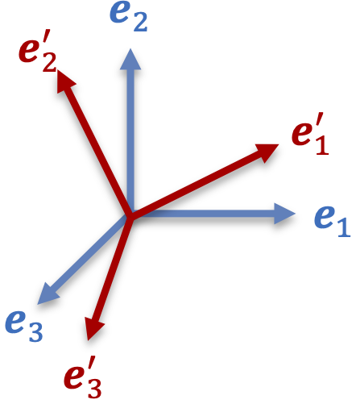
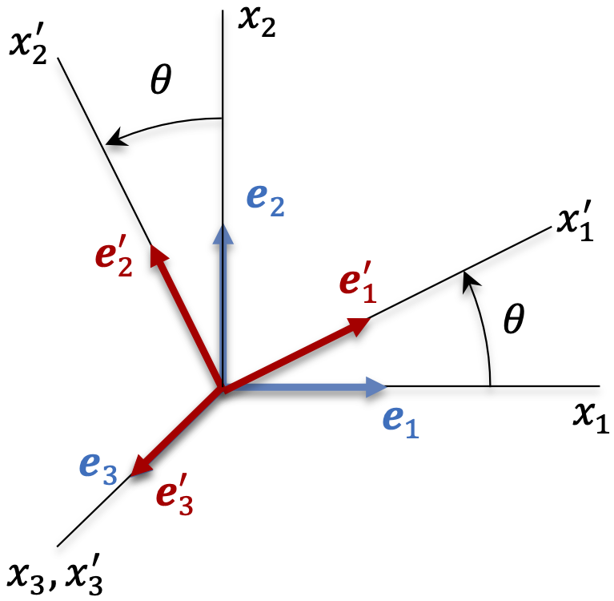

# A.1 Second-Order Tensors

## Definition

Let $\mathbf{T}$ be a transformation, which transforms any vector into another vector, e.g.,

\[ \mathbf{T}\cdot\mathbf{a}=\mathbf{b}\quad\mathbf{T}\cdot\mathbf{c}=\mathbf{d} \]

If $\mathbf{T}$ has the following properties,

\[ \begin{equation} \mathbf{T}\cdot\left(\mathbf{a}+\mathbf{c}\right)=\mathbf{T}\cdot\mathbf{a}+\mathbf{T}\cdot\mathbf{c}\label{eq6-1} \end{equation} \]

\[ \begin{equation} \mathbf{T}\cdot\left(\alpha\mathbf{a}\right)=\alpha\mathbf{T}\cdot\mathbf{a}\label{eq7-1} \end{equation} \]

where $\mathbf{a}$ and $\mathbf{c}$ are arbitrary vectors, and $\alpha$ is an arbitrary scalar, then $\mathbf{T}$ is called a _linear transformation_, a _second-order tensor_, or simply a _tensor_. Vectors are first-order tensors and scalars are zeroth-order tensors.

## Cartesian Components of a Tensor

Let $\left\{ \mathbf{e}_{1},\mathbf{e}_{2},\mathbf{e}_{3}\right\}$ form an orthonormal basis in a Cartesian coordinate system $x_{1},x_{2},x_{3}$. Then the Cartesian components of $\mathbf{a}$ are

\[ a_{1}=\mathbf{e}_{1}\cdot\mathbf{a},\quad a_{2}=\mathbf{e}_{2}\cdot\mathbf{a},\quad a_{3}=\mathbf{e}_{3}\cdot\mathbf{a} \]

or equivalently,

\[ \begin{equation} \boxed{a_{j}=\mathbf{e}_{j}\cdot\mathbf{a}}\label{eq7b} \end{equation} \]

(Recall that $\mathbf{a}=a_{i}\mathbf{e}_{i}$, thus $\mathbf{a}\cdot\mathbf{e}_{j}=a_{i}\mathbf{e}_{i}\cdot\mathbf{e}_{j}=a_{i}\delta_{ij}=a_{j}$.)

The Cartesian components of a tensor $\mathbf{T}$ are obtained as follows. Let $\mathbf{T}\cdot\mathbf{a}=\mathbf{b}$. The components of $\mathbf{b}$ are given by $b_{i}=\mathbf{e}_{i}\cdot\mathbf{b}=\mathbf{e}_{i}\cdot\mathbf{T}\cdot\mathbf{a}$. But $\mathbf{a}=a_{j}\mathbf{e}_{j}$, so $b_{i}=a_{j}\mathbf{e}_{i}\cdot\mathbf{T}\cdot\mathbf{e}_{j}$. Note that $\mathbf{e}_{i}\cdot\mathbf{T}\cdot\mathbf{e}_{j}$ is the component along $\mathbf{e}_{i}$ of the vector $\mathbf{T}\cdot\mathbf{e}_{j}$. By convention, we denote this component as

\[ \begin{equation} \boxed{T_{ij}=\mathbf{e}_{i}\cdot\mathbf{T}\cdot\mathbf{e}_{j}}\quad\text{components of tensor }\mathbf{T}\label{eq7c} \end{equation} \]

components of tensor $\mathbf{T}$.

Thus, $\mathbf{b}=\mathbf{T}\cdot\mathbf{a}=a_{j}\mathbf{T}\cdot\mathbf{e}_{j}=b_{k}\mathbf{e}_{k}$. Taking the dot product on both sides with $\mathbf{e}_{i}$ yields $a_{j}\mathbf{e}_{i}\cdot\mathbf{T}\cdot\mathbf{e}_{j}=a_{j}T_{ij}=b_{k}\mathbf{e}_{i}\cdot\mathbf{e}_{k}=b_{k}\delta_{ik}=b_{i}$, or

\[ \boxed{b_{i}=T_{ij}a_{j}} \]

in indicial form. In matrix form,

\[ \left[\begin{array}{c} b_{1}\\ b_{2}\\ b_{3} \end{array}\right]=\left[\begin{array}{ccc} T_{11} & T_{12} & T_{13}\\ T_{21} & T_{22} & T_{23}\\ T_{31} & T_{32} & T_{33} \end{array}\right]\left[\begin{array}{c} a_{1}\\ a_{2}\\ a_{3} \end{array}\right] \]

The matrix of tensor $\mathbf{T}$ with respect to $\left\{ \mathbf{e}_{1},\mathbf{e}_{2},\mathbf{e}_{3}\right\}$ can also be denoted by $\left[\mathbf{T}\right]$ or $\left[T_{ij}\right]$. The columns of $\left[\mathbf{T}\right]$ are given by $\mathbf{T}\cdot\mathbf{e}_{i}$, e.g.,

\[ \left[\mathbf{T}\cdot\mathbf{e}_{2}\right]=\left[T_{j2}\mathbf{e}_{2}\right]=\left[\begin{array}{ccc} T_{11} & T_{12} & T_{13}\\ T_{21} & T_{22} & T_{23}\\ T_{31} & T_{32} & T_{33} \end{array}\right]\left[\begin{array}{c} 0\\ 1\\ 0 \end{array}\right]=\left[\begin{array}{c} T_{12}\\ T_{22}\\ T_{32} \end{array}\right] \]

This result, when generalized, leads to the useful identity

\[ \begin{equation} \boxed{\mathbf{T}\cdot\mathbf{e}_{i}=T_{ji}\mathbf{e}_{j}}=T_{1i}\mathbf{e}_{1}+T_{2i}\mathbf{e}_{2}+T_{3i}\mathbf{e}_{3}\label{eq8-1} \end{equation} \]

**Example 1.** Scaling transformation

A scaling transformation $\mathbf{T}$ with different scale factors along $x_{1},x_{2},x_{3}$ should satisfy the following relations by definition:

\[ \mathbf{T}\cdot\mathbf{a}=s_{1}\left(\mathbf{a}\cdot\mathbf{e}_{1}\right)\mathbf{e}_{1}+s_{2}\left(\mathbf{a}\cdot\mathbf{e}_{2}\right)\mathbf{e}_{2}+s_{3}\left(\mathbf{a}\cdot\mathbf{e}_{3}\right)\mathbf{e}_{3} \]

Verify that $\mathbf{T}$ is a tensor. Also find the matrix of $\mathbf{T}$ in $\left\{ \mathbf{e}_{1},\mathbf{e}_{2},\mathbf{e}_{3}\right\}$.

_Solution_. Is $\mathbf{T}$ a tensor? Let any $\mathbf{a}=a_{i}\mathbf{e}_{i}$ and $\mathbf{b}=b_{i}\mathbf{e}_{i}$, then

\[ \begin{aligned}\mathbf{T}\cdot\left(\alpha\mathbf{a}\right) & =s_{1}\left(\alpha\mathbf{a}\cdot\mathbf{e}_{1}\right)\mathbf{e}_{1}+s_{2}\left(\alpha\mathbf{a}\cdot\mathbf{e}_{2}\right)\mathbf{e}_{2}+s_{3}\left(\alpha\mathbf{a}\cdot\mathbf{e}_{3}\right)\mathbf{e}_{3}\\ & =\alpha\left(s_{1}\left(\mathbf{a}\cdot\mathbf{e}_{1}\right)\mathbf{e}_{1}+s_{2}\left(\mathbf{a}\cdot\mathbf{e}_{2}\right)\mathbf{e}_{2}+s_{3}\left(\mathbf{a}\cdot\mathbf{e}_{3}\right)\mathbf{e}_{3}\right)\\ & =\alpha\mathbf{T}\cdot\mathbf{a} \end{aligned} \]

and

\[ \begin{aligned}\mathbf{T}\cdot\left(\mathbf{a}+\mathbf{b}\right) & =s_{1}\left(\left(\mathbf{a}+\mathbf{b}\right)\cdot\mathbf{e}_{1}\right)\mathbf{e}_{1}+s_{2}\left(\left(\mathbf{a}+\mathbf{b}\right)\cdot\mathbf{e}_{2}\right)\mathbf{e}_{2}+s_{3}\left(\left(\mathbf{a}+\mathbf{b}\right)\cdot\mathbf{e}_{3}\right)\mathbf{e}_{3}\\ & =s_{1}\left(\mathbf{a}\cdot\mathbf{e}_{1}\right)\mathbf{e}_{1}+s_{2}\left(\mathbf{a}\cdot\mathbf{e}_{2}\right)\mathbf{e}_{2}+s_{3}\left(\mathbf{a}\cdot\mathbf{e}_{3}\right)\mathbf{e}_{3}\\ & +s_{1}\left(\mathbf{b}\cdot\mathbf{e}_{1}\right)\mathbf{e}_{1}+s_{2}\left(\mathbf{b}\cdot\mathbf{e}_{2}\right)\mathbf{e}_{2}+s_{3}\left(\mathbf{b}\cdot\mathbf{e}_{3}\right)\mathbf{e}_{3}\\ & =\mathbf{T}\cdot\mathbf{a}+\mathbf{T}\cdot\mathbf{b} \end{aligned} \]

Now that we have demonstrated that $\mathbf{T}$ is a tensor, its components are given by $T_{ij}=\mathbf{e}_{i}\cdot\mathbf{T}\cdot\mathbf{e}_{j}$, thus

\[ \begin{gathered}\left[T_{i1}\right]=\left[\mathbf{e}_{i}\cdot\mathbf{T}\cdot\mathbf{e}_{1}\right]=\left[\mathbf{e}_{i}\cdot s_{1}\mathbf{e}_{1}\right]=\left[s_{1}\delta_{i1}\right]=\left[\begin{array}{c} s_{1}\\ 0\\ 0 \end{array}\right]\\ \left[T_{i2}\right]=\left[\mathbf{e}_{i}\cdot\mathbf{T}\cdot\mathbf{e}_{2}\right]=\left[\mathbf{e}_{i}\cdot s_{2}\mathbf{e}_{2}\right]=\left[s_{2}\delta_{i2}\right]=\left[\begin{array}{c} 0\\ s_{2}\\ 0 \end{array}\right]\\ \left[T_{i3}\right]=\left[\mathbf{e}_{i}\cdot\mathbf{T}\cdot\mathbf{e}_{3}\right]=\left[\mathbf{e}_{i}\cdot s_{3}\mathbf{e}_{3}\right]=\left[s_{3}\delta_{i3}\right]=\left[\begin{array}{c} 0\\ 0\\ s_{3} \end{array}\right] \end{gathered} \]

Then, the matrix of $\mathbf{T}$ is given by

\[ \left[\mathbf{T}\right]=\left[\begin{array}{ccc} s_{1} & 0 & 0\\ 0 & s_{2} & 0\\ 0 & 0 & s_{3} \end{array}\right] \]

## Sum of Tensors

The sum of two tensors $\mathbf{T}$ and $\mathbf{S}$ is denoted by $\mathbf{T}+\mathbf{S}$ and defined by

\[ \begin{equation} \boxed{\left(\mathbf{T}+\mathbf{S}\right)\cdot\mathbf{a}=\mathbf{T}\cdot\mathbf{a}+\mathbf{S}\cdot\mathbf{a}}\label{eq9-1} \end{equation} \]

for any vector $\mathbf{a}$. Thus $\mathbf{T}+\mathbf{S}$ is also a tensor, whose components are

\[ \left(\mathbf{T}+\mathbf{S}\right)_{ij}=\mathbf{e}_{i}\cdot\left(\mathbf{T}+\mathbf{S}\right)\cdot\mathbf{e}_{j}=\mathbf{e}_{i}\cdot\mathbf{T}\cdot\mathbf{e}_{j}+\mathbf{e}_{i}\cdot\mathbf{S}\cdot\mathbf{e}_{j}=T_{ij}+S_{ij} \]

In matrix notation, $\left[\mathbf{T}+\mathbf{S}\right]=\left[\mathbf{T}\right]+\left[\mathbf{S}\right]$.

## Dyadic Product of Vectors

The dyadic product of two vectors $\mathbf{a}$ and $\mathbf{b}$ is denoted by $\mathbf{a}\otimes\mathbf{b}$ (or $\mathbf{ab}$) and defined as the transformation which satisfies

\[ \begin{equation} \boxed{\left(\mathbf{a}\otimes\mathbf{b}\right)\cdot\mathbf{c}=\left(\mathbf{b}\cdot\mathbf{c}\right)\mathbf{a}}\label{eq10-1} \end{equation} \]

For any $\mathbf{c}$, $\mathbf{d}$, $\alpha$ and $\beta$, we have

\[ \begin{gathered}\left(\mathbf{a}\otimes\mathbf{b}\right)\cdot\left(\alpha\mathbf{c}+\beta\mathbf{d}\right)=\left(\mathbf{b}\cdot\left(\alpha\mathbf{c}+\beta\mathbf{d}\right)\right)\mathbf{a}=\left(\mathbf{b}\cdot\alpha\mathbf{c}\right)\mathbf{a}+\left(\mathbf{b}\cdot\beta\mathbf{d}\right)\mathbf{a}\\ =\alpha\left(\mathbf{b}\cdot\mathbf{c}\right)\mathbf{a}+\beta\left(\mathbf{b}\cdot\mathbf{d}\right)\mathbf{a}=\alpha\left(\mathbf{a}\otimes\mathbf{b}\right)\cdot\mathbf{c}+\beta\left(\mathbf{a}\otimes\mathbf{b}\right)\cdot\mathbf{d} \end{gathered} \]

thus $\mathbf{a}\otimes\mathbf{b}$ is a tensor. Its Cartesian components with respect to $\left\{ \mathbf{e}_{1},\mathbf{e}_{2},\mathbf{e}_{3}\right\}$ are

\[ \left(\mathbf{a}\otimes\mathbf{b}\right)_{ij}=\mathbf{e}_{i}\cdot\left(\mathbf{a}\otimes\mathbf{b}\right)\cdot\mathbf{e}_{j}=\mathbf{e}_{i}\cdot\left(\mathbf{b}\cdot\mathbf{e}_{j}\right)\mathbf{a}=b_{j}\mathbf{e}_{i}\cdot\mathbf{a}=a_{i}b_{j} \]

In matrix form,

\[ \left[\mathbf{a}\otimes\mathbf{b}\right]=\left[\begin{array}{ccc} a_{1}b_{1} & a_{1}b_{2} & a_{1}b_{3}\\ a_{2}b_{1} & a_{2}b_{2} & a_{2}b_{3}\\ a_{3}b_{1} & a_{3}b_{2} & a_{3}b_{3} \end{array}\right]=\left[\begin{array}{c} a_{1}\\ a_{2}\\ a_{3} \end{array}\right]\left[\begin{array}{ccc} b_{1} & b_{2} & b_{3}\end{array}\right]=\left[\mathbf{a}\right]\left[\mathbf{b}\right]^{T} \]

Note that in general, $\mathbf{a}\otimes\mathbf{b}\ne\mathbf{b}\otimes\mathbf{a}$, i.e., the dyadic product is _not commutative_. Also note that

\[ \left[\mathbf{e}_{1}\otimes\mathbf{e}_{1}\right]=\left[\begin{array}{ccc} 1 & 0 & 0\\ 0 & 0 & 0\\ 0 & 0 & 0 \end{array}\right],\quad\left[\mathbf{e}_{1}\otimes\mathbf{e}_{2}\right]=\left[\begin{array}{ccc} 0 & 1 & 0\\ 0 & 0 & 0\\ 0 & 0 & 0 \end{array}\right],\quad\left[\mathbf{e}_{1}\otimes\mathbf{e}_{3}\right]=\left[\begin{array}{ccc} 0 & 0 & 1\\ 0 & 0 & 0\\ 0 & 0 & 0 \end{array}\right]\quad\text{etc.} \]

thus it is possible to represent a second-order tensor in terms of its Cartesian components in $\left\{ \mathbf{e}_{1},\mathbf{e}_{2},\mathbf{e}_{3}\right\}$ as $\mathbf{T}=T_{11}\mathbf{e}_{1}\otimes\mathbf{e}_{1}+T_{12}\mathbf{e}_{1}\otimes\mathbf{e}_{2}+T_{13}\mathbf{e}_{1}\otimes\mathbf{e}_{3}+\ldots+T_{33}\mathbf{e}_{3}\otimes\mathbf{e}_{3}$, or

\[ \begin{equation} \boxed{\mathbf{T}=T_{ij}\mathbf{e}_{i}\otimes\mathbf{e}_{j}}\label{eq11-1} \end{equation} \]

This turns out to be an important result that can be generalized to higher order tensors, e.g., third-order tensors can be represented in terms of their Cartesian components as $\mathbb{T}=T_{ijk}\mathbf{e}_{i}\otimes\mathbf{e}_{j}\otimes\mathbf{e}_{k}$, and similarly for higher orders.

**Example 2.** The scaling transformation derived in a previous example can be represented as

\[ \mathbf{T}=s_{1}\mathbf{e}_{1}\otimes\mathbf{e}_{1}+s_{2}\mathbf{e}_{2}\otimes\mathbf{e}_{2}+s_{3}\mathbf{e}_{3}\otimes\mathbf{e}_{3} \]

## Trace of a Second-Order Tensor

The trace of any dyad $\mathbf{a}\otimes\mathbf{b}$ is defined by

\[ \boxed{\tr\left(\mathbf{a}\otimes\mathbf{b}\right)=\mathbf{a}\cdot\mathbf{b}} \]

and

\[ \boxed{\tr\left(\alpha\mathbf{a}\otimes\mathbf{b}+\beta\mathbf{c}\otimes\mathbf{d}\right)=\alpha\tr\left(\mathbf{a}\otimes\mathbf{b}\right)+\beta\tr\left(\mathbf{c}\otimes\mathbf{d}\right)} \]

The trace operator yields a scalar function. In component form,

\[ \tr\left(a_{i}b_{j}\right)=a_{i}b_{i} \]

For any tensor $\mathbf{T}$, we can write $\mathbf{T}=T_{ij}\mathbf{e}_{i}\otimes\mathbf{e}_{j}$, thus

\[ \tr\mathbf{T}=T_{ij}\tr\left(\mathbf{e}_{i}\otimes\mathbf{e}_{j}\right)=T_{ij}\mathbf{e}_{i}\cdot\mathbf{e}_{j}=T_{ij}\delta_{ij}=T_{ii}=T_{11}+T_{22}+T_{33} \]

The trace of a tensor is the sum of its diagonal components.

## Product of Two Tensors

The products of two tensors $\mathbf{T}$ and $\mathbf{S}$ are denoted by $\mathbf{T}\cdot\mathbf{S}$ and $\mathbf{S}\cdot\mathbf{T}$ and defined respectively by

\[ \begin{equation} \boxed{\left(\mathbf{T}\cdot\mathbf{S}\right)\cdot\mathbf{a}=\mathbf{T}\cdot\left(\mathbf{S}\cdot\mathbf{a}\right)}\label{eq12-1} \end{equation} \]

and

\[ \begin{equation} \boxed{\left(\mathbf{S}\cdot\mathbf{T}\right)\cdot\mathbf{a}=\mathbf{S}\cdot\left(\mathbf{T}\cdot\mathbf{a}\right)}\label{eq12b} \end{equation} \]

Clearly, $\mathbf{T}\cdot\mathbf{S}$ and $\mathbf{S}\cdot\mathbf{T}$ are tensors as well. Their components in $\left\{ \mathbf{e}_{1},\mathbf{e}_{2},\mathbf{e}_{3}\right\}$ are given by

\[ \left(\mathbf{T}\cdot\mathbf{S}\right)_{ij}=\mathbf{e}_{i}\cdot\left(\mathbf{T}\cdot\mathbf{S}\right)\cdot\mathbf{e}_{j}=\mathbf{e}_{i}\cdot\mathbf{T}\cdot\left(\mathbf{S}\cdot\mathbf{e}_{j}\right)=\mathbf{e}_{i}\cdot\mathbf{T}\cdot\left(S_{kj}\mathbf{e}_{k}\right)=S_{kj}\mathbf{e}_{i}\cdot\mathbf{T}\cdot\mathbf{e}_{k}=T_{ik}S_{kj} \]

In matrix form, $\left[\mathbf{T}\cdot\mathbf{S}\right]=\left[\mathbf{T}\right]\left[\mathbf{S}\right]$. Similarly,

\[ \left(\mathbf{S}\cdot\mathbf{T}\right)_{ij}=S_{ik}T_{kj}\quad\text{and}\quad\left[\mathbf{S}\cdot\mathbf{T}\right]=\left[\mathbf{S}\right]\left[\mathbf{T}\right] \]

In general, $\mathbf{T}\cdot\mathbf{S}\ne\mathbf{S}\cdot\mathbf{T}$, however $\left(\mathbf{T}\cdot\mathbf{S}\right)\cdot\mathbf{V}=\mathbf{T}\cdot\left(\mathbf{S}\cdot\mathbf{V}\right)$, i.e., the tensor product is _associative_ but _not commutative_.

## Identity Tensor and Tensor Inverse

The identity tensor, denoted by $\mathbf{I}$, is defined by

\[ \begin{equation} \boxed{\mathbf{I}\cdot\mathbf{a}=\mathbf{a}}\label{eq13-1} \end{equation} \]

for any vector $\mathbf{a}$. The Cartesian components o f $\mathbf{I}$ in $\left\{ \mathbf{e}_{1},\mathbf{e}_{2},\mathbf{e}_{3}\right\}$ are given by

\[ I_{ij}=\mathbf{e}_{i}\cdot\mathbf{I}\cdot\mathbf{e}_{j}=\mathbf{e}_{i}\cdot\mathbf{e}_{j}=\delta_{ij} \]

or

\[ \left[\mathbf{I}\right]=\left[\begin{array}{ccc} 1 & 0 & 0\\ 0 & 1 & 0\\ 0 & 0 & 1 \end{array}\right] \]

Given $\mathbf{T}$, if $\mathbf{S}$ exists such that $\mathbf{S}\cdot\mathbf{T}=\mathbf{I}$, we call $\mathbf{S}$ the _inverse_ of $\mathbf{T}$, and $\mathbf{S}=\mathbf{T}^{-1}$. The inverse exists as long as $\det\mathbf{T}\neq0$. Also note that $\left(\mathbf{T}^{-1}\right)^{-1}=\mathbf{T}$ and $\mathbf{T}^{-1}\cdot\mathbf{T}=\mathbf{T}\cdot\mathbf{T}^{-1}=\mathbf{I}$. Also note that

\[ \boxed{\left(\mathbf{U}\cdot\mathbf{V}\right)^{-1}=\mathbf{V}^{-1}\cdot\mathbf{U}^{-1}}\,. \]

## Transpose of a Tensor

Given a tensor $\mathbf{T}$, its transpose is denoted by $\mathbf{T}^{T}$ which is defined by

\[ \begin{equation} \boxed{\mathbf{a}\cdot\left(\mathbf{T}\cdot\mathbf{b}\right)=\mathbf{b}\cdot\left(\mathbf{T}^{T}\cdot\mathbf{\mathbf{a}}\right)}\label{eq14-1} \end{equation} \]

In component form,

\[ T_{ij}^{T}=\mathbf{e}_{i}\cdot\mathbf{T}^{T}\cdot\mathbf{e}_{j}=\mathbf{e}_{j}\cdot\mathbf{T}\cdot\mathbf{e}_{i}=T_{ji} \]

Also note that

\[ \begin{equation} \boxed{\left(\mathbf{S}\cdot\mathbf{T}\right)^{T}=\mathbf{T}^{T}\cdot\mathbf{S}^{T}}\label{eq15-1} \end{equation} \]

and $\left(\mathbf{S}^{T}\right)^{T}=\mathbf{S}$ and$\left(\mathbf{S}+\mathbf{T}\right)^{T}=\mathbf{S}^{T}+\mathbf{T}^{T}$.

## Double Product of Tensors

The double product of tensors is analogous to the dot product of vectors. Given two tensors $\mathbf{S}$ and $\mathbf{T}$, the double product (or _double contraction_) is defined as

\[ \begin{equation} \boxed{\mathbf{S}:\mathbf{T}=\tr\left(\mathbf{S}^{T}\cdot\mathbf{T}\right)}\label{eq16-1} \end{equation} \]

Thus, for any tensor $\mathbf{T}$, $\tr\mathbf{T}=\mathbf{I}:\mathbf{T}$. In component form,

\[ \mathbf{S}:\mathbf{T}=S_{ij}T_{ij} \]

The double product of second order tensors is commutative.

**Example 3.** Show that $\mathbf{a}\cdot\mathbf{T}\cdot\mathbf{b}=\mathbf{T}:\left(\mathbf{a}\otimes\mathbf{b}\right)$ and $\left(\mathbf{a}\otimes\mathbf{b}\right):\left(\mathbf{c}\otimes\mathbf{d}\right)=\left(\mathbf{a}\cdot\mathbf{c}\right)\left(\mathbf{b}\cdot\mathbf{d}\right)$.

Using indicial notation,

\[ \mathbf{a}\cdot\mathbf{T}\cdot\mathbf{b}=a_{i}T_{ij}b_{j}=T_{ij}a_{i}b_{j}=\mathbf{T}:\left(\mathbf{a}\otimes\mathbf{b}\right)\,, \]

and

\[ \left(\mathbf{a}\otimes\mathbf{b}\right):\left(\mathbf{c}\otimes\mathbf{d}\right)=a_{i}b_{j}c_{i}d_{j}=\left(a_{i}c_{i}\right)\left(b_{j}d_{j}\right)=\left(\mathbf{a}\cdot\mathbf{c}\right)\left(\mathbf{b}\cdot\mathbf{d}\right)\,. \]

## Determinant of a Tensor {: #subsubsec:determinant }

The determinant of a tensor is equal to the determinant of its components in $\left\{ \mathbf{e}_{1},\mathbf{e}_{2},\mathbf{e}_{3}\right\}$,

\[ \begin{equation} \det\mathbf{T}=\det\left[\mathbf{T}\right]_{\mathbf{e}_{i}}=\left|\begin{array}{ccc} T_{11} & T_{12} & T_{13}\\ T_{21} & T_{22} & T_{23}\\ T_{31} & T_{32} & T_{33} \end{array}\right|=\left(\mathbf{T}\cdot\mathbf{e}_{1}\times\mathbf{T}\cdot\mathbf{e}_{2}\right)\cdot\mathbf{T}\cdot\mathbf{e}_{3}=\varepsilon_{ijk}T_{i1}T_{j2}T_{k3}\label{eq17-1} \end{equation} \]

In particular, the determinant of a diagonal matrix is the product of the diagonal components,

\[ \begin{equation} \det\left[\mathbf{T}\right]_{\mathbf{e}_{i}}=\left|\begin{array}{ccc} T_{11} & 0 & 0\\ 0 & T_{22} & 0\\ 0 & 0 & T_{33} \end{array}\right|=\varepsilon_{123}T_{11}T_{22}T_{33}=T_{11}T_{22}T_{33}\label{eq18-1} \end{equation} \]

The determinant satisfies the following relations,

\[ \begin{equation} \det\mathbf{T}^{-1}=\frac{1}{\det\mathbf{T}}\label{eq19-1} \end{equation} \]

\[ \begin{equation} \det\left(\mathbf{S}\cdot\mathbf{T}\right)=\left(\det\mathbf{S}\right)\left(\det\mathbf{T}\right)\label{eq20-1} \end{equation} \]

## Orthogonal Tensor

An orthogonal tensor $\mathbf{Q}$ is a linear transformation which preserves the length of a vector and the angle between vectors. Thus, by definition,

\[ \left|\mathbf{Q}\cdot\mathbf{a}\right|=\left|\mathbf{a}\right|\quad\text{and}\quad\cos\left(\mathbf{Q}\cdot\mathbf{a},\mathbf{Q}\cdot\mathbf{b}\right)=\cos\left(\mathbf{a},\mathbf{b}\right) \]

for any vectors $\mathbf{a}$ and $\mathbf{b}$. It follows from this definition and the definition of the dot product of vectors ($\mathbf{a}\cdot\mathbf{b}=\left|\mathbf{a}\right|\left|\mathbf{b}\right|\cos\left(\mathbf{a},\mathbf{b}\right))$, that

\[ \left(\mathbf{Q}\cdot\mathbf{a}\right)\cdot\left(\mathbf{Q}\cdot\mathbf{b}\right)=\mathbf{a}\cdot\mathbf{b} \]

But $\left(\mathbf{Q}\cdot\mathbf{a}\right)\cdot\left(\mathbf{Q}\cdot\mathbf{b}\right)=\mathbf{b}\cdot\left(\mathbf{Q}^{T}\cdot\mathbf{Q}\right)\mathbf{a}=\mathbf{a}\cdot\mathbf{b}=\mathbf{b}\cdot\mathbf{I}\cdot\mathbf{a}$, which implies that $\mathbf{b}\cdot\left(\mathbf{Q}^{T}\cdot\mathbf{Q}-\mathbf{I}\right)\cdot\mathbf{a}=0$. Since $\mathbf{a}$ and $\mathbf{b}$ are arbitrary, an orthogonal tensor must satisfy $\mathbf{Q}^{T}\cdot\mathbf{Q}=\mathbf{I}$. In indicial form, $Q_{im}^{T}Q_{mj}=Q_{mi}Q_{mj}=\delta_{ij}$, and in matrix form, $\left[\mathbf{Q}\right]^{T}\left[\mathbf{Q}\right]=\left[\mathbf{I}\right]$.

Note that $\mathbf{Q}^{T}\cdot\mathbf{Q}=\mathbf{I}$ implies that $\mathbf{Q}^{T}=\mathbf{Q}^{-1}$, i.e., the transpose of an orthogonal tensor is equal to its inverse, since $\mathbf{Q}^{-1}\cdot\mathbf{Q}=\mathbf{Q}\cdot\mathbf{Q}^{-1}=\mathbf{I}$. It follows that

\[ \begin{equation} \boxed{\mathbf{Q}^{T}\cdot\mathbf{Q}=\mathbf{Q}\cdot\mathbf{Q}^{T}=\mathbf{I}}\label{eq21-1} \end{equation} \]

The determinant of an orthogonal tensor is given by

\[ \det\mathbf{Q}=\left(\mathbf{Q}\cdot\mathbf{e}_{1}\times\mathbf{Q}\cdot\mathbf{e}_{2}\right)\cdot\mathbf{Q}\cdot\mathbf{e}_{3}=\left(\mathbf{e}'_{1}\times\mathbf{e}'_{2}\right)\cdot\mathbf{e}'_{3}=\pm\mathbf{e}'_{3}\cdot\mathbf{e}'_{3}=\pm1 \]

Here, $\left\{ \mathbf{e}'_{1},\mathbf{e}'_{2},\mathbf{e}'_{3}\right\}$ is the orthonormal basis resulting from the transformation of $\left\{ \mathbf{e}_{1},\mathbf{e}_{2},\mathbf{e}_{3}\right\}$ by $\mathbf{Q}$. If $\mathbf{Q}$ maintains the handedness of $\left\{ \mathbf{e}_{1},\mathbf{e}_{2},\mathbf{e}_{3}\right\}$ (e.g., if both $\left\{ \mathbf{e}_{1},\mathbf{e}_{2},\mathbf{e}_{3}\right\}$ and $\left\{ \mathbf{e}'_{1},\mathbf{e}'_{2},\mathbf{e}'_{3}\right\}$ form a right-handed basis), then $\det\mathbf{Q}=+1$ and $\mathbf{Q}$ is called a _proper_ orthogonal transformation (also equivalent to a rigid body rotation). Otherwise, in the case of a reflection which reverses the handedness of the basis vectors, $\det\mathbf{Q}=-1$ and $\mathbf{Q}$ is called _improper_ (e.g., $\mathbf{e}'_{1}=\mathbf{e}_{1},\,\mathbf{e}'_{2}=-\mathbf{e}_{2},\,\mathbf{e}'_{3}=\mathbf{e}_{3}$).

## Transformation Laws for Cartesian Components of Vectors and Tensors

/// figure-caption

Orthonormal bases $\left\{ \mathbf{e}_{1},\mathbf{e}_{2},\mathbf{e}_{3}\right\}$ and $\left\{ \mathbf{e}'_{1},\mathbf{e}'_{2},\mathbf{e}'_{3}\right\}$.

///

Let $\left\{ \mathbf{e}_{1},\mathbf{e}_{2},\mathbf{e}_{3}\right\}$ and $\left\{ \mathbf{e}'_{1},\mathbf{e}'_{2},\mathbf{e}'_{3}\right\}$ be two orthogonal bases in a Cartesian coordinate system. $\left\{ \mathbf{e}_{1},\mathbf{e}_{2},\mathbf{e}_{3}\right\}$ could be made to coincide with $\left\{ \mathbf{e}'_{1},\mathbf{e}'_{2},\mathbf{e}'_{3}\right\}$ through a rigid body rotation (i.e., a transformation that preserves vector length and angles),

\[ \mathbf{e}'_{i}=\mathbf{Q}\cdot\mathbf{e}_{i}=Q_{mi}\mathbf{e}_{m} \]

where $Q_{mi}Q_{mj}=Q_{im}Q_{jm}=\delta_{ij}$. Since $Q_{mi}=\mathbf{e}_{m}\cdot\mathbf{Q}\cdot\mathbf{e}_{i}=\mathbf{e}_{m}\cdot\mathbf{e}'_{i}=\cos\left(\mathbf{e}_{m},\mathbf{e}'_{i}\right)$, the components of $\mathbf{Q}$ are direction cosines between $\mathbf{e}_{m}$ and $\mathbf{e}'_{i}$.

**Example 4.** Rotation about $x_{3}$

/// figure-caption

Rotation about $x_{3}$.

///

\[ \left[\mathbf{Q}\right]=\left[\begin{array}{ccc} \cos\theta & -\sin\theta & 0\\ \sin\theta & \cos\theta & 0\\ 0 & 0 & 1 \end{array}\right] \]

Reflection about $x_{2}-x_{3}$ plane, $\mathbf{e}'_{1}=\mathbf{Q}\cdot\mathbf{e}_{1}=-\mathbf{e}_{1},\,\mathbf{e}'_{2}=\mathbf{Q}\cdot\mathbf{e}_{2}=\mathbf{e}_{2},\,\mathbf{e}'_{3}=\mathbf{Q}\cdot\mathbf{e}_{3}=\mathbf{e}_{3}$.

\[ \left[\mathbf{Q}\right]=\left[\begin{array}{ccc} -1 & 0 & 0\\ 0 & 1 & 0\\ 0 & 0 & 1 \end{array}\right] \]

For any vector $\mathbf{a}$, its components with respect to $\left\{ \mathbf{e}_{1},\mathbf{e}_{2},\mathbf{e}_{3}\right\}$ and $\left\{ \mathbf{e}'_{1},\mathbf{e}'_{2},\mathbf{e}'_{3}\right\}$ are $a_{i}=\mathbf{e}_{i}\cdot\mathbf{a}$ and $a'_{i}=\mathbf{e}'_{i}\cdot\mathbf{a}$, respectively. Using the above relation,

\[ a'_{i}=\mathbf{e}'_{i}\cdot\mathbf{a}=\mathbf{a}\cdot\mathbf{Q}\cdot\mathbf{e}_{i}=Q_{mi}\mathbf{a}\cdot\mathbf{e}_{m}=Q_{mi}a_{m}, \]

or

\[ \begin{equation} \boxed{a'_{i}=Q_{mi}a_{m}}\label{eq22-1} \end{equation} \]

In matrix form,

\[ \left[\begin{array}{c} a'_{1}\\ a'_{2}\\ a'_{3} \end{array}\right]_{\mathbf{e'}_{i}}=\left[\begin{array}{ccc} Q_{11} & Q_{21} & Q_{31}\\ Q_{12} & Q_{22} & Q_{32}\\ Q_{13} & Q_{23} & Q_{33} \end{array}\right]\left[\begin{array}{c} a_{1}\\ a_{2}\\ a_{3} \end{array}\right]_{\mathbf{e}_{i}} \]

or

\[ \left[\mathbf{a}\right]^{\prime}=\left[\mathbf{Q}\right]^{T}\left[\mathbf{a}\right]\quad\text{or}\quad\left[\mathbf{a}\right]_{\mathbf{e'}_{i}}=\left[\mathbf{Q}\right]^{T}\left[\mathbf{a}\right]_{\mathbf{e}_{i}} \]

Here $\left[\mathbf{a}\right]^{\prime}$ and $\left[\mathbf{a}\right]$ are matrices of the _same_ vector, expressed in two different coordinate systems. This is _not the same_ as $\mathbf{a}'=\mathbf{Q}^{T}\cdot\mathbf{a}$, where $\mathbf{a}'$ is the linear transformation of $\mathbf{a}$ by $\mathbf{Q}^{T}$.

Now consider a tensors $\mathbf{T}$. Its components with respect to $\left\{ \mathbf{e}_{1},\mathbf{e}_{2},\mathbf{e}_{3}\right\}$ and $\left\{ \mathbf{e}'_{1},\mathbf{e}'_{2},\mathbf{e}'_{3}\right\}$ are given by $T_{ij}=\mathbf{e}_{i}\cdot\mathbf{T}\cdot\mathbf{e}_{j}$ and $T'_{ij}=\mathbf{e}'_{i}\cdot\mathbf{T}\cdot\mathbf{e}'_{j}$, respectively. Thus, $T'_{ij}=\left(\mathbf{Q}\cdot\mathbf{e}_{i}\right)\cdot\mathbf{T}\cdot\left(\mathbf{Q}\cdot\mathbf{e}_{j}\right)=Q_{mi}\mathbf{e}_{m}\cdot\mathbf{T}\cdot Q_{nj}\mathbf{e}_{n}=Q_{mi}Q_{nj}\mathbf{e}_{m}\cdot\mathbf{T}\cdot\mathbf{e}_{n}=Q_{mi}Q_{nj}T_{mn}$, or

\[ \begin{equation} \boxed{T'_{ij}=Q_{mi}Q_{nj}T_{mn}}\label{eq23-1} \end{equation} \]

In matrix form, $\left[\mathbf{T}\right]^{\prime}=\left[\mathbf{Q}\right]^{T}\left[\mathbf{T}\right]\left[\mathbf{Q}\right]$, or

\[ \left[\begin{array}{ccc} T'_{11} & T'_{12} & T'_{13}\\ T'_{21} & T'_{22} & T'_{23}\\ T'_{31} & T'_{32} & T'_{33} \end{array}\right]=\left[\begin{array}{ccc} Q_{11} & Q_{21} & Q_{31}\\ Q_{12} & Q_{22} & Q_{32}\\ Q_{13} & Q_{23} & Q_{33} \end{array}\right]\left[\begin{array}{ccc} T_{11} & T_{12} & T_{13}\\ T_{21} & T_{22} & T_{23}\\ T_{31} & T_{32} & T_{33} \end{array}\right]\left[\begin{array}{ccc} Q_{11} & Q_{12} & Q_{13}\\ Q_{21} & Q_{22} & Q_{23}\\ Q_{31} & Q_{32} & Q_{33} \end{array}\right] \]

Equivalently, we can show that

\[ \begin{equation} \boxed{T_{ij}=Q_{im}Q_{jn}T'_{mn}}\label{eq24-1} \end{equation} \]

or $\left[\mathbf{T}\right]=\left[\mathbf{Q}\right]\left[\mathbf{T}\right]^{\prime}\left[\mathbf{Q}\right]^{T}$. As for vectors, we note that $\left[\mathbf{T}\right]$ and $\left[\mathbf{T}\right]^{\prime}$ are the matrices of the _same_ tensor $\mathbf{T}$, with respect to two different coordinate systems. This is _not the same_ as $\mathbf{T}'=\mathbf{Q}^{T}\cdot\mathbf{T}\cdot\mathbf{Q}$.

## Symmetric and Antisymmetric Tensors {: #subsubsec:symmetric }

A _symmetric_ tensor $\mathbf{T}$ satisfies $\mathbf{T}^{T}=\mathbf{T}$, i.e., $T_{ji}=T_{ij}$, or in matrix form,

\[ \left[\mathbf{T}\right]=\left[\begin{array}{ccc} T_{11} & T_{12} & T_{13}\\ T_{12} & T_{22} & T_{23}\\ T_{13} & T_{23} & T_{33} \end{array}\right] \]

An _antisymmetric_ (or _skew-symmetric_) tensor $\boldsymbol{\Omega}$ satisfies $\boldsymbol{\Omega}^{T}=-\boldsymbol{\Omega}$, i.e., $\Omega_{ji}=-\Omega_{ij}$ and thus $\Omega_{11}=\Omega_{22}=\Omega_{33}=0$,

\[ \left[\boldsymbol{\Omega}\right]=\left[\begin{array}{ccc} 0 & \Omega_{12} & -\Omega_{31}\\ -\Omega_{12} & 0 & \Omega_{23}\\ \Omega_{31} & -\Omega_{23} & 0 \end{array}\right] \]

Any tensor can be written as the sum of a symmetric and antisymmetric tensor,

\[ \mathbf{T}=\mathbf{T}^{S}+\mathbf{T}^{A}\quad\text{where}\quad\mathbf{T}^{S}=\frac{1}{2}\left(\mathbf{T}+\mathbf{T}^{T}\right)\quad\text{and}\quad\mathbf{T}^{A}=\frac{1}{2}\left(\mathbf{T}-\mathbf{T}^{T}\right) \]

This is a unique decomposition. It can be checked that $\mathbf{T}^{S}$ is symmetric and $\mathbf{T}^{A}$ is antisymmetric.

The _dual vector_ $\boldsymbol{\omega}$ of an antisymmetric tensor $\boldsymbol{\Omega}$ satisfies

\[ \begin{equation} \boxed{\boldsymbol{\Omega}\cdot\mathbf{a}=\boldsymbol{\omega}\times\mathbf{a}}\label{eq25-1} \end{equation} \]

for any vector $\mathbf{a}$. Thus $\Omega_{ij}=\mathbf{e}_{i}\cdot\boldsymbol{\Omega}\cdot\mathbf{e}_{j}=\mathbf{e}_{i}\cdot\left(\boldsymbol{\omega}\times\mathbf{e}_{j}\right)=\omega_{k}\mathbf{e}_{i}\cdot\left(\mathbf{e}_{k}\times\mathbf{e}_{j}\right)=\omega_{k}\mathbf{e}_{i}\cdot\varepsilon_{kjl}\mathbf{e}_{l}=\omega_{k}\varepsilon_{kjl}\delta_{il}$ or

\[ \begin{equation} \boxed{\Omega_{ij}=-\varepsilon_{ijk}\omega_{k}}\label{eq26-1} \end{equation} \]

In matrix form,

\[ \left[\boldsymbol{\Omega}\right]=\left[\begin{array}{ccc} 0 & -\omega_{3} & \omega_{2}\\ \omega_{3} & 0 & -\omega_{1}\\ -\omega_{2} & \omega_{1} & 0 \end{array}\right] \]

Conversely, it can also be shown that

\[ \begin{equation} \boxed{\omega_{i}=-\frac{1}{2}\varepsilon_{ijk}\Omega_{jk}}\label{eq27-1} \end{equation} \]

As a homework problem, it may be shown that $\varepsilon_{ijk}T_{jk}=\varepsilon_{ijk}T_{jk}^{A}$, since $\varepsilon_{ijk}T_{jk}^{S}=0$ for any symmetric tensor $\mathbf{T}^{S}$.

## Eigenvalues and Eigenvectors of Real Symmetric Tensors

A second-order tensor $\mathbf{T}$ has three pairs of eigenvalues $\lambda$ and eigenvectors $\mathbf{v}$ that each satisfy

\[ \begin{equation} \mathbf{T}\cdot\mathbf{v}=\lambda\mathbf{v}\label{eq:eigen-def} \end{equation} \]

The eigenvalues $\lambda$ are the roots of the characteristic equation of $\mathbf{T}$, which is the cubic polynomial produced by setting $\det\left(\mathbf{T}-\lambda\mathbf{I}\right)=0$,

\[ \begin{equation} -\lambda^{3}+I_{1}\lambda^{2}-I_{2}\lambda+I_{3}=0\label{eq:eigen-char-eqn} \end{equation} \]

where

\[ \begin{equation} \begin{aligned}I_{1} & =\tr\mathbf{T}\\ I_{2} & =\frac{1}{2}\left(I_{1}^{2}-\tr\mathbf{T}^{2}\right)\\ I_{3} & =\det\mathbf{T} \end{aligned} \label{eq:eigen-invariants} \end{equation} \]

are called _invariants_ of $\mathbf{T}$.

According to the Cayley-Hamilton theorem, a tensor $\mathbf{T}$ satisfies its own characteristic equation,

\[ \begin{equation} -\mathbf{T}^{3}+I_{1}\mathbf{T}^{2}-I_{2}\mathbf{T}+I_{3}\mathbf{I}=\mathbf{0}\label{eq:Cayley-Hamilton-theorem} \end{equation} \]

Therefore, the cubic power of $\mathbf{T}$ can be expressed in terms of its lower powers according to $\mathbf{T}^{3}=I_{1}\mathbf{T}^{2}-I_{2}\mathbf{T}+I_{3}\mathbf{I}$. Taking the trace of this equation allows us to solve for $I_{3}$ as

\[ \begin{equation} \begin{aligned}I_{3} & =\frac{1}{3}\left(\tr\mathbf{T}^{3}-I_{1}\tr\mathbf{T}^{2}+I_{2}\tr\mathbf{T}\right)\\ & =\frac{1}{3}\left(\tr\mathbf{T}^{3}-I_{1}^{3}+3I_{1}I_{2}\right) \end{aligned} \label{eq:eigen-I3-soln} \end{equation} \]

Multiplying eq.\eqref{eq:Cayley-Hamilton-theorem} by $\mathbf{T}^{-1}$ also produces

\[ I_{3}\mathbf{T}^{-1}=\mathbf{T}^{2}-I_{1}\mathbf{T}+I_{2}\mathbf{I} \]

Using all these relations, we may differentiate the three invariants of $\mathbf{T}$ with respect to $\mathbf{T}$ to get

\[ \begin{equation} \begin{aligned}\frac{\partial I_{1}}{\partial\mathbf{T}} & =\mathbf{I}\\ \frac{\partial I_{2}}{\partial\mathbf{T}} & =I_{1}\mathbf{I}-\mathbf{T}^{T}\\ \frac{\partial I_{3}}{\partial\mathbf{T}} & =I_{3}\mathbf{T}^{-T} \end{aligned} \label{eq:eigen-dinv-dT} \end{equation} \]

**Theorem.** The eigenvalues of real symmetric tensors are real (proof not provided here).

**Theorem.** If the eigenvalues of a real symmetric tensor are all distinct, the eigenvectors are orthogonal to each other.

_Proof:_ Given $\mathbf{T}\cdot\mathbf{v}_{1}=\lambda_{1}\mathbf{v}_{1}$, $\mathbf{T}\cdot\mathbf{v}_{2}=\lambda_{2}\mathbf{v}_{2}$, $\lambda_{1}\ne\lambda_{2}$, then $\mathbf{v}_{2}\cdot\mathbf{T}\cdot\mathbf{v}_{1}=\lambda_{1}\mathbf{v}_{1}\cdot\mathbf{v}_{2}$ and $\mathbf{v}_{1}\cdot\mathbf{T}\cdot\mathbf{v}_{2}=\lambda_{2}\mathbf{v}_{1}\cdot\mathbf{v}_{2}=\mathbf{v}_{2}\cdot\mathbf{T}^{T}\cdot\mathbf{v}_{1}=\mathbf{v}_{2}\cdot\mathbf{T}\cdot\mathbf{v}_{1}$,

\[ \Rightarrow\lambda_{1}\mathbf{v}_{1}\cdot\mathbf{v}_{2}=\lambda_{2}\mathbf{v}_{1}\cdot\mathbf{v}_{2}\quad\text{or}\quad\left(\lambda_{1}-\lambda_{2}\right)\mathbf{v}_{1}\cdot\mathbf{v}_{2}=0\quad\Rightarrow\mathbf{v}_{1}\cdot\mathbf{v}_{2}=0 \]

When two of the eigenvalues are repeated (a double root of the characteristic equation), the resulting eigenvectors are not necessarily orthogonal to each other; however, they remain orthogonal to the third eigenvector. This means that any vector lying in the plane normal to the third eigenvector is an eigenvector corresponding to the double root. Similarly, when all three eigenvalues are repeated (a triple root), any vector becomes an eigenvector of $\mathbf{T}$.

**Example 5.** In hydrostatics the stress tensor is $\mathbf{T}=-p\mathbf{I}$, where $p$ is the hydrostatic pressure. In this case, $-p$ is a triple root of the characteristic equation of $\mathbf{T}$. Any vector $\mathbf{v}$ satisfies $\mathbf{T}\cdot\mathbf{v}=-p\mathbf{v}$, and is thus an eigenvector of $\mathbf{T}$.

In continuum mechanics the eigenvectors $\mathbf{v}$ of a tensor are generally normalized,

\[ \mathbf{n}\equiv\frac{\mathbf{v}}{\left|\mathbf{v}\right|} \]

Thus, we can always find a set of three orthonormal eigenvectors $\left\{ \mathbf{n}_{1},\mathbf{n}_{2},\mathbf{n}_{3}\right\}$ for any real symmetric tensor $\mathbf{T}$, even when the eigenvalues are repeated. Given a tensor $\mathbf{T}$ with eigenvalues $\lambda_{1},\lambda_{2},\lambda_{3}$ and eigenvectors $\mathbf{n}_{1},\mathbf{n}_{2},\mathbf{n}_{3}$, the components of $\mathbf{T}$ in the orthonormal basis $\left\{ \mathbf{n}_{1},\mathbf{n}_{2},\mathbf{n}_{3}\right\}$ can be obtained from

\[ T_{i1}=\mathbf{v}_{i}\cdot\mathbf{T}\cdot\mathbf{n}_{1}=\lambda_{1}\mathbf{n}_{i}\cdot\mathbf{n}_{1}=\lambda_{1}\delta_{i1}\quad T_{i2}=\lambda_{2}\delta_{i2}T_{i3}=\lambda_{3}\delta_{i3} \]

Thus,

\[ \left[\mathbf{T}\right]_{\mathbf{n}_{i}}=\left[\begin{array}{ccc} \lambda_{1} & 0 & 0\\ 0 & \lambda_{2} & 0\\ 0 & 0 & \lambda_{3} \end{array}\right]=\left[\begin{array}{ccc} T_{1} & 0 & 0\\ 0 & T_{2} & 0\\ 0 & 0 & T_{3} \end{array}\right] \]

Since $\mathbf{T}=T_{ij}\mathbf{n}_{i}\otimes\mathbf{n}_{j}=T_{i1}\mathbf{n}_{i}\otimes\mathbf{n}_{1}+T_{i2}\mathbf{n}_{i}\otimes\mathbf{n}_{2}+T_{i3}\mathbf{n}_{i}\otimes\mathbf{n}_{3}$, we find that

\[ \begin{equation} \mathbf{T}=\lambda_{1}\mathbf{n}_{1}\otimes\mathbf{n}_{1}+\lambda_{2}\mathbf{n}_{2}\otimes\mathbf{n}_{2}+\lambda_{3}\mathbf{n}_{3}\otimes\mathbf{n}_{3}\label{eq:eigen-spectral-rep} \end{equation} \]

This is known as the _spectral representation_ of the tensor $\mathbf{T}$. In particular, since the eigenvalues of the identity tensor are $\lambda_{1}=\lambda_{2}=\lambda_{3}=1$, and since any vector is an eigenvector of $\mathbf{I}$, we can select the basis vectors $\mathbf{e}_{1},\,\mathbf{e}_{2},\,\mathbf{e}_{3}$ so that the spectral representation of $\mathbf{I}$ may be given by

\[ \begin{equation} \mathbf{I}=\mathbf{e}_{i}\otimes\mathbf{e}_{i}=\mathbf{e}_{1}\otimes\mathbf{e}_{1}+\mathbf{e}_{2}\otimes\mathbf{e}_{2}+\mathbf{e}_{3}\otimes\mathbf{e}_{3}\label{eq:eigen-identity-spectral} \end{equation} \]

## Orthogonal Transformation of Tensors

An orthogonal transformation $\mathbf{Q}$ transforms any vector $\mathbf{a}$ into the vector $\mathbf{Q}\cdot\mathbf{a}$, which we may denote as

\[ \begin{equation} \mathbf{a}^{*}=\mathbf{Q}\cdot\mathbf{a}\label{eq:OT-vector} \end{equation} \]

Recall that a tensor $\mathbf{T}$ may be expressed in its spectral representation as per eq.\eqref{eq:eigen-spectral-rep}. Each of its eigenvectors $\mathbf{n}$ is transformed by $\mathbf{Q}$ into $\mathbf{n}^{*}=\mathbf{Q}\cdot\mathbf{n}$. Since eigenvalues of $\mathbf{T}$ are invariant to orthogonal transformations, it follows that

\[ \begin{aligned}\mathbf{T}^{*} & =\lambda_{1}\mathbf{n}_{1}^{*}\otimes\mathbf{n}_{1}^{*}+\lambda_{2}\mathbf{n}_{2}^{*}\otimes\mathbf{n}_{2}^{*}+\lambda_{3}\mathbf{n}_{3}^{*}\otimes\mathbf{n}_{3}^{*}\\ & =\lambda_{1}\left(\mathbf{Q}\cdot\mathbf{n}_{1}\right)\otimes\left(\mathbf{Q}\cdot\mathbf{n}_{1}\right)+\lambda_{2}\left(\mathbf{Q}\cdot\mathbf{n}_{2}\right)\otimes\left(\mathbf{Q}\cdot\mathbf{n}_{2}\right)+\lambda_{3}\left(\mathbf{Q}\cdot\mathbf{n}_{3}\right)\otimes\left(\mathbf{Q}\cdot\mathbf{n}_{3}\right)\\ & =\mathbf{Q}\cdot\left(\lambda_{1}\mathbf{n}_{1}\otimes\mathbf{n}_{1}+\lambda_{2}\mathbf{n}_{2}\otimes\mathbf{n}_{2}+\lambda_{3}\mathbf{n}_{3}\otimes\mathbf{n}_{3}\right)\cdot\mathbf{Q}^{T}\\ & =\mathbf{Q}\cdot\mathbf{T}\cdot\mathbf{Q}^{T} \end{aligned} \]

Thus, the transformation of the second-order tensor $\mathbf{T}$ by $\mathbf{Q}$ is $\mathbf{T}^{*}=\mathbf{Q}\cdot\mathbf{T}\cdot\mathbf{Q}^{T}$.
